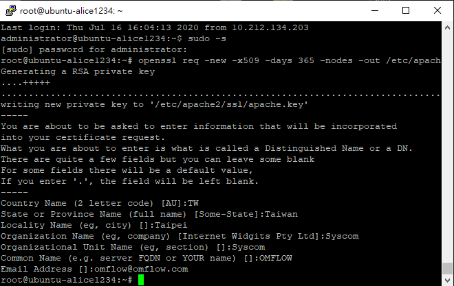
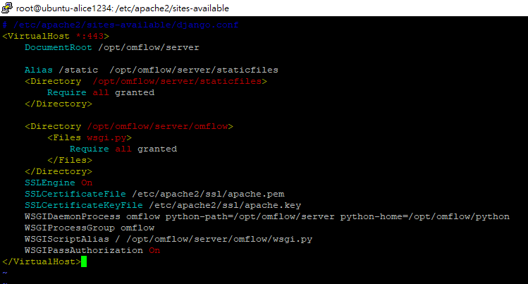
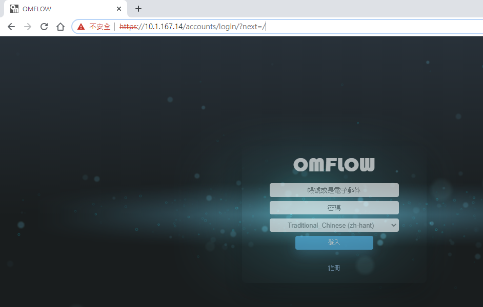
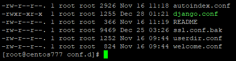

# HTTPSの有効化

## Linux <a href="#linux" id="linux"></a>

### Ubuntuの場合

### STEP1、HTTPS証明書を作成する

opensslをインストール

```
apt-get install openssl
```

sslディレクトリを作成

```
cd /etc/apache2/
mkdir ssl
```

証明書を作成

```
openssl req -new -x509 -days 365 -nodes -out /etc/apache2/ssl/apache.pem -keyout /etc/apache2/ssl/apache.key​​
```

<figure><figcaption><p>証明書作成例</p></figcaption></figure>

### STEP2、django.confを変更する

```
/etc/apache2/sites-available/
vi django.conf
```

次のコードを追加

```
SSLEngine On
SSLCertificateFile /etc/apache2/ssl/apache.pem
SSLCertificateKeyFile /etc/apache2/ssl/apache.key
```

**Port : \*:80から\*:443に変更**

<figure><figcaption><p>django.conf 変更例</p></figcaption></figure>

### STEP3、settings.pyの変更

```
LOCAL_PROTOCOL = "http"
改為
LOCAL_PROTOCOL = "https"
```

### STEP4、SSLモジュールを有効にし、サービスを再起動する <a href="#di-san-bu-zhou-qi-yong-ssl-mo-zu" id="di-san-bu-zhou-qi-yong-ssl-mo-zu"></a>

```
a2enmod ssl
/opt/omflow/server/omflow_server stop
/opt/omflow/server/omflow_server start
```

### STEP5、OMFLOWのWebページを確認する <a href="#di-si-bu-zhou-jian-cha-omflow-wang-ye" id="di-si-bu-zhou-jian-cha-omflow-wang-ye"></a>

**https://\<SERVER IP>:443/** と入力

<figure><figcaption><p>OMFLOWのWebページが正常に表示されることを確認</p></figcaption></figure>

### Centosの場合

### STEP1、HTTPS証明書を作成する

opensslをインストール

```
yum install openssl
```

証明書を作成

```
mkdir /etc/ssl/omcerts
openssl req -new -x509 -sha256 -days 365 -nodes -out /etc/ssl/omcerts/apache.pem -keyout /etc/ssl/omcerts/apache.key
```

mod\_sslをインストール

```
yum install mod_ssl
```

### STEP2、httpd.confを変更する

ファイルパス： /etc/httpd/conf/httpd.conf

現在ListenしているIPをコメントアウトし、新たにhttpsのポートを追加：

```
# Change this to Listen on specific IP addresses as shown below to
# prevent Apache from glomming onto all bound IP addresses.
#
#Listen 12.34.56.78:80
#Listen 80
Listen 443

```

### STEP3、django.confを変更する <a href="#di-er-bu-zhou-xiu-gai-djangoconf" id="di-er-bu-zhou-xiu-gai-djangoconf"></a>

```
cd /etc/httpd/conf.d/
vi django.conf
```

次のコードを追加し、\<IP>:443の箇所を変更

```
WSGIPassAuthorization On
WSGIDaemonProcess omflow python-path=/opt/omflow/server:/opt/omflow/python/lib/python3.6/site-packages
WSGIProcessGroup omflow
WSGIScriptAlias / /opt/omflow/server/omflow/wsgi.py

<IfModule mod_ssl.c>
<VirtualHost <IP>:443>

        Alias /static  /opt/omflow/server/staticfiles
        <Directory /opt/omflow/server/staticfiles>
                Require all granted
        </Directory>

        <Directory /opt/omflow/server/omflow>
                <Files wsgi.py>
                        Require all granted
                </Files>
        </Directory>
        SSLEngine on
        SSLCertificateFile      /etc/ssl/localcerts/apache.pem
        SSLCertificateKeyFile   /etc/ssl/localcerts/apache.key

</VirtualHost>
</IfModule>
```

django.conf変更例


conf.dディレクトリ配下にssl.confが存在する場合は、名称変更をしておく必要があります。


<figure><figcaption></figcaption></figure>

### STEP4、settings.pyを変更する

ファイルパス： _/opt/omflow/server/omflow/settings.py_

```
LOCAL_PROTOCOL = "http"
改為
LOCAL_PROTOCOL = "https"
```

### STEP5、サービスを再起動する <a href="#di-san-bu-zhou-qi-yong-ssl-mo-zu" id="di-san-bu-zhou-qi-yong-ssl-mo-zu"></a>

```
/opt/omflow/server/omflow_server stop
/opt/omflow/server/omflow_server start
```

### STEP6、OMFLOWのWebページを確認する <a href="#di-si-bu-zhou-jian-cha-omflow-wang-ye" id="di-si-bu-zhou-jian-cha-omflow-wang-ye"></a>

**https://\<SERVER IP>:443/** と入力

<figure><figcaption><p>OMFLOWのWebページが正常に表示されることを確認</p></figcaption></figure>

### Windowsの場合

### STEP1、httpd.confを変更する

ファイルパス： _C:\Program Files\OMFLOW Server\Apache24\conf\httpd.conf_

現在ListernしているIPをコメントアウト：

```
# Listen: Allows you to bind Apache to specific IP addresses and/or
# ports, instead of the default. See also the <VirtualHost>
# directive.
#
# Change this to Listen on specific IP addresses as shown below to 
# prevent Apache from glomming onto all bound IP addresses.
#
#Listen 12.34.56.78:80
Listen <IP>:80


上記の9行目の先頭に#を挿入
#Listen <IP>:80
```

ssl設定ファイルを有効化

```
# Secure (SSL/TLS) connections
# Note: The following must must be present to support
#       starting without SSL on platforms with no /dev/random equivalent
#       but a statically compiled-in mod_ssl.
#
<IfModule ssl_module>
#Include conf/extra/httpd-ssl.conf
#Include conf/extra/httpd-ahssl.conf
#SSLRandomSeed startup builtin
#SSLRandomSeed connect builtin
</IfModule>


上記の7行目の#を削除
Include conf/extra/httpd-ssl.conf
```

### STEP2、httpd-ssl.confを変更する

ファイルパス： _C:\Program Files\OMFLOW Server\Apache24\conf\extra\httpd-ssl.conf_

ファイルの先頭にWSGI関連コードを追加：

```
LoadFile "C:\Program Files\OMFLOW Server\Python\python37.dll"
LoadModule wsgi_module "C:\Program Files\OMFLOW Server\Python\lib\site-packages\mod_wsgi\server\mod_wsgi.cp37-win32.pyd"
WSGIPythonHome "C:\Program Files\OMFLOW Server\Python"
WSGIScriptAlias / "C:/Program Files/OMFLOW Server/omflow/omflow/wsgi.py"
WSGIPythonPath "C:/Program Files/OMFLOW Server/omflow"

<Directory "C:/Program Files/OMFLOW Server/omflow/omflow">

<Files wsgi.py>

Require all granted

</Files>

</Directory>

Alias /static "C:/Program Files/OMFLOW Server/omflow/staticfiles"
<Directory "C:/Program Files/OMFLOW Server/omflow/staticfiles">

AllowOverride None

Options None

Require all granted

</Directory>
```

Listen対象のIPを追加：

```
# When we also provide SSL we have to listen to the 
# standard HTTP port (see above) and to the HTTPS port
#
# Note: Configurations that use IPv6 but not IPv4-mapped addresses need two
#       Listen directives: "Listen [::]:443" and "Listen 0.0.0.0:443"
#
Listen <IP>:443

```

```
##
## SSL Virtual Host Context
##

<VirtualHost <IP>:443>

#   General setup for the virtual host
DocumentRoot "${SRVROOT}/htdocs"
ServerName <IP>:443
ServerAdmin admin@example.com
ErrorLog "${SRVROOT}/logs/error.log"
TransferLog "${SRVROOT}/logs/access.log"
```

証明書のファイルパスを追加：

```
#   Server Certificate:
#   Point SSLCertificateFile at a PEM encoded certificate.  If
#   the certificate is encrypted, then you will be prompted for a
#   pass phrase.  Note that a kill -HUP will prompt again.  Keep
#   in mind that if you have both an RSA and a DSA certificate you
#   can configure both in parallel (to also allow the use of DSA
#   ciphers, etc.)
#   Some ECC cipher suites (http://www.ietf.org/rfc/rfc4492.txt)
#   require an ECC certificate which can also be configured in
#   parallel.
SSLCertificateFile "C:\Program Files\OMFLOW Server\cert\cer\server.cer"
#SSLCertificateFile "${SRVROOT}/conf/server-dsa.crt"
#SSLCertificateFile "${SRVROOT}/conf/server-ecc.crt"

#   Server Private Key:
#   If the key is not combined with the certificate, use this
#   directive to point at the key file.  Keep in mind that if
#   you've both a RSA and a DSA private key you can configure
#   both in parallel (to also allow the use of DSA ciphers, etc.)
#   ECC keys, when in use, can also be configured in parallel
SSLCertificateKeyFile "C:\Program Files\OMFLOW Server\cert\pfx\server.key"
#SSLCertificateKeyFile "${SRVROOT}/conf/server-dsa.key"
#SSLCertificateKeyFile "${SRVROOT}/conf/server-ecc.key"
SSLCertificateChainFile "C:\Program Files\OMFLOW Server\cert\cer\uca.cer"
```


証明書のファイルパス

server.cer 、 server.key 、 uca.cerの3つのファイルについては

実施の状況に応じて記入してください。


### STEP3、settings.pyを変更する

ファイルパス： _C:\Program Files\OMFLOW Server\omflow\omflow\settings.py_

```
LOCAL_PROTOCOL = "http"
改為
LOCAL_PROTOCOL = "https"
```

### STEP4、サービスを再起動する

サービスコントロールパネルよりOMFLOW Serverを再起動

サービスの再起動後、変更が正しく動作していることを確認
