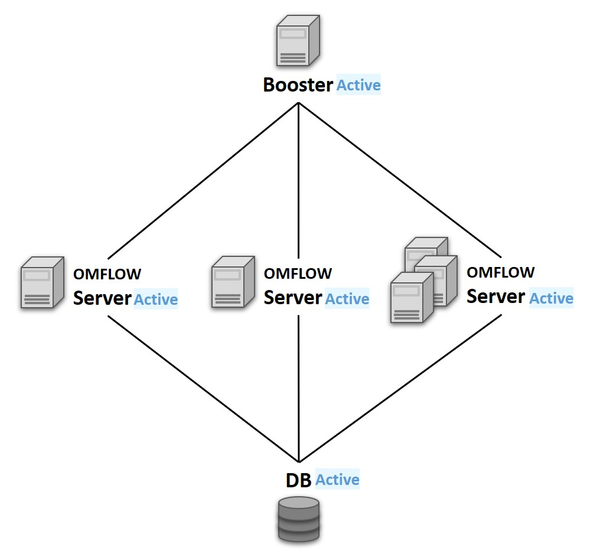
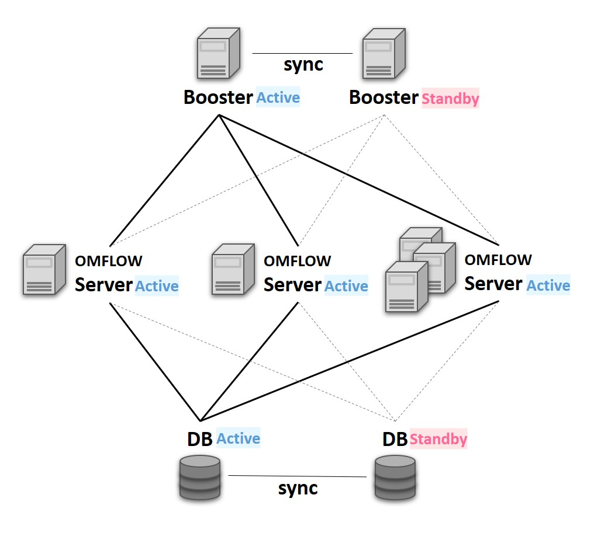

# 安裝Booster

## 功能介紹

### 負載平衡架構

### 負載平衡兼高可用架性構

支援Python：3.7以上

#### OMFLOW Booster

#### OMFLOW Server

具備

#### OMFLOW Booster Agent

## 安裝

### 1.  安裝 OMFLOW Booster

最優先安裝，並依照情境安裝一台或兩台Booster。兩者無順序要求，安裝時需填入以下資訊：

#### 輸入本機IP/Domain 及 Port：

填寫此Booster所代表的IP/Domain及Port，並確保所有OMFLOW Server與此連通。

#### 輸入 HA Booster IP/Domain 及 Port(非必填)：

當情境為HA架構時，填寫另一台Booster所代表的IP/Domain及Port，並確保兩台Booster彼此能互相連通。


HA架構下，一台為主Booster，一台為副Booster


### 2. 建置資料庫

Booster架構並不支援Sqlite，需要事先建立好對應的資料庫。OMFLOW支援的資料庫如下：

* PostgreSQL
* MySQL
* SQL Server
* Oracle


準備好資料庫以及具備建立資料表和讀寫該資料庫權限的帳號


### 3. 安裝 OMFLOW Server

當Booster安裝完畢後，接著安裝本架構的**第一台OMFLOW Server**。安裝過程會需要額外填入以下資訊：

#### 輸入DB相關資訊：

請輸入[步驟2](an-zhuang-booster.md#2.-jian-zhi-zi-liao-ku)所準備的資料庫相關資訊。

#### 輸入 Booster IP 及 Port：

請輸入視為主Booster的相關資訊。

#### 輸入 HA Booster IP 及 Port：

請輸入視為副Booster的相關資訊。

#### 先前已安裝OMFLOW Server：

若在安裝Booster之前已有運行中的OMFLOWServer，可按照以下步驟進行：

1. 確保運行中的OMFLOW Server資料庫並非Sqlite
2. 將OMFLOW Server更新至最新版本
3. 修改setting.py文件，將Booster相關資訊填入BOOSTER\_IP、BOOSTER\_PORT、SECOND\_BOOSTER\_IP、SECOND\_BOOSTER\_PORT四個參數
4. 重啟OMFLOW Server

### 4. 安裝 OMFLOW Booster Agent

待第一台OMFLOW Server安裝完畢後，在同一環境上繼續安裝OMFLOW Booster Agent。


BoosterAgent需與OMFLOWServer安裝在同一台伺服器上。


### 5. 安裝 OMFLOW Slave

待以上步驟皆完成後，最後便是依照情境的需求安裝一台以上的OMFLOWSlave。OMFLOWSlave內已包含OMFLOW Server及OMFLOWBooster Agent，安裝過程會需要額外填入以下資訊：

#### 輸入 Booster IP 及 Port：

請輸入視為主Booster的相關資訊。

#### 輸入 HA Booster IP 及 Port：

請輸入視為副Booster的相關資訊。

## 啟動順序

在啟動順序上，Booster及DB為最高優先順序。其次為負責主要

1. Booster、Database
2. Master Booster Agent
3. Slave Booster Agent
