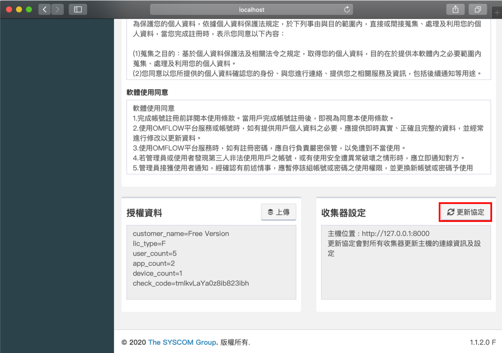

# 變更資料中心網址

伺服器會因為各項包含但不限於組織異動、設備架構異動、伺服器異常等因素，導致需要更換憑證、連接埠、網域、IP等等，該篇文章主要是說明哪些地方需要進行修改，才能讓資料中心正常運作。

## Windows

### 修改httpd.conf

_檔案路徑：C:\Program Files\OMFLOW Server\Apache24\conf\httpd.conf_

修改下列兩段設定中的&lt;IP&gt;與&lt;Port&gt;

```text
# Listen: Allows you to bind Apache to specific IP addresses and/or
# ports, instead of the default. See also the <VirtualHost>
# directive.
#
# Change this to Listen on specific IP addresses as shown below to 
# prevent Apache from glomming onto all bound IP addresses.
#
#Listen 12.34.56.78:80
Listen <IP>:<Port>
```

```text
# ServerName gives the name and port that the server uses to identify itself.
# This can often be determined automatically, but we recommend you specify
# it explicitly to prevent problems during startup.
#
# If your host doesn't have a registered DNS name, enter its IP address here.
#
ServerName <IP>:<Port>
```


### 修改settings.py

_檔案路徑：C:\Program Files\OMFLOW Server\omflow\omflow\settings.py_

修改**LOCAL**_**\_**_**IP**以及**LOCAL\_PORT**

```text
#omflow type(server/collector)
OMFLOW_TYPE = "server"
#local info
LOCAL_IP = "127.0.0.1"
LOCAL_PORT = "80"
UNIQUE_ID = ""
LOCAL_PROTOCOL = "http"
```


### 重啟服務


### 更新collector報到位置

重啟後登入OMFLOW

首頁 &gt; 系統設定 &gt; 系統設定



更新完成後，所有已經報到過的收集器，都會修改報到對象至新的位置。


## Linux

### ubuntu

### 修改django.conf

_檔案路徑：_/etc/apache2/sites-available/django.conf

修改下列兩段設定中的&lt;IP&gt;與&lt;Port&gt;

```text
<IfModule mod_ssl.c>
<VirtualHost <IP>:<Port> >
    DocumentRoot /opt/omflow/server

    Alias /static  /opt/omflow/server/staticfiles

```

### 修改settings.py

_檔案路徑：/opt/omflow/server/omflow/settings.py_

修改**LOCAL**_**\_**_**IP**以及**LOCAL\_PORT**

```text
#omflow type(server/collector)
OMFLOW_TYPE = "server"
#local info
LOCAL_IP = "<IP>"
LOCAL_PORT = "<Port>"
LOCAL_PROTOCOL = "http"

```

### 重啟服務

```text
systemctl stop omflow_server
systemctl start omflow_server
```

### 更新collector報到位置

重啟後登入OMFLOW

首頁 &gt; 系統設定 &gt; 系統設定


更新完成後，所有已經報到過的收集器，都會修改報到對象至新的位置。

### centos

### 修改httpd.conf

_檔案路徑：/etc/httpd/conf/httpd.conf_

修改下列兩段設定中的&lt;IP&gt;與&lt;Port&gt;

```text
# Change this to Listen on specific IP addresses as shown below to 
# prevent Apache from glomming onto all bound IP addresses.
#
#Listen 12.34.56.78:80
Listen <IP>:<Port>
```

### 修改django.conf

_檔案路徑：_/etc/httpd/conf.d/django.conf

修改下列兩段設定中的&lt;IP&gt;與&lt;Port&gt;

```text
<IfModule mod_ssl.c>
<VirtualHost <IP>:<Port> >
    DocumentRoot /opt/omflow/server

    Alias /static  /opt/omflow/server/staticfiles

```

### 修改settings.py

_檔案路徑：/opt/omflow/server/omflow/settings.py_

修改**LOCAL**_**\_**_**IP**以及**LOCAL\_PORT**

```text
#omflow type(server/collector)
OMFLOW_TYPE = "server"
#local info
LOCAL_IP = "<IP>"
LOCAL_PORT = "<Port>"
LOCAL_PROTOCOL = "http"

```

### 重啟服務

```text
systemctl stop omflow_server
systemctl start omflow_server
```

### 更新collector報到位置

重啟後登入OMFLOW

首頁 &gt; 系統設定 &gt; 系統設定


更新完成後，所有已經報到過的收集器，都會修改報到對象至新的位置。

