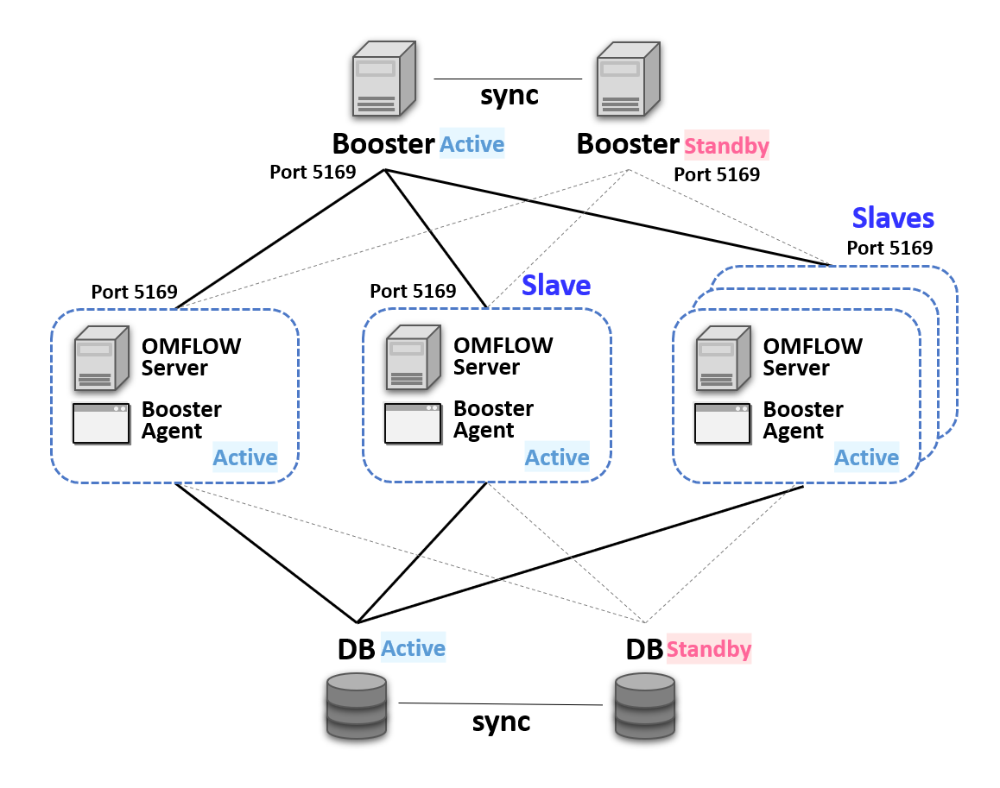

# Booster

## 功能介紹

### 負載平衡架構

當用戶需要長時間大量開單或是眾多使用者同時上線等極耗效能情境出現，導致單台OMFLOW Server難以負荷時。OMFLOW也提供了負載平衡的機制，可同時建置多台OMFLOW Server分散效能，並由Booster進行協同調配進而提升整體效率，架構圖如下：

.png>)

### 負載平衡兼高可用架性構

同時OMFLOW也提供了高可用性的架構，將Booster分為「主、副」兩台，所有OMFLOW Server都會依此順序向Booster報到，以確保此架構任一節點失去聯繫時，系統仍能正常運作。



#### OMFLOW Booster

擔任資料傳遞中心，主要負責協同所有OMFLOW Server共同處理表單流程。平時由主Booster進行作業。當主Booster失去聯繫時，會改由副Booster接替作業，形成高可用性架構。

#### OMFLOW Booster Agent

使用Booster架構時，Booster Agent需要與OMFLOW Server安裝在同一環境上，其作用為當任一台OMFLOW Server更新Patch時，所有其他的OMFLOW Server也會自動更新。

## 安裝步驟

### 1. 環境需求

Booster伺服器：建議至少 4 core 8 GB，用於安裝OMFLOWBooster

Python：確保Booster與OMFLOWServer的Python版本為3.7.7或3.8以上

Port：確保Booster與OMFLOWServer之間的5169埠號相互開通

### 2. 安裝 OMFLOW Booster

最優先安裝，並依照情境安裝一台或兩台Booster。兩者無順序要求，安裝時需填入以下資訊：

#### 輸入本機IP/Domain 及 Port：

填寫此Booster所代表的IP/Domain及Port，並確保所有OMFLOW Server與此連通。


除Booster以外，OMFLOW Server也需要開通5169埠號。


#### 輸入 HA Booster IP/Domain 及 Port(非必填)：

當情境為HA架構時，填寫另一台Booster所代表的IP/Domain及Port，並確保兩台Booster彼此能互相連通。


HA架構下，一台為主Booster，一台為副Booster



Linux 安裝方式

在安裝包擺放的路徑下解壓縮，並且進入執行 install.sh 。


```
tar xvf Booster_1140.tar.gz
cd Booster_1140
./install.sh
```

### 3. 建置資料庫

Booster架構並不支援Sqlite，需要事先建立好對應的資料庫。OMFLOW支援的資料庫如下：

* PostgreSQL
* MySQL
* SQL Server
* Oracle


準備好資料庫以及具備建立資料表和讀寫該資料庫權限的帳號



### 4. 安裝 OMFLOW Server

當Booster安裝完畢後，接著安裝本架構的**第一台OMFLOW Server**。安裝過程會需要額外填入以下資訊：

#### 輸入DB相關資訊：

請輸入[步驟2](booster.md#2.-jian-zhi-zi-liao-ku)所準備的資料庫相關資訊。

#### 輸入 Booster IP 及 Port：

請輸入視為主Booster的相關資訊。

#### 輸入 HA Booster IP 及 Port：

請輸入視為副Booster的相關資訊。

#### 先前已安裝OMFLOW Server：

若在安裝Booster之前已有運行中的OMFLOWServer，可按照以下步驟進行：


安裝前請先備份資料庫。


確保運行中的OMFLOW Server資料庫並非Sqlite

1. 將OMFLOW Server更新至最新版本
2. 修改setting.py文件，將Booster相關資訊填入BOOSTER\_IP、BOOSTER\_PORT、SECOND\_BOOSTER\_IP、SECOND\_BOOSTER\_PORT四個參數
3. 重啟OMFLOW Server

### 5. 安裝 OMFLOW Booster Agent

待第一台OMFLOW Server安裝完畢後，在同一環境上繼續安裝OMFLOW Booster Agent。


BoosterAgent需與OMFLOWServer安裝在同一台伺服器上。



Linux 安裝方式

在安裝包擺放的路徑下解壓縮，並且進入執行 install.sh 。


```
tar xvf BoosterAgent_1140.tar.gz
cd BoosterAgent_1140
./install.sh
```

### 6. 安裝 OMFLOW Slave


安裝前請先備份以下：

1. 步驟3的資料庫
2. 步驟4的OMFLOW Server。


待以上步驟皆完成後，最後便是依照情境的需求安裝一台以上的OMFLOWSlave。OMFLOWSlave內已包含OMFLOW Server及OMFLOWBooster Agent，安裝過程會需要額外填入以下資訊：

#### 輸入 Booster IP 及 Port：

請輸入視為主Booster的相關資訊。

#### 輸入 HA Booster IP 及 Port：

請輸入視為副Booster的相關資訊。


Windows安裝方式

有獨立的安裝檔 omflow\_slave\_1\_1\_4\_0.exe提供執行。



Linux 安裝方式

同 [Server](2.md#kai-shi-an-zhuang-omflow-server) 的安裝方式，只需將類型輸入 Slave 即可。


## 啟動順序

在啟動順序上，Booster及DB為最高優先順序，再來啟動所有的Booster Agent。

1. Booster、Database
2. Booster Agent


Booster Agent 啟動時會自動啟動 OMFLOW Server。



Linux 的服務啟動方式

Booster

```
/opt/omflow/Booster/omflow_booster_service { start | stop | status }
```

BoosterAgent

```
/opt/omflow/BoosterAgent/omflow_booster_agent_service { start | stop | status }
```


## 上傳License

1. 點擊「左側主選單 > 系統設定 > 系統設定」
2. 於主畫面拖曳至最下方，找到「Booster授權資料」區塊
3. 點擊上傳「上傳」按鈕，將license檔案


Booster在未上傳license情況下仍有7天試用期。


