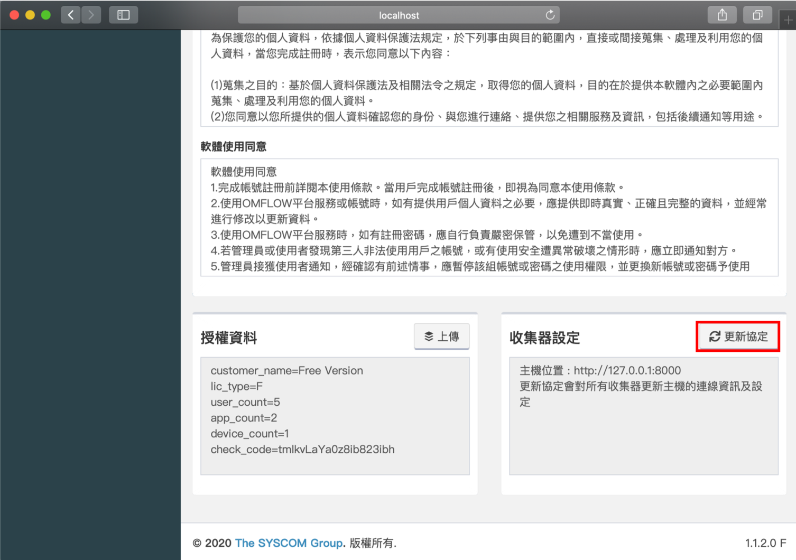

# データセンターのURLを変更する

サーバーは、組織の変更、デバイス構造の変更、サーバーの異常など、さまざまな要因により、証明書、ポート、ドメイン、IPなどを変更する必要があります。このドキュメントでは、主に何を変更する必要があるかについて説明します。データセンターが正常に動作できるようにします。

## Windows

### httpd.confを変更する

ファイルパス：C:\Program Files\ OMFLOW Server\Apache24\conf\httpd.conf&#x20;

で次の2つの設定を変更します\<IP>と\<Port>

```
# Listen: Allows you to bind Apache to specific IP addresses and/or
# ports, instead of the default. See also the <VirtualHost>
# directive.
#
# Change this to Listen on specific IP addresses as shown below to 
# prevent Apache from glomming onto all bound IP addresses.
#
#Listen 12.34.56.78:80
Listen <IP>:<Port>
```

```bash
# ServerName gives the name and port that the server uses to identify itself.
# This can often be determined automatically, but we recommend you specify
# it explicitly to prevent problems during startup.
#
# If your host doesn't have a registered DNS name, enter its IP address here.
#
ServerName <IP>:<Port>
```

### settings.pyを変更

ファイルパス：C:\Program Files\OMFLOW Server\omflow\omflow\settings.py&#x20;

改訂**LOCAL**_\*\*\\_**\_**IP**以及**LOCAL\_PORT\*\*

```bash
#omflow type(server/collector)
OMFLOW_TYPE = "server"
#local info
LOCAL_IP = "127.0.0.1"
LOCAL_PORT = "80"
UNIQUE_ID = ""
LOCAL_PROTOCOL = "http"
```

### サービス再開


 (1) (1).png>)

### コレクターレポートの位置を更新する

再起動後にOMFLOWにログインします&#x20;

ホーム>システム設定>システム設定




更新が完了すると、報告されたすべてのコレクターは、報告されたオブジェクトを新しい場所に変更します。

## Linux

### ubuntu

### django.confを変更する

ファイルパス：/etc/apache2/sites-available/django.conf&#x20;

1つの設定を変更します

```bash
<IfModule mod_ssl.c>
<VirtualHost <IP>:<Port> >
    DocumentRoot /opt/omflow/server

    Alias /static  /opt/omflow/server/staticfiles

```

### settings.pyを変更する

ファイルパス：/opt/omflow/server/omflow/settings.py

LOCAL\_IPとLOCAL\_PORTを変更します

```bash
#omflow type(server/collector)
OMFLOW_TYPE = "server"
#local info
LOCAL_IP = "<IP>"
LOCAL_PORT = "<Port>"
LOCAL_PROTOCOL = "http"

```

### サービスを再開する

```bash
systemctl stop omflow_server
systemctl start omflow_server
```

### コレクターレポートの位置を更新する

再起動後にOMFLOWにログインします&#x20;

ホーム>システム設定>システム設定


更新が完了すると、報告されたすべてのコレクターは、報告されたオブジェクトを新しい場所に変更します。

### centos

### httpd.confを変更する

_ファイルパス：/etc/httpd/conf/httpd.conf_

次の2つの設定で< IP>と< Port>を変更します。

```bash
# Change this to Listen on specific IP addresses as shown below to 
# prevent Apache from glomming onto all bound IP addresses.
#
#Listen 12.34.56.78:80
Listen <IP>:<Port>
```

### django.confを変更する

ファイルパス：/etc/httpd/conf.d/django.conf

次の2つの設定で< IP>と< Port>を変更します。

```bash
<IfModule mod_ssl.c>
<VirtualHost <IP>:<Port> >
    DocumentRoot /opt/omflow/server

    Alias /static  /opt/omflow/server/staticfiles

```

### settings.pyを変更する

ファイルパス：/opt/omflow/server/omflow/settings.py

LOCAL \*\* \ \_IPおよびLOCAL\_PORT \*\*を変更します。

```bash
#omflow type(server/collector)
OMFLOW_TYPE = "server"
#local info
LOCAL_IP = "<IP>"
LOCAL_PORT = "<Port>"
LOCAL_PROTOCOL = "http"

```

### サービスを再開する

```bash
systemctl stop omflow_server
systemctl start omflow_server
```

### コレクターレポートの位置を更新します

再起動後にOMFLOWにログインします

ホーム>システム設定>システム設定


更新が完了すると、報告されたすべてのコレクターは、報告されたオブジェクトを新しい場所に変更されます。
