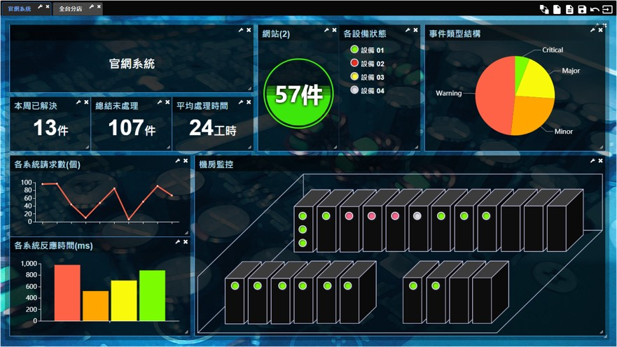

# OMFLOW Dashboard

## 機能紹介

OMFLOW DashboardはOMFLOWの拡張パッケージで、多様なグラフィカルペインを提供し、ユーザがダッシュボードを自由に設計できる、ダッシュボードデザインツールソフトウェアです。表示するデータソースはデータベースのSQL文でのクエリで、取得したデータをグラフィカルに表示します。本製品がサポートしているデータベースは以下の通りです。

* MySQL
* PostgresSQL
* SQL Server
* Oracle
* DBMaker

### 設計構造

#### タブ

本製品はマルチタブ設計となっており、各タブは個別に背景や表示内容を設定できます。また、ユーザが様々な情報を分類して表示したり、全ての情報を表示するためにはディスプレイのサイズが不足しているという問題を解決するため、一定間隔でタブを自動的に切り替えるように設定することも可能です。

#### 表示ペイン

タブ内には、テキスト、テーブル、棒グラフ、折れ線グラフ、円グラフ、ライトチャート、水道管グラフ、地理情報図などの各種表示ペインを設定することができます。

#### 共有

上記のタブと各種表示ペインは、ユーザによる設定後にアップロードして公開が可能です。アップロードする際に「個人、公開」という種別を選択でき、「公開」としたタブと表示ペインは、他のユーザがインポートして利用できます。

## インストール手順

**Windows**

Windows環境ではインストーラを直接実行します。インストール中に下記の情報を入力する必要があります。

* Java：事前にJava8以上のバージョンをインストールし、そのPathを設定します。
* Port：本製品が受け付けるポート番号、ブラウザからこのポート番号に接続することにより、本製品の画面を表示します。
* OMFLOW情報：本製品はOMFLOWに組み合わせて使用する製品のため、先にインストールしているOMFLOWのURL情報を入力し、本製品と連動できるようにします。

**Linux**

Linux環境ではWARファイルのみを提供します。インストール中に下記の点に注意してください。

* Java：事前にJava8以上のバージョンをインストールし、そのPathを設定します。
* Tomcat：Webサーバは別に構築してください。
* OMFLOW情報：本製品はOMFLOWに組み合わせて使用する製品のため、インストールしたOMFLOW Dashboardのディレクトリのdashboard.confファイルを修正して、先にインストールしているOMFLOWのURLを対応するパラメータに設定し、本製品と連動できるようにしてください。

## ライセンスの入力

### ログイン

ブラウザでDashboardのログイン画面を開きます。ここで、OMFLOWのユーザIDとパスワードを入力してログインします。成功すると本製品の画面が表示されます。

### **輸入序號**

本製品はインストール後14日間試用でき、画面上に関連する情報が表示されます。その表示をクリックして表示される入力画面で正しいライセンスキーを入力することにより、合法的に使用することができるようになります。
