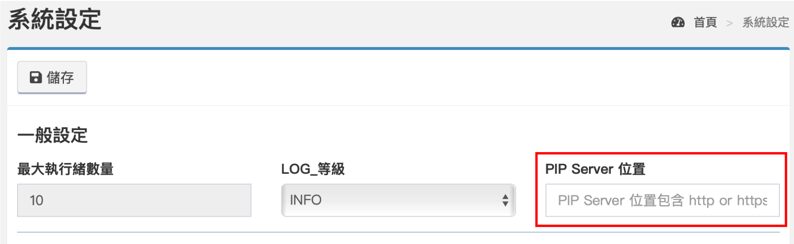

# pypiプライベートサーバーを設定する

OMFlow流れのコードコンポーネントはPythonコードを実行できます。ユーザーは、インターネットやコミュニティで便利なサンプルプログラムやパッケージを見つけて、独自の流れを構築できます。 このとき、pythonパッケージを別途インストールする必要がありますので、pythonパッケージのインストール方法を説明します。 サーバーに外部ネットワークがある場合、パッケージのインストールはomflowを介して直接行うことができます。ユーザーは、流れのpythonコンポーネントの\[パッケージ\]タブにインストールするパッケージのパッケージ名を入力するだけで済みます（詳細については） 、コンポーネントの概要を参照してください）。システムは、パッケージがインストールされているかどうかを確認し、インストールされていない場合は、ユーザーに自動的にパッケージをインストールします。 サーバーに外部ネットワークがない場合、ユーザーはこの時点でプライベートサーバーをセットアップする必要があります。以下では、pypiプライベートサーバーを作成する方法について説明します。

## プライベートサーバーを設定する

基本的な要件：python、pip

プライベートサーバーを設定する最も基本的な方法は、Pythonを環境にインストールする必要があることです。Pythonのインストール方法、環境変数の設定などは、Pythonの公式ウェブサイトを自分で参照してください。ここでは詳しく説明しません。

#### ステップ1、キットをインストールします

プライベートサーバー環境に外部ネットワークがある場合は、コマンドプロンプトを開き、以下のコマンドを入力します

```text
pip install devpi-server
pip install devpi-client
```

外部ネットワークがない場合は、外部ネットワーク環境でパッケージを入手してください。devpiを直接検索し、Googleでパッケージをダウンロードできます。






以下の例に対応するには、.whlファイルをダウンロードしてください。


または、pythonコマンドを使用してダウンロードします。以下のコマンドを入力します。

```text
pip download devpi-server -d <下載路徑>
pip download devpi-client -d <下載路徑>
```

次に、ダウンロードしたwhlファイルをプライベートサーバー環境に移動し、コマンドプロンプトを再度開いて、以下のコマンドを入力します。

```text
pip install <devpi-server.whl路徑>
pip install <devpi-client.whl路徑>
```

#### ステップ2、devpiサーバーを初期化します

devpiパッケージをインストールした後、プライベートサーバーの初期設定を実行する必要があります。次のコマンドを入力します。

```text
devpi-server --serverdir="/devpi" --init
```


--serverdirの背後にあるパスはサーバーの場所を表し、自分で調整できます。


#### ステップ3、rootアカウントを作成する

devpiサーバーのユーザーを作成するための以下のコマンドを入力します。

```text
devpi-server --serverdir = "/ devpi" --passwd root

＃パスワードリクエストが表示されます
rootのパスワードを入力してください：
＃パスワードを入力してEnterキーを押すと、パスワードが再度確認されます。
rootのパスワードを繰り返します。
```

#### ステップ4：プライベートサーバーを起動します

アカウントを作成したら、サーバーを起動できます。次のコマンドを入力します。

```text
devpi-server --serverdir = "/ devpi" --restrict-modify = root --port = 3141 --host = <IPの場所>-start
```


--port = 3141がデフォルト値です。自分で変更できます。 

--host =現在のセットアップ環境のIPを入力してください。



プライベートサーバーが設定されている環境に外部ネットワークがある場合は、この手順を完了した後、6番目の手順にスキップしてください。


#### ステップ5、クライアントを設定します

外部ネットワークがない場合、ユーザーはパッケージを個別にダウンロードし、最終的に統合管理のためにプライベートサーバーにアップロードすることしかできません。このとき、クライアントパッケージが必要です。設定は次のコマンドを入力します。

```text
＃クライアントが指すサーバーの場所を設定する
devpiはhttp：// <IPの場所>：<ポート>を使用します
```


ipとportはどちらも、手順4で設定した位置です。


```text
＃サインイン
devpi login root --password = <password>

＃rootユーザーの下に独自のフォルダを作成する
devpiインデックス-cローカル
```


localはそれ自体で置き換えることができます。


```text
＃作成したばかりのローカルフォルダに切り替えます
devpiはroot / localを使用します

＃ダウンロードしたパッケージをpypiプライベートサーバーにアップロードします
devpi upload --from-dir <さまざまな自己ダウンロードパッケージのwhlファイルへのパス>
```

この時点で、pypiサーバーのセットアップは完了です。

#### ステップ6、omflowサーバーを設定します

プライベートサーバーを設定した後、omflow設定に移動する必要があるため、アプリケーションが起動すると、システムはこの設定に従ってインストールパッケージをpypiサーバーにダウンロードします。

omflow&gt;システム設定&gt;システム設定に入力します



プライベートサーバーの場所を入力すると、保存が有効になります。


pypiサーバーに外部ネットワークがある場合、入力するパスの場所の例： 

http：// ：3141 / root / pypi / + simple /



外部ネットワークがない場合、入力するパスの場所の例： 

http：// ：3141 / root / local /


#### pypiサーバーをシャットダウンします

```text
devpi-server --serverdir = "/ devpi" --restrict-modify = root --port = 3141 --host = <IPの場所>-stop
```

