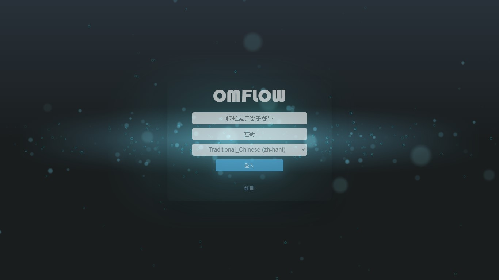
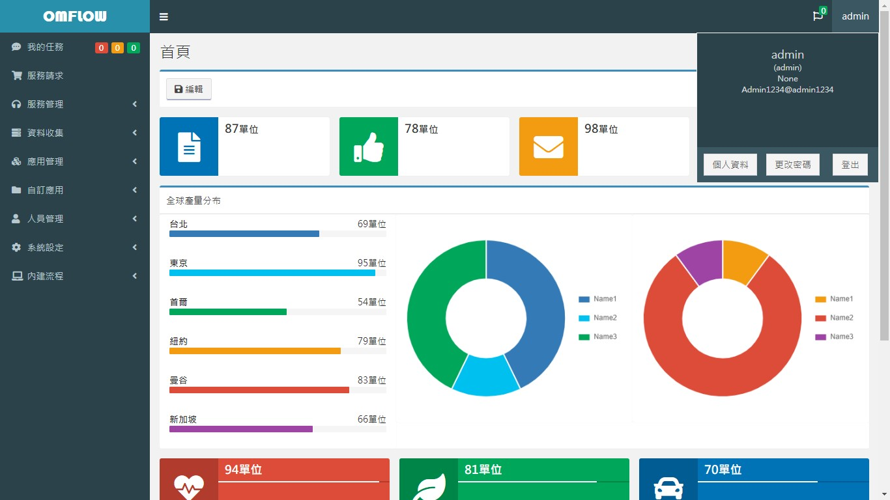
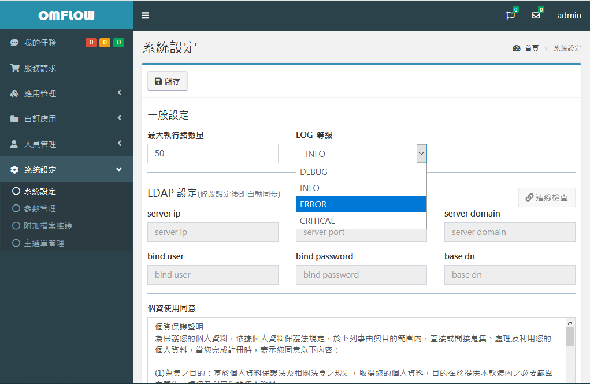

# 初期設定

## STEP1  ログイン

前の章に従ってシステムを起動した後、ブラウザを使用してシステム画面（http://127.0.0.1:80）に入ることができます。オープンソースバージョンは、事前設定されたアカウントパスワードを使用してログインします。無料バージョンとエンタープライズバージョンは、登録機能を使用して最初のものを登録してください アカウント、システムは最初に登録されたアカウントをシステム管理者としてログに記録します。



## STEP2  デフォルトのパスワードを変更する

システムがアクティブ化された後、最初にデフォルトの管理者パスワードを変更することをお勧めします。右上隅にある\[管理\]をクリックすると、個人情報/パスワードの変更/ログアウトウィンドウが表示され、\[パスワードの変更\]ボタンをクリックします



パスワード変更インターフェイスに入ることができ、元のパスワードと新しいパスワードを入力した後で変更できます。 変更後、システムはログアウトします。新しいパスワードでログインしてください。


## STEP3  ログレベルを設定する

\[**システム設定\]&gt; \[システム設定\]**に移動し、システムログをエラーレベルに設定して、過剰なログ生成を回避します。 システムが異常であり、デバッグが必要な場合、LOGレベルをDEBUGに設定して、OMFLOWディレクトリのLOGフォルダに格納されている完全なLOGを出力できます。

デフォルトのLOG設定は、1日あたり1つのLOGファイルで、最大10日間保存されます。

``注：この設定を変更するには、omflow / settings.pyのLOGGING設定を変更します。```



システム設定の個人データ使用許諾契約とソフトウェア使用許諾契約を使用して、独自の条件をカスタマイズできます。これらの条件は、新しいユーザーがアカウントを登録するために登録するときに同意する必要があります。

## STEP4  メニューレイアウト

\[システム設定\]&gt; \[メインメニューの管理\]左メニューの順序を管理者が調整できるようにします。ドラッグアンドドロップ方式を使用して調整してください。配置が完了したら、保存してすぐに有効になります。


