# Create APPs and Flow

## Create application

1. Click **Main Menu > APP Management > Design APP** to enter the application list.
2. Click the **New** button and enter "practice application" to the **APP Name** column.
3. Make sure the application just created is displayed in the list.

## New flow

1. Click the application just created and you will see a empty flow list.
2. Click **New** and choose **FormFlow** to create a new flow.
3. Enter the **Flow Name** column and check other options as required.


Please refer to [**FEATURES**](../5/6.md#xin-jian-bian-ji-liu-cheng-ye-mian-can-shu-she-ding) _\*\*_for the function of each option


## Form design

1. Undertake the above, select the **Form Design** tab and click **Half block** twice.
2. Then click **+** button to create four fields for **\*Title**, **Input box**, **\*Status**, and **\*Level** in the two half blocks.
3. Set the **\*Status** field, design the Options tab as follows:

| value | key    |
| ----- | ------ |
| 1     | New    |
| 2     | Review |
| 3     | Accept |
| 0     | Reject |

## Flow Design

Click the "Flow Design" tab.

There will be a preset flow at the beginning, and we can modify it on this basis.


Practice flow situation:

1. When the order is executed, the **Title** and **Input box** will be combined to a new value, and will be backfilled to the **Input box.**
2. After that, the user should confirms if it is correct, and change the **Status** field.
3. If **Status** is "Accept" , flow will go to the **End** point and closed. Otherwise, flow will go back to the **Manual input** point again.


Before starting the flow design. Click any component and you will see that there are more function keys on the component. The numbers in the figure below represent the following functions:

<figure>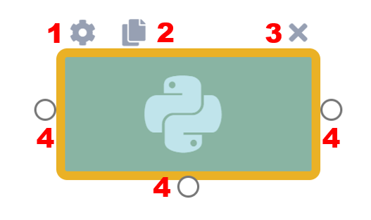<figcaption></figcaption></figure>

1. Settings: Set this component
2. Copy: Copy this component (including the set parameters)
3. Delete: delete this component (including the line connected to the component)
4. Connection point: connect other components

Select the actuator.

<figure>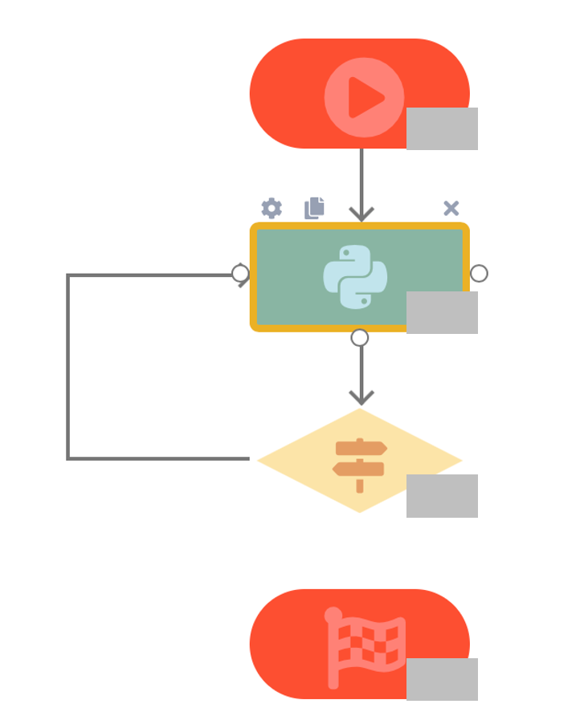<figcaption></figcaption></figure>

Click the connection point of the actuator, the connection point will change color at this time, and the connection line will also change color.

<figure>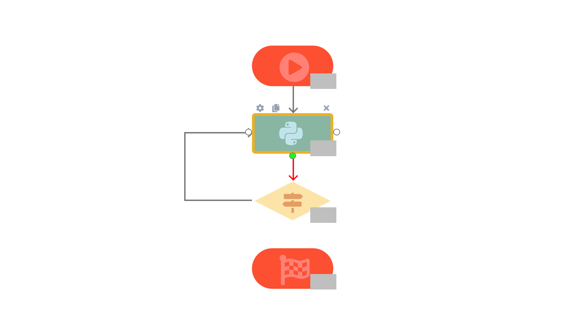<figcaption></figcaption></figure>

Click the connection point again, and the connection line will be deleted at this time.


**If** **multiple lines are connected to the connection point at the same time, this operation will delete all lines.**

**Only** [**Conditional judgment component**](../5/6.md#liu-cheng-lie-biao) **will have multiple outputs.**


<figure>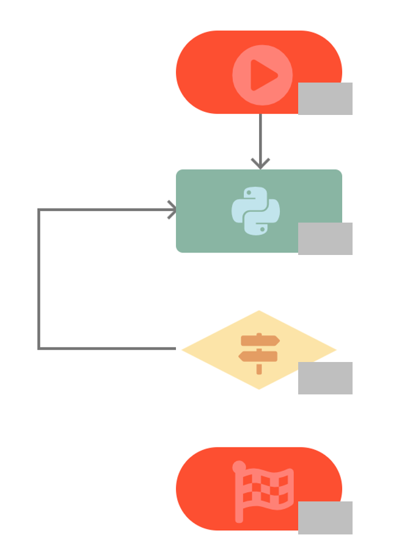<figcaption></figcaption></figure>

Do the same for the judgment point again and delete the connecting line to the left of the judgment point. The result is shown in the figure below.

<figure><figcaption></figcaption></figure>

Then add new components and select manual input.

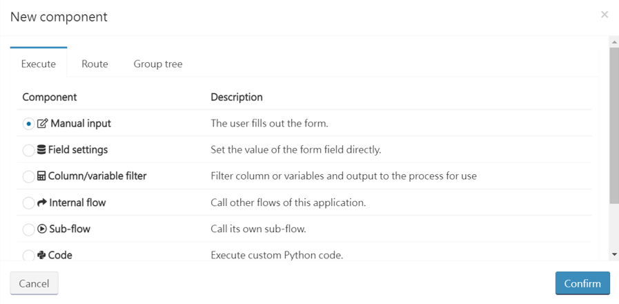

You can drag the components by pressing and holding the left mouse button, and arrange the components as shown in the figure below.

<figure><figcaption></figcaption></figure>

After clicking the actuator, click the lower connection point (left and right also work), and then move the mouse to the manual input point, you will find that there are three connection points on the manual input point.

<figure>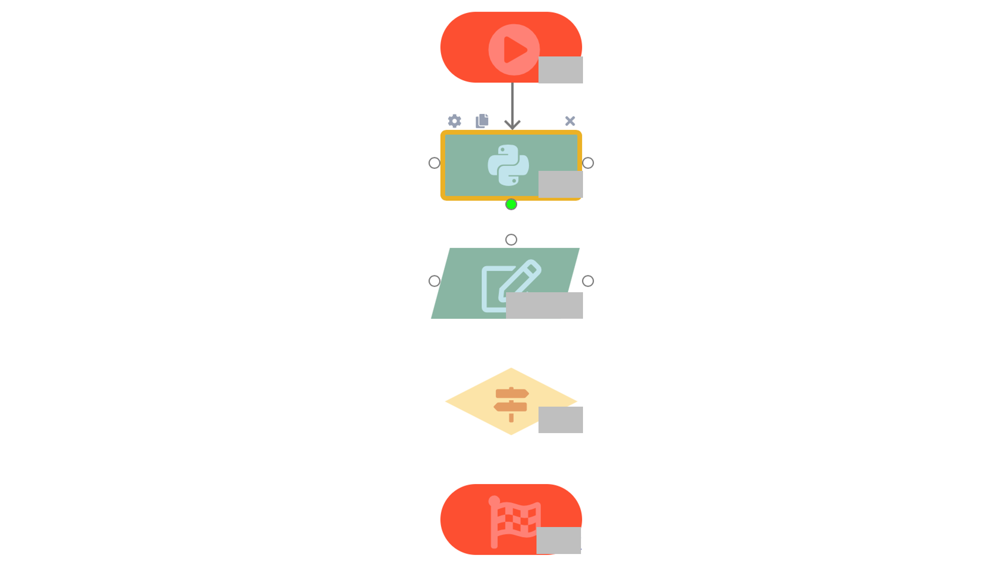<figcaption></figcaption></figure>

Click the connection point of the manual input point to connect the line.

<figure>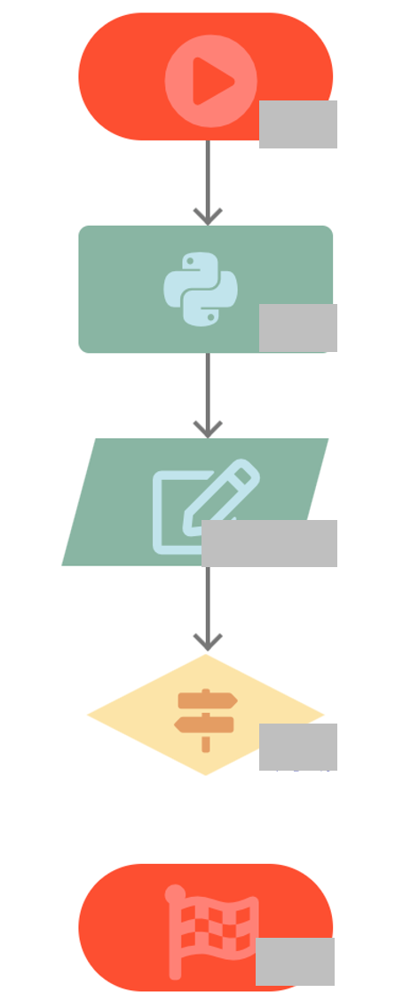<figcaption></figcaption></figure>

The same operation mode completes the flowchart.

<figure>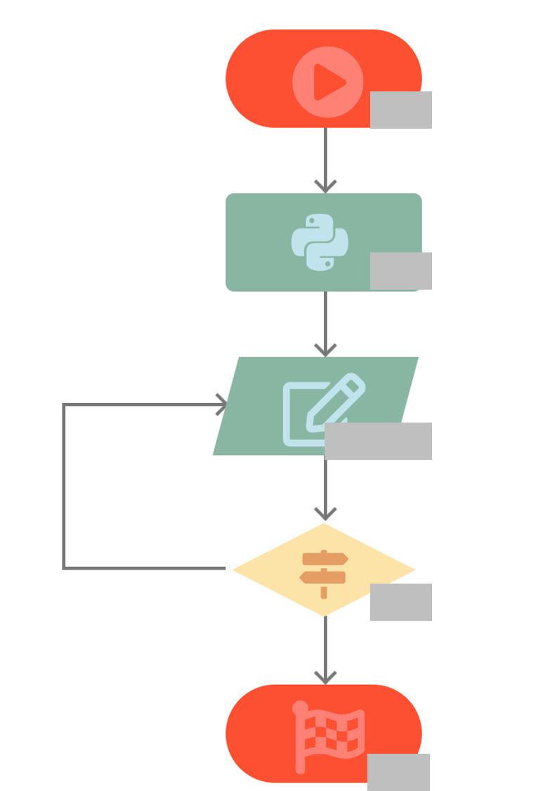<figcaption></figcaption></figure>

## Set components

After the flowchart structure is completed, the function, input, and output of each component must be set next.

First set the starting point, select the "Input" tab, and then add three rows of input rows.

Establish three flow variables: title, input, python\_result

title and input correspond to the title and input fields respectively, leave python\_result blank.

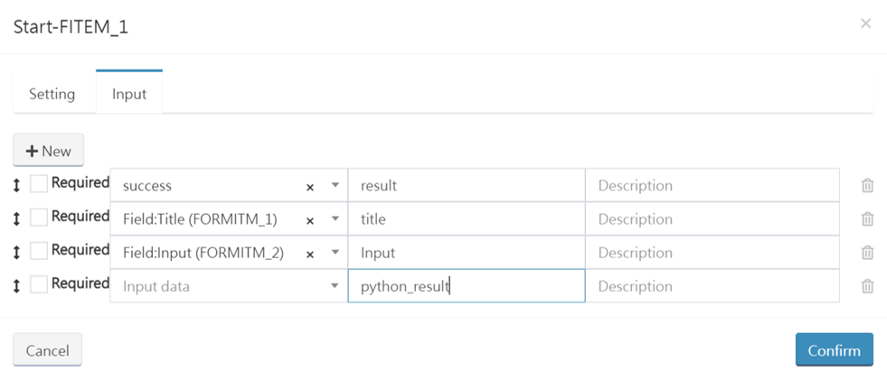

Then set the code components, select the "Input" tab, and add three rows of input rows.

Create three python variables: a, b, c

a and b correspond to title and input respectively, and c is left blank.


a and b are variables to be input into python, and c is to return the result of adding a and b back to the flow, so one more variable needs to be dropped to connect.


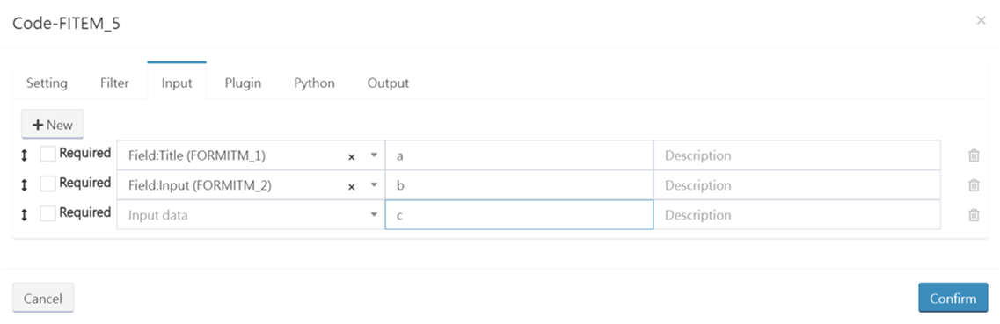

Select the "python" tab and type the following code:

```
def mergeInput(title, text):
    ans = title + text
    return ans


c = mergeInput(a,b)
```

The code first defines a mergeInput method, which will add the two input variables to the string, and finally return the result of the addition.


All the variables input from the flow are of string type. If you need other types, please remember to convert them in python.


Then use c to catch the return result of mergeInput, and at the same time bring a and b into the method.

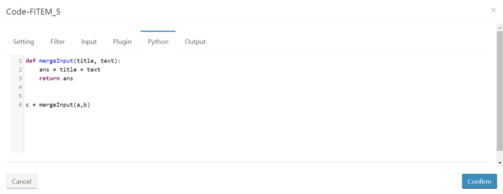

After completing python, go to the "Output" tab.

The input c is output to the flow variable python\_result.

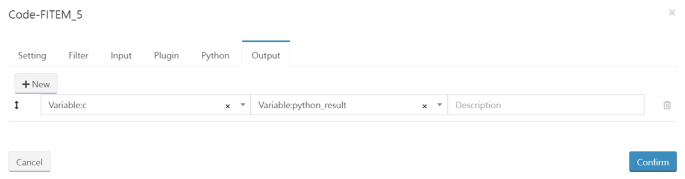

Set the manual processing component, click on the "Field Settings" tab, and fill in 2 in the status field.

The purpose of this setting is to automatically modify the status to audit every time the manual point is reached.

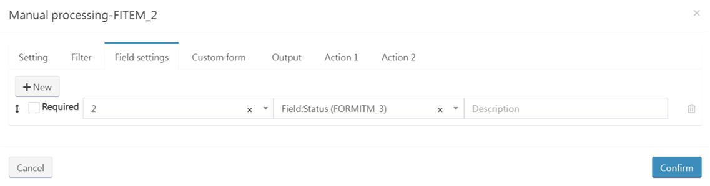

Set the condition judgment component and select the rule "tab".


The rule of condition judgment will be established according to the output line of the component, and there will be several rules if there are several output lines.


Here you can see that we have two rules, one connected to the end point (FITEM\_4), and one connected back to the manual processing point (FITEM\_10).


In the upper left corner of the setting window of each component, the name and the component number (FITEM\_XX) will be displayed.


The receiver modifies the rules. When the status is equal to 3 (passed), the flow leads to the end point, if not equal to 3, leads back to the manual processing point.

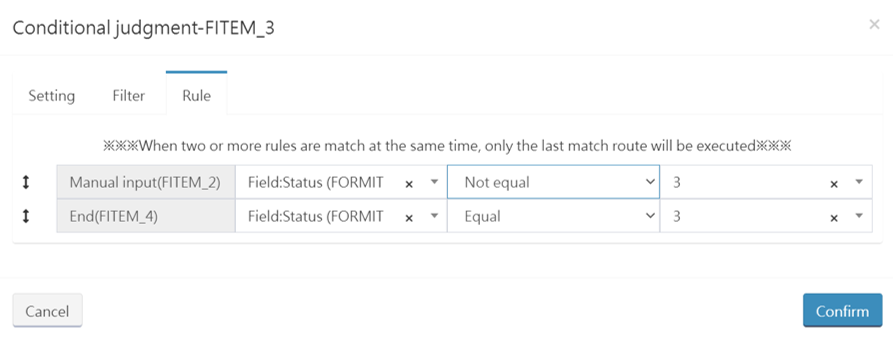

Finally, click **Save** button in the upper right corner.

Then return to the application list, click **Main Menu**>**APP Management**>**Design APP**

Tick the app you just created, and click **Deploy** button.

Then a Dialog will show up, Choose **Deploy new APP** and click **confirm**.

After success message appear, you can find the flow just listed on **Main Menu**>**Apps.**


**Congratulations on your successful establishment of a flow!**

**Select the flow in the menu to open the bill, please refer to** [**APPs**](../5/7.md)**.**

