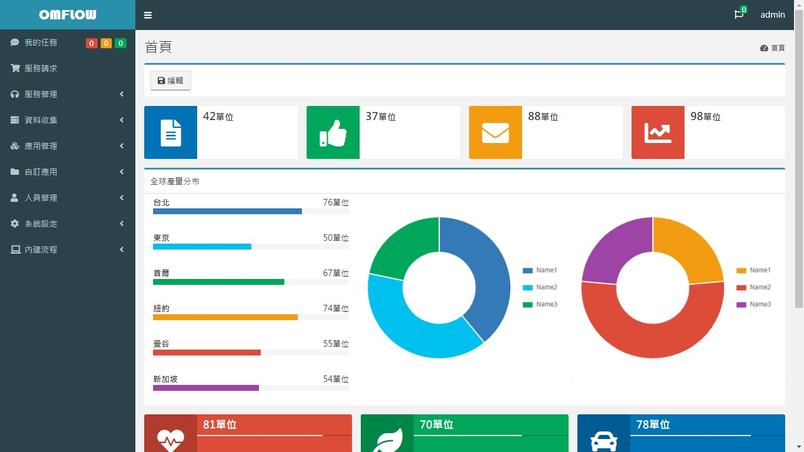
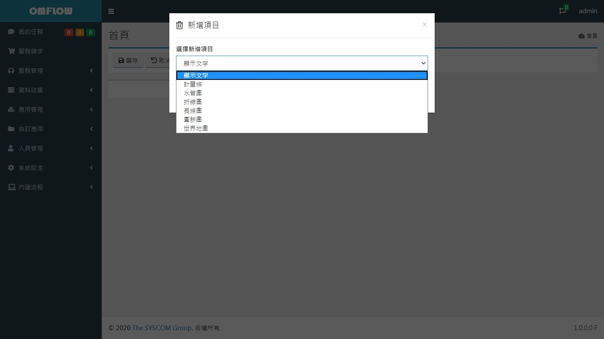
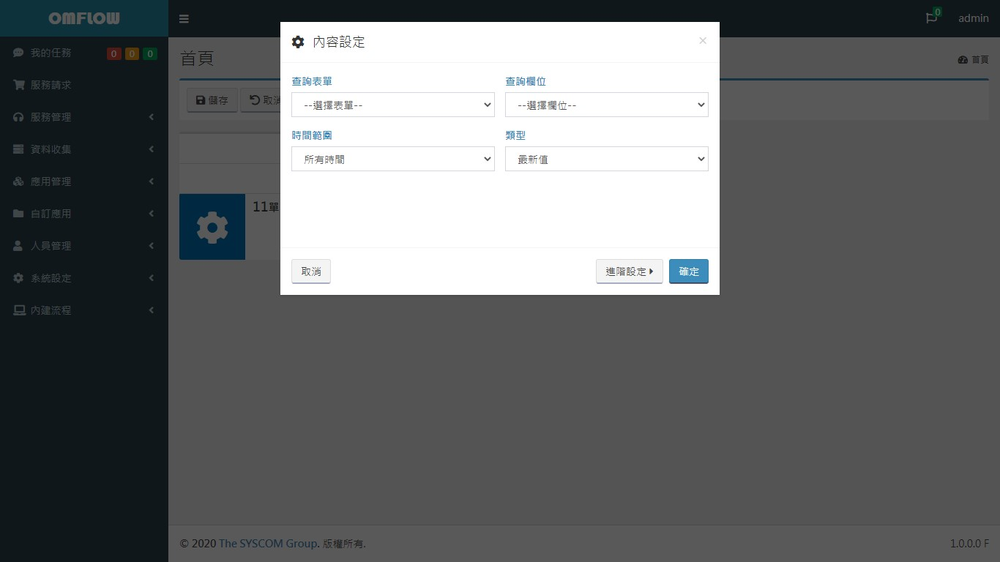
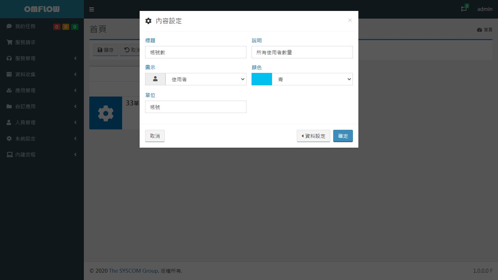

# 首頁

## 個人資訊

點擊網頁右上角使用者名稱，會開啟小視窗功能如下：

1. **個人資料**：點擊後進入個人資料頁面，詳細可參考 [_**功能介紹&gt;人員管理**_](8.md)_\*\*\*\*_
2. **更改密碼**：變更個人密碼，密碼規則為大小寫英文數字各一、全長至少8碼
3. **登出**：登出使用者

## 語系切換

點擊個人資訊旁的地球圖案展開下拉選單，選擇要顯示的語言版本進行切換。


部分由使用者輸入的內容無法進行語言切換，應用管理及服務請求可由使用者自行匯入翻譯包後，方可顯示切換後的語言。


## 代理人

顯示所有目前可職代的使用者，選擇使用者後可操作該使用者可使用的表單，進行開單、推單等動作。

當使用者身兼代理人職務時，在網頁右上角會顯示提示，點擊後可檢視所有代理人及相關任務服務水準。若再點擊代理人名稱則可切換為代理人模式並協助處理相關事務。

## 主選單

本系統所有功能大項皆顯示於左側，根據每個登入使用者的檢視權限，主選單僅會顯示對應的項目，以下將對各項目作簡單介紹，詳細可點擊下列項目 _****_：

* \*\*\*\*[**我的任務**](2.md)：彙整與使用者自身相關的所有任務，以方便進行接收或推進。
* \*\*\*\*[**服務請求**](3.md)：提供一般使用者提出服務請求的介面。
* \*\*\*\*[**服務管理**](4.md)：**商業版功能**，提供事故管理、問題管理、變更管理相關流程。
* \*\*\*\*[**資料收集**](5.md)：**商業版功能**，部署收集器進行監控或分散運算。
* \*\*\*\*[**應用管理**](6.md)：設計各種應用流程。
* \*\*\*\*[**報　　表**](bao-biao.md)：**商業版功能**，設計並匯出各式報表。
* \*\*\*\*[**自訂應用**](7.md)：存放使用者設計的應用流程所產出的各種資料
* \*\*\*\*[**人員管理**](8.md)：管理帳號、組織、角色、組織圖、休假紀錄及代理紀錄等相關資訊。
* \*\*\*\*[**系統設定**](9.md)：設定基本設置、LDAP等系統相關功能。
* \*\*\*\*[**內建流程**](10.md)：**商業版功能**，提供電子郵件發送等常見的應用流程。

## 儀錶板

儀錶板能整合並顯示每個應用流程的欄位值，其中每張圖的更新頻率為一分鐘，以下將介紹如何設計專屬的儀表板。

點擊儀錶板上方的編輯按鈕進入編輯模式，右方會依序出現按鈕，依序如下：

1. **儲存**：儲存本次編輯內容，並離開編輯模式。
2. **取消**：取消本次編輯內容，並回到編輯前的狀態。
3. **區塊**：新增區塊以分割儀表板寬度，總寬度為1，例：要在儀錶板同一高度同時顯示 4 張圖形，可新增四個 1/4區塊，並在各區塊各新增一圖形。

每個區塊上方會有三個按鈕，依序如下：

1. **新增**：新增各種圖形，顯示文字、計量條、水管圖、折線圖、長條圖、圓餅圖，其中1區塊內可以再新增其他尺寸區塊。
2. **設定**：設定區塊名稱及線條顏色，若未設定名稱將隱藏標題及線條
3. **刪除**：移除區塊

每個圖形上方會有兩個按鈕，依序如下：

* **設定**：分為「一般設定、資料設定」，下方將進一步介紹選項。
* **刪除**：刪除圖形

資料設定，設定想要查詢的數據或文字。

* **查詢表單**：可選擇使用者、組織與角色及其他應用流程
* **查詢欄位**：可查詢所選表單所有欄位\(單選 \)
* **時間範圍**：指定查詢時的資料時間範圍\(更新時間\)，如：今天、上周...
* **類型**：對查詢值進行整理，如：最新值、平均值、最大值、最小值等...
* **分類**：選擇所選表單特定欄位，作為查詢值分堆 \(group by\) 的依據

進階設定，設定圖形外觀風格。

* **標題**：輸入文字，空白時將隱藏標題。
* **說明**：輸入說明以輔助圖形。
* **圖示**：選擇圖示以輔助圖形。
* **顏色**：選擇顏色。
* **單位**：輸入文字，將顯示於查詢值右側。
* **高度\(px\)**：輸入數字，指定圖形高度。
* **數值上限**：輸入數字，於計量條、水管圖應用。
* **資料起始顏色**：產生多筆查詢值之圖形如長條圖，將依據起始顏色變換長條顏色，變換順序為「藍、青、綠、黃、紅、紫、灰、深灰」。

