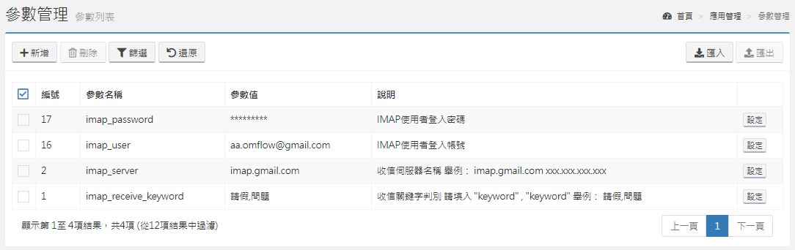
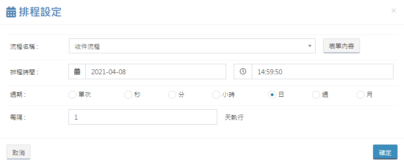

# 内部プロセス

## フロー送信

送信プロセスを使用する前に[SMTP](https://doc.omflow.com.tw/v/japan/5/6#can-shu-guan-li)パラメータを設定する必要があり、設定が完了した後、プロセスを使用してメールを送信できます。受信者、コピー、機密文書は、受信者のメールボックスの場所に直接入力され、複数の受信者を設定することができます。また、グループを直接選択することもできます。担当者は、システムでユーザーが入力したメールボックスの場所を使用して、グループを選択できます。 担当者は、担当者を受信者に書き込み、一緒にメールを送信します。グループのみが選択されている場合、グループ内の全ユーザーが受信者になります。実際の例では、サービス管理のインシデント管理プロセスを参照できます。

## プロセス承認

ユーザーは、承認に関連する全フォームの管理を容易にするフローを設計する際に、外部承認フローを設計できます。

## 受信プロセス

メールボックスの件名キーワードをクロールし、インシデントチケットを発行します。スケジューリングシステムを使用して、メールボックスを定期的に更新できます。

<table>
  <thead>
    <tr>
      <th style="text-align:left">&#x30D1;&#x30E9;&#x30E1;&#x30FC;&#x30BF;&#x540D;</th>
      <th style="text-align:left">&#x30D1;&#x30E9;&#x30E1;&#x30FC;&#x30BF;&#x306E;&#x8AAC;&#x660E;</th>
    </tr>
  </thead>
  <tbody>
    <tr>
      <td style="text-align:left">imap_server</td>
      <td style="text-align:left">IMAP&#x30B5;&#x30FC;&#x30D0;&#x30FC;&#x540D;</td>
    </tr>
    <tr>
      <td style="text-align:left">imap_user</td>
      <td style="text-align:left">IMAP&#x30E6;&#x30FC;&#x30B6;&#x30FC;&#x30A2;&#x30AB;&#x30A6;&#x30F3;&#x30C8;</td>
    </tr>
    <tr>
      <td style="text-align:left">imap_password</td>
      <td style="text-align:left">IMAP&#x30E6;&#x30FC;&#x30B6;&#x30FC;&#x30D1;&#x30B9;&#x30EF;&#x30FC;&#x30C9;</td>
    </tr>
    <tr>
      <td style="text-align:left">imap_receive_keyword</td>
      <td style="text-align:left">
        
&#x4EF6;&#x540D;&#x306E;&#x30AD;&#x30FC;&#x30EF;&#x30FC;&#x30C9;&#x3092;&#x30AF;&#x30ED;&#x30FC;&#x30EB;&#x3057;&#x3001;

        
&#x30A4;&#x30F3;&#x30B7;&#x30C7;&#x30F3;&#x30C8;&#x30C1;&#x30B1;&#x30C3;&#x30C8;&#x3092;&#x958B;&#x304D;&#x307E;&#x3059;

        
&#x30AD;&#x30FC;&#x30EF;&#x30FC;&#x30C9;&#x306E;&#x4F8B;&#xFF1A;&#x9AD8;&#x3059;&#x304E;&#x308B;&#x3001;&#x8CA0;&#x8377;

      </td>
    </tr>
  </tbody>
</table>

## プロセスを離れる

事前設定された休暇プロセスは、休暇申請者が特定の期間内にエージェントレビュープロセスを自動的に設定するのに役立ちます。


ユーザーは、このプロセスをサービスリクエストとして設定するか、このプロセスまたはAPIを参照して、必要なプロセスを自分で作成できます。


## ユーザークエリ

プロセス設計を支援する場合、「外部プロセス」を使用してこのプロセスを呼び出すことができます。

データ入力：キーワードを使用して、対応するフィールドのユーザーに一致する関連情報を照会します。

データ出力：最初に一致したデータのみが返され、次の情報が返されます。

## 組織と役割のクエリ

プロセス設計を支援する場合、「外部プロセス」を使用してこのプロセスを呼び出すことができます。

データ入力：対応するフィールドのキーワードを使用して、組織または役割に一致する関連情報を照会します。

データ出力：最初に一致したデータのみが返され、次の情報が返されます。

