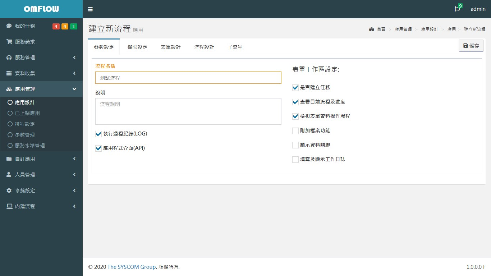

# 我的任務

## 任務列表

當流程進到人工點時，受派人為自己或受派組織為我的組織的表單都會顯示於此，可以直接點擊表單進入檢視相關資訊並進行[推單](7.md#tui-chan)，在左側主選單顯示任務列表內待處理任務各燈號的統計數字。


注意流程需勾選「是否建立任務」選項，否則任務將不被建立。


## 進行中任務

檢視所有自己經手過的表單，在流程未進入結束點之前都會顯示在此列表，直接點擊可以檢視此流程目前進度，右上角旗標圖示為進行中任務的快速連結，並顯示統計數字\(不分燈號\)。

## 已關單任務

檢視所有自己處理過並已到達結束點後關單的任務，點擊列表可檢視此任務完整流程和紀錄。

## 填單紀錄

檢視所有自己處理過的表單紀錄，點擊列表顯示當時送出的表單內容

