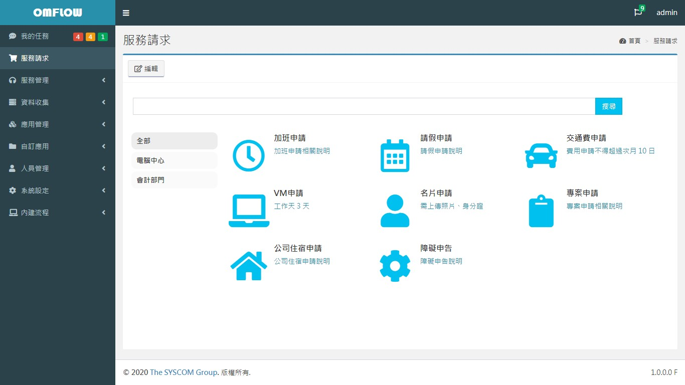
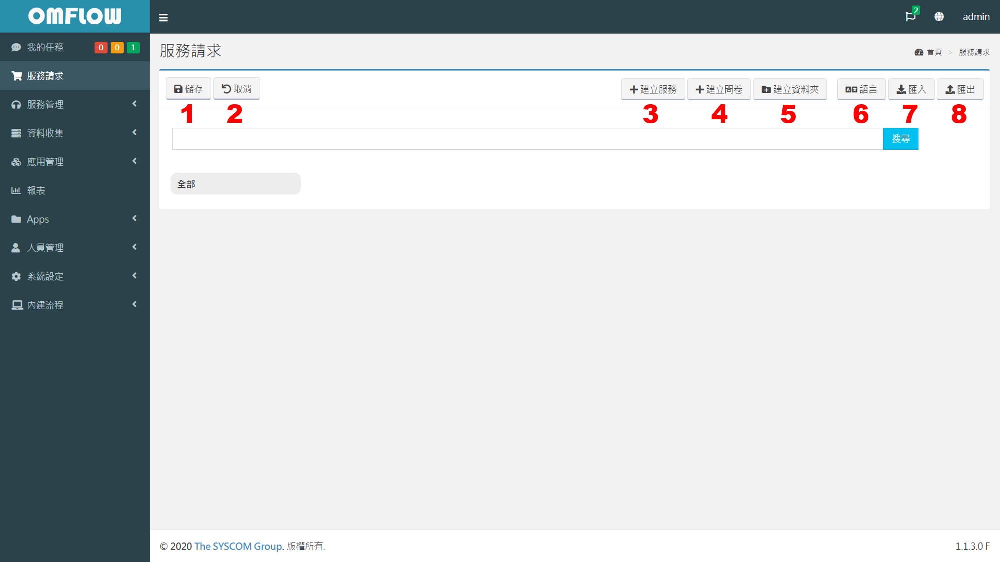
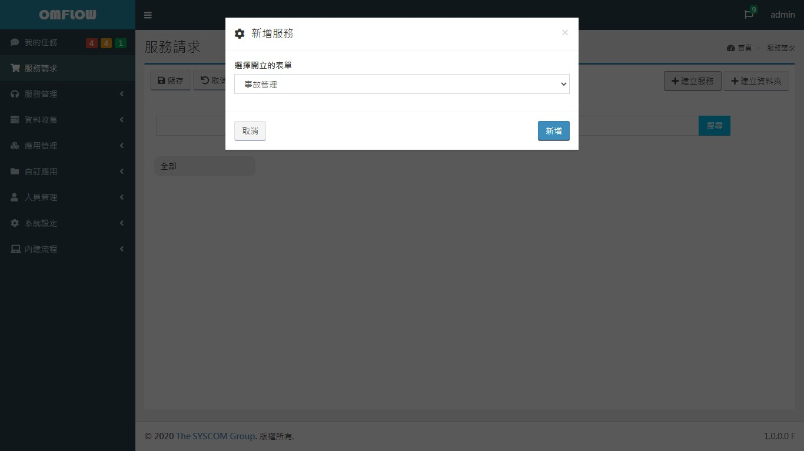
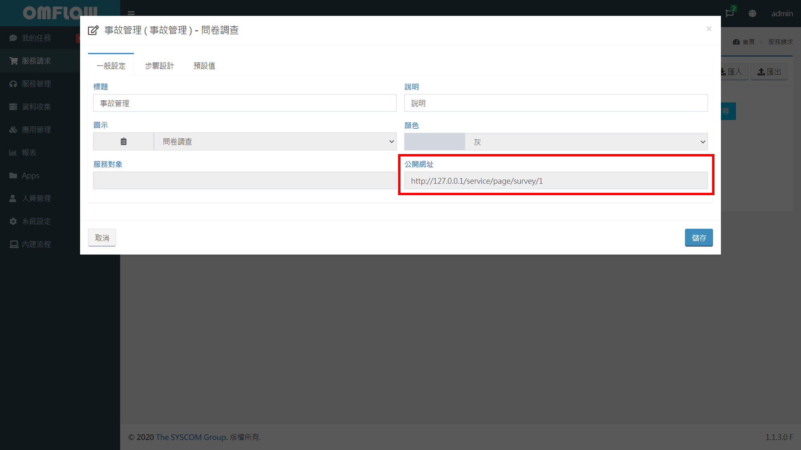

# サービスリクエスト

[アプリ管理 > アプリ設計](https://doc.omflow.com.tw/v/japan/5/6#ying-yong-she-ji)が完了すると、権限制限により、ユーザーが自分でフォームに記入できない場合や、フォームに一般ユーザーが記入しにくいフィールドが多い場合があります。このため、サービスリクエストインターフェースは、指定されたフォームプロセスに段階的で単純化されたフォーム入力インターフェースを提供できます。

## 編集モード

スーパーユーザーまたは「サービスリクエスト管理」権限を持つユーザーは、「編集」をクリックすると編集モードになり、次のボタンが生成されます。

1. **保存**：現在のデザインを保存します。
2. **キャンセル**：現在のデザインをキャンセルし、最後に保存したデザインに復元します。
3. **サービスの作成**：サービスを構築します。
4. **アンケートの作成**：質問表を作成します。
5. **フォルダの作成**：フォルダを作成し、他のサービスをそのフォルダに移動します。
6. **言語**：現在のデザインの言語翻訳パッケージをインポートまたはエクスポートします。
7. **インポート**：デザインをインポートし、現在のデザインコンテンツをカバーします。
8. **エクスポート**：最後に保存したデザインをエクスポートします。

## サービスの作成

\[サービスの作成]をクリックしてアプリケーションプロセスを選択し（サービスリクエストが送信されると、システムが自動的に作成リクエストを発行してフロープロセスを実行します）、作成後にサービスをクリックして編集インターフェイスに入ります。

.jpg>)

1. **一般設定**：サービスの表示名、説明、アイコン、その他の設定を設定できます。「サービスオブジェクト」は、このサービスを使用するロールを制限できます。
2. **ステップ設計**：フィールドとステップを追加できます。追加したフィールドは、選択したアプリケーションフローフォームフィールドから取得されます。ここで追加したステップとフィールドは、一般ユーザーが使用します。
3. **デフォルト**：フィールドを追加でき、フィールドは選択したアプリケーションプロセスフォームフィールドから追加します。ユーザーがサービスリクエストを送信すると、システムはデフォルト値を統合して自動的に請求します。


サービスが正しく実行されるようにするには、すべての必須フィールドを\[ステップ設計]または\[デフォルト]タブに追加する必要があります。


## アンケートの作成

「アンケート作成」は、サービスはOMFLOWユーザー向けではなく、ログインしていないビジター向けです。記入後、請求書が発行されます、以下の点に注意する必要があります：

* **パブリックURL**：ビジターのリンクを提供します。次の図に示すように、作成時に\[一般設定]タブの\[パブリックURL]フィールドを確認できます。

* **ターゲットはOMFLOW以外のユーザーです。**すべてのアンケートが一般ユーザーのサービスインターフェイスに表示されるわけではありません。
* **一部のフィールドの使用を制限する**：ログインしていないオブジェクトは使用が許可されているため、情報セキュリティ保護の目的で、設計者は「サブクエリ、割り当てられた組織、組織、ユーザー、ファイルのアップロード」をに追加することはできません。「ステップデザイン」タブ「その他のフィールド」。 ただし、「デフォルト値」タブにはこの制限はありません。

## フォルダ作成

\[フォルダの作成]をクリックすると、左側に\[フォルダ]アイテムが生成されます。フォルダ間をドラッグアンドスワップして、次の機能を利用することもできます：

* **全部**：すべてのサービスリクエストがここに表示されます。
* **フォルダ **：各フォルダは、サービスを追加したり、サービスに移動したりすることができ、フォルダをクリックして表示を切り替えます。

## 言語

「言語」をクリックして使用する言語を選択し、翻訳ファイルをインポートまたはエクスポートします。翻訳をエクスポートする前にデザインを変更した場合は、翻訳ファイルをエクスポートする前にデザインを保存する必要があります。

.png>)

エクスポートした翻訳ファイルを開いたら、翻訳するコンテンツの次の行に翻訳したコンテンツを直接入力して保存します。翻訳ファイルをインポートする前に、正しい言語を選択し、対応する翻訳ファイルをインポートしてください。

.png>)

## 無効なサービス

サービスに対応する申請フローがシェルフから撤去されると、サービスは使用不可になり、「撤去済み」と表示されます。フローが再度使用可能になると、再度使用されます。
