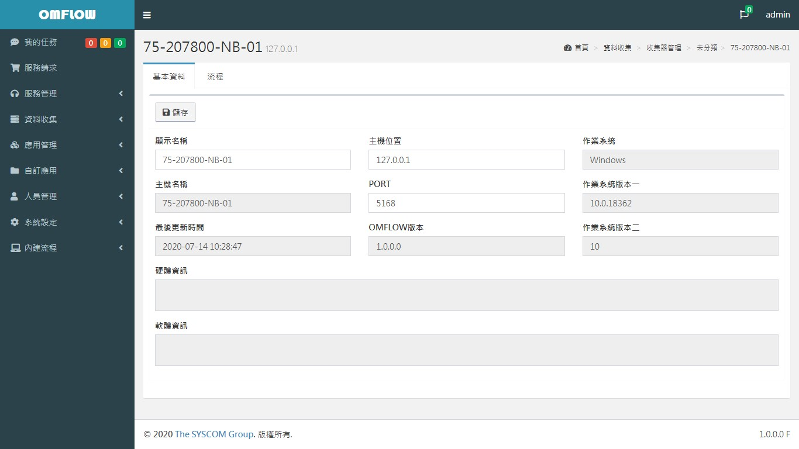
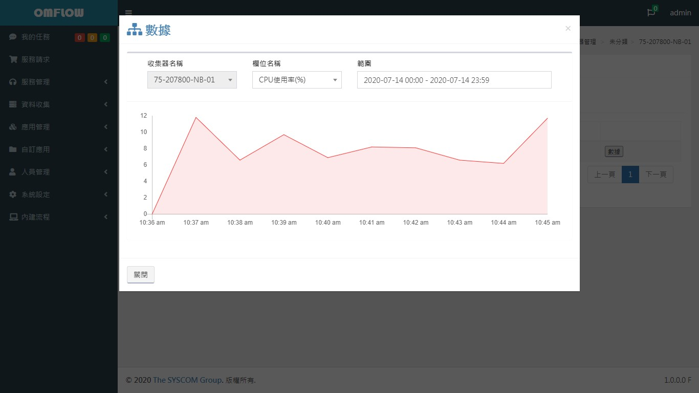
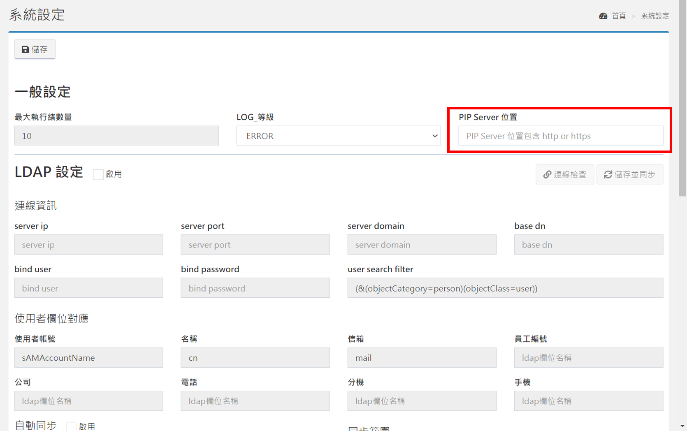
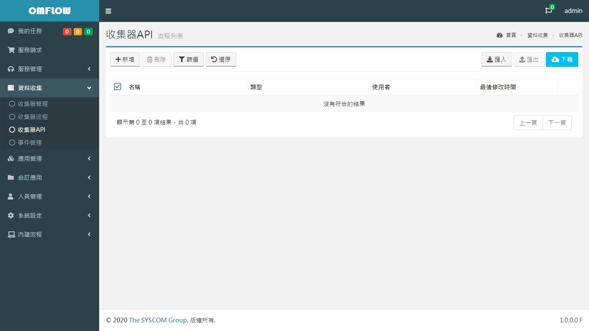
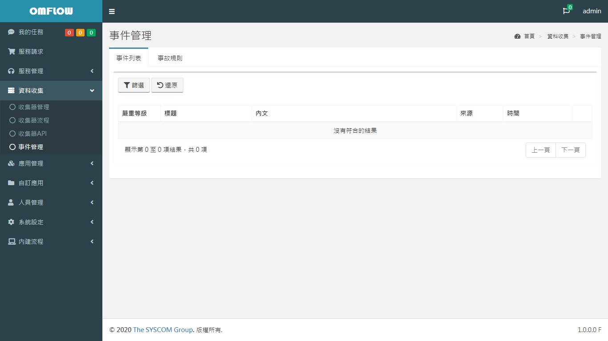

# Data Collection

## Collector management

Collector classification list, each collector can be set to one of the classifications, the default two classifications are as follows:


1. **Uncategorized:** All "collectors" registered for the first time will be classified here by default.
2. **Scattered operation:** When the process runs to the python point where the "scattered operation" is checked, one of the collectors of this category will be selected to run the python point. For details, please refer to [_**Application Management&gt;Application Design&gt;Python point**_](6.md#cheng-shi-ma) _**.**_

Each category has the following two settings:

**Operation list:**


1. **New:** New category
2. **Delete:** delete category
3. **Filter:** search for keywords and adjust the number of items displayed on each page
4. **Revert:** Cancel search keywords

**Collector list:** After clicking the category, you can enter the collector list

**Operation list:**


1. **Move:** Move the collection to the specified category
2. **Delete:** delete collector
3. **Filter:** search for keywords and display the number of items per page
4. **Revert:** Cancel search keywords

**Collector information**

Click on any collector in the collector list to display related information about that collector, as shown in the figure below.



Parameter

The parameter setting operation mode is the same as the _**application design**_. All modification actions will be synchronized to the collector in real time, providing the dispatched process for use.


## Collector flow

The flow list of all collectors can be sent to the collector to execute the process regularly and send the output data at the end of the flow back to the data center.


1. **New:** Similar to **Application Management&gt; Application Design**, you can create any flow and assign a collector to execute it.
2. **Delete:** Delete the check process.
3. **Copy:** Copy the checked process and create it as a new process.
4. **Delivery:** Specify the selected collector to execute this flow.
5. **Execute:** Set process execution variables, schedules, and collectors for execution.
6. **Data:** View the data collected in the process and display it in a line graph.


The process needs to be dispatched to the collector before the scheduled execution can be set. The same schedule can be set on multiple collectors at the same time.



The data source is the output variable of the "end point" of the dispatch flow, detailed [Application design&gt; end point](6.md#end).




## Collector Packages

When the collector is in an environment with an external network, it can install the packages required by the process by itself, without the user's manual installation. If the collector itself does not have an external network, there are two suggestions:

1. If there is a private PIP Server in the environment, you can set the location in the system:



1. It can also be downloaded manually according to the collector process that the Collector needs to execute. The following is a list of packages required for the built-in collector process:

```text
aiosnmp
asyncio
cx_Oracle
mysql
paramiko
psutil
psycopg2
pyodbc
requests
```

## Collector API

Create a collector-specific API, so that the external can directly call the flow to the collector and send the output of the end point of the flow back to the data center. Each call will only be executed once.


The data source is the output variable of the "end point" of the dispatch flow, details [_**Application Design&gt;End point**_](6.md#jie-shu)_**.**_




## Incident management

All events will be managed here.



List of incident rules: When an event occurs, the system will check whether the event rules are in compliance and generate an accident ticket. There are several points to note as follows:

* Check the order from top to bottom
* When one of the event rules is met, no more checks


New incident rules: set the content of the fields when the accident order is generated, and decide whether to generate an accident order according to the "accident trigger condition":

1. **Time compliance:** When this rule reaches the specified number of compliance times within the specified time range, an event will be generated. For example, if it meets 3 times in a day, if it is blank, an accident ticket will be generated every time it is met.
2. **Column condition:** When the judgment result of all specified columns is true, it is deemed to meet.


