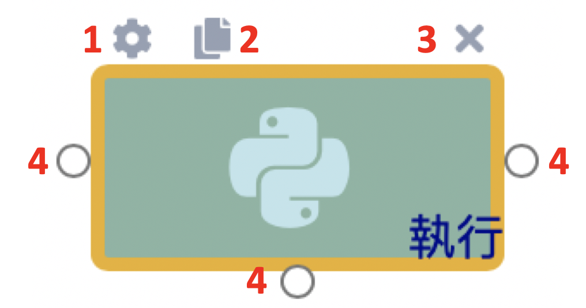
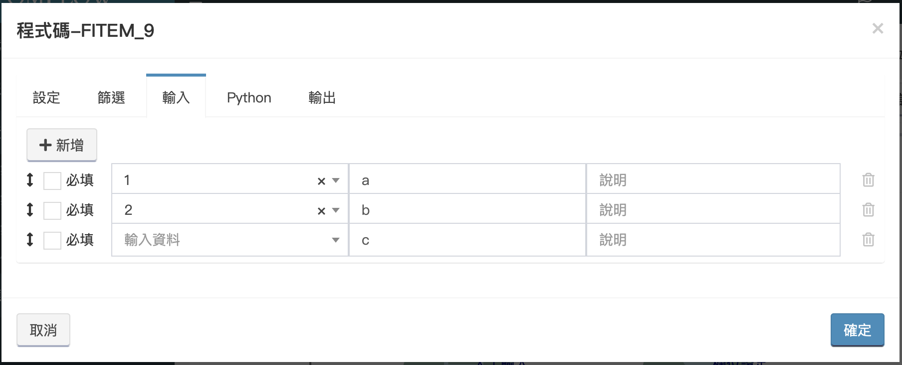
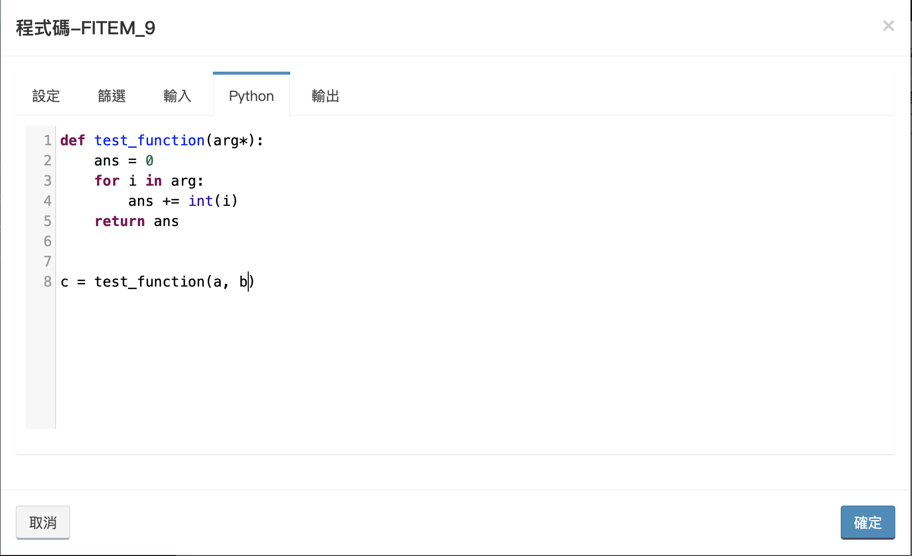

# Application Management

## Application Design

You can create custom applications and flow here and deploy them for users.


This article mainly introduces the functions of each page. For how to build an application from scratch, please refer to[ Quick Start](../4/3.md).


### Application List

Each application can be regarded as a container with multiple flow. The functions of the application list page are introduced as follows:

1. **New:**New custom application
2. **Delete:**Remove checked apps
3. **Enable:**deploy an application that has been designed
4. **Filter:**Search through keywords, filter attributes, and display the number of data at a time
5. **Restore:**Restore filter to default
6. **Import:**Import apps
7. **Export:**Export the checked apps
8. **Download:**Download the official cloud application
9. **Settings：**Modify application name and decentralization settings


Decentralization setting:

Allow the role to edit and release the application without giving the **application management permissions**.


### Flow List

Click any application in the application list to enter the flow list page.


The flow seen in this list are subsequently collectively referred to as the main flow to distinguish it from the [sub-flow](6.md#zi-liu-cheng).


Introduction to the flow list function:

1. **New:**Create a new flow
2. **Copy:**Copy the checked flow to another application
3. **Delete:**Delete the checked flow
4. **Filter:**Search through keywords and display the number of data at a time
5. **Restore:**Restore filter to default
6. **Package:**List the kits required for all processes of the application
7. **Language:**Import and export translated language packs

### New/Edit Flow Page - Parameter Setting

Click Add or Flow List to enter the flow new/edit page.

1. **Flow name:**Flow Name
2. **API path:**Used when calling from an external system (it cannot be changed after deployed).
3. **Description:**Explain the role of the flow
4. **Execution process record:**Whether to record the input and output of each point of the flow
5. **Application programming interface:**Whether to allow the flow to be called by other functions and systems through API
6. **Whether to create a task:**Do you see the data generated by this flow on the My Mission page? (See [My Mission](2.md))
7. **View the current flow and progress:**Whether to display the function button in the form.
8. **View the history of form data operations:**Whether to display the function button in the form.
9. **Additional file function:**Whether to display the function button in the form.
10. **Show data association:**Whether to display the function button in the form.
11. **Fill in and display the work log:**Whether to display the function button in the form.
12. **Quick operation confirmation window in the form:** Whether the confirmation window pops up when the user uses the quick operation in the form.

Please refer to [custom application](7.md) for items 7\~12 above

### New/Edit Flow Page - Permission Setting

The list shows which roles have the permissions of the flow.

* **Add:**Add an existing role and give this role the permissions of this flow.
* **Delete:**Remove the permissions of this flow from the checked roles.

For the setting of roles and permissions, please refer to [User Management](8.md), and the following points must be noted:

* **Viewing permission:** This flow will appear in _**Main Menu> Customize Application**_, and all the orders of the flow can be viewed.
* **Added permission:** You can create a form for the flow.
* **Update permissions:** When the form enters the manual point, the form can be pushed to the next step.
* **Delete permission:** You can delete the form of the flow.


**Permissions need to be used together. If there is only a new permission but no viewing permission, the user will not be able to add data because they cannot see the flow.**


**Advanced：**

In some specific cases, it is hoped that users can only see certain specific orders, and then they can use the form view rules of advanced settings.

**First、View All**

Even under restricted circumstances, a role similar to an administrator will be required to appear. These people must be able to view all the data of the process. At this time, select the specified organization, role, and user under the item.

**Second、Meet user information**

This type is more commonly used in asset lists. It is selected as shown in the figure below. When the assignee is equal to the user's name, the user can see the list.

**Third、Meet the criteria**

Third, when the specified field meets the conditions, the organization, role, and user selected at the back can see the note.

ex:\
When status is **Process**. Only the **Engineer** can see this ticket.\
When status is **Review**，Only the **Manager** can see this ticket.


Each of the above three inspection rules is established separately, that is to say, when the user meets any one of the rules, he can see the order.


### New/Edit Flow Page-Form Design

Design fields for users to fill in and bring them into the flow for calculation and application.


The form does not have to be designed. If the flow does not require users to fill in information, it can be left blank.


Block function introduction:

1. **New**：Add a field to the block.
2. **Setting**：Set the block.
3. **Delete**：Delete the block.

Set half block:

* **Title text:** The title text of the block
* **Marking color:** the color of the line above the block
* **Hide:** Whether to hide the entire block

If the designer has some information that he wants to place in the form, but he does not want the user to see or modify it, he will place the writing field in a block and hide the entire block.

New field:

Fields setting:

1. **Setting**：Set the field.
2. **Delete**：Delete the field.

The setting of the field will be different for different items. Currently, there are the following types of fields:

#### 1.Input box

* **Field name:** the name of the field
* **Annotation description:** The description of the field is displayed in placeholder.
* **Default value:** the value brought into the field by default
* **Type:** Divided into text, number, password, unique value, URL, email
* **Format check:** After entering the regex grammar, when the user fills in the field, the system will check whether the content is consistent according to the grammar, and the user’s operation will be rejected if it does not.
* **Required:** When the data is created or advanced, the required fields will be checked. If the value is empty, the operation will be rejected.
* **Read only:** After checking, the user can only view this field and cannot change it.
* **Hide:** hide the field. (Similar to the hiding of blocks, but only a single field is hidden here)

#### 2.Multi-line input

* **Number of rows:** This adjustment is usually for the beauty of the form layout and does not limit the length of the content entered by the user. If the content entered by the user exceeds the setting, a drop-down scroll will appear next to the field.

#### 3.Drop-down menu

There is an additional option tab in the drop-down menu, and you can add and delete options. Press and hold`↕︎`to drag options.


The _**value**_ is used for system calculation, and the _**display text**_ is displayed for the user.

The default value of the drop-down menu is filled with the _**value**_ instead of the _**display text**_.


#### 4.Single/multiple selection menu

Single-selection and multiple-selection are the same item, the options with multiple-selection in the setting can be checked, and the default is single-selection.


**Please separate the checked default values with half commas.**

**example:1,2,3,4**


#### 5.Title

Similar to the **input box**, but the title will be used in my task list.

#### 6.Status

Similar to the **drop-down menu**, but the **status** will be used in my task list.

#### 7.Level

Similar to a **drop-down menu**, but only three fixed options, red, yellow, and green, will also be used in [My Mission](2.md)

If there is a design service level, the light will be controlled by the service level, please refer to [Service Level](6.md#service-level-management) for details

#### 8.Assignees and organizations

A special combination field, this field is linked to [User](8.md#user-management) and [Organization](8.md#organization-management) , it needs to be created before you can select it in the field.

* Include assignee field: If this check is cleared, only the organization can fill in this field.

This field will affect the creation of my task. When the assignment is only to the organizational level, all members of the organization will see the data in the [My Mission](2.md#task-list); when assigned to the assignee level, only the user Can be seen in the [My Misssion](2.md#task-list).


**When users/organizations are assigned, even if they do not have** [**permission of the flow**](6.md#xin-jian-bian-ji-liu-cheng-ye-mian-quan-xian-she-ding)**, they can still push orders.**


#### 9.Date

Click Input, the calendar will pop up for selection.

#### 10.Datetime

Similar to **Date**, but there will be a time to choose.

#### 11.Sub query

Set to query other forms, and backfill specific fields of the form selected by the user.

First select the application and process to be queried on the form tab

Preliminary screening is performed on the condition and dynamic condition tabs to prevent users from seeing some junk data

The condition tab is to enter a fixed value, and the dynamic condition is to obtain the current form field or current user data.

The backfill tab is that when the user selects the data, the field value of the data is backfilled into the specified field of this form

#### 12.Calculator

The contents of other fields are calculated and finally filled into the calculation field.


Example scenario:

There are two fields in the form -- price and quantity.

The user hopes that when he fills in the price and quantity, the total price will be automatically calculated.


Step 1. Click to open the calculation field setting.

Step 2, insert the variable field drop-down menu, select field: price.

Step 3. Click the **Insert** button, and the variable will go to the upper calculation box.

Step 4. In the calculation content, enter a \* (multiplication operator) after the variable just inserted, and then insert the field: quantity into the calculation content to complete the calculation field.

After completion, when the user opens an order, after entering the content in both fields, the calculation field will be calculated according to the set formula, and the field content will be backfilled.

#### 13.Organization

Select the established organization from the drop-down menu, and you can set a check.

#### 14.User

Select the established user from the drop-down menu, and you can set a check.

#### 15.Hint

A field for reminders and warnings. The content of this field cannot be edited by the user, nor can it be used by the process.

### New/Edit Flow Page-Calculator Rule

The content of its designated field is calculated and finally filled in other designated fields.


The calculation rules will only be triggered on the front-end interface, and these calculation conditions will not be triggered when field values are modified or field backfilled in the process.


Click Add to add a new algorithm.

1. **Setting:** Set the rule.
2. **Delete:** Delete the rule.

**Setting:**

After entering the setting screen, you can modify the name and add comments for this rule.

**Trigger field:**

Click Add to add a trigger field.

When the user fills in the form, when the value of the trigger field is changed, the trigger condition will be checked.

**Triggering conditions:**

When the trigger condition is met, the calculation will start. If the trigger condition is empty, the calculation will be performed directly.

**Calculate:**

There are four types of operations: number, date, date and time, and date and specified time.

The calculation logic of the number can refer to the [calculator](6.md#12-calculator).

For the date type, only the [date field](6.md#9-date) can be selected for date addition and subtraction.

The date/time type can only select the [date/time field](6.md#10-datetime) for addition and subtraction of date and time.

The date specified time type is special, here only the addition and subtraction of the date is done, and the time will be fixed to the specified time.


Examples:

Starttime: 2021-01-01 08:00:00\
Calculator: +\
Calculate time: 0-1-1 01:30:00

Date/time type result:\
2021-02-02 09:30:00

Date/Specified time type result:\
2021-02-02 01:30:00


**Backfill:**

Backfill the calculated result into the specified field.

### New/Edit Flow Page-Flow Design

When you enter the flow design page, you will see a preset flow, which can be used directly.

First define some nouns, click on the component and you will see some more function keys on the component. The numbers in the figure below represent the following functions:

1. Settings: Set this component
2. Copy: Copy this component (including the set parameters)
3. Delete: delete this component (including the line connected to the component)
4. Connection point: connect other components

Next, we will introduce all the components one by one:

#### Start

As the name suggests, the source of a flow, it is recommended to create flow variables here for subsequent components to use.



Display name: Give the component a name to facilitate the user to recognize the current position when viewing the process.



Write field values or fixed strings into variables. The variables created here are flow variables, and all subsequent components can use these variables.

Here you will see that there is a default input, result=success, whose purpose is explained on the verification tab.



Choose a sub-flow to verify the entered data. When the verification fails (the result returned by the sub-flow is not equal to success), the billing fails and no record will be left.

This feature has two main purposes:

1.Check whether the input information is correct.

2.Filter data.



The input field of the starting point of the selected verification flow will be automatically brought here (if the verification tab is not selected, this field will be empty).



#### End

At the end of a flow, only when the flow reaches this element, will the order be closed (close task, end SLA monitoring... etc.), when the flow is called by other flow, only when it reaches the end point The execution result will be returned.


In general, the flow should be executed smoothly to the end point.


When the flow falls into the following situations, be sure to connect to the end point, otherwise the flow will not be completed smoothly:

1. When the flow is a sub-flow
2. When the flow will be called by other flow
3. When the flow is a [Data Collection](5.md) flow



Display name: Give the component a name to facilitate the user to recognize the current position when viewing the flow.



The screening is roughly divided into three aspects, for more details, check the '[Workflow Components - Filter](6.md#flow-component-filter)' section below.

1.Replace existing variables, take length, etc.

2.Get some default fields of the system

3.Obtain system parameters from [Parameter management](6.md#can-shu-guan-li)


**The variables created by the filter can only be used by the current component, not flow variables! ! !**




When the flow meets the above three conditions, the variables are output back to the main flow or data center.



#### Manual input

Also known as stay point. Once the flow is executed here, it will stop for the user to review, fill in the data and advance (it can be advanced through the front-end interface or API).


When entering manual input, only **manual push** or **API push** can make the flow continue.




Display name: Give the component a name to facilitate the user to recognize the current position when viewing the flow.

Log: It has the same function as the _**execution process log**_ described [前面](6.md#xin-jian-bian-ji-liu-cheng-ye-mian-can-shu-she-ding). When the _**execution process**_ _**log**_ is not checked, the log log on all components will be invalid, and the log log will only affect the current component.



The screening is roughly divided into three aspects, for more details, check the '[Workflow Components - Filter](6.md#flow-component-filter)' section below.

1.Replace existing variables, take length, etc.

2.Get some default fields of the system

3.Obtain system parameters from [Parameter management](6.md#can-shu-guan-li)


**The variables created by the filter can only be used by the current component, not flow variables! ! !**




When the flow stops, modify the field value in the database. When the user opens the form, the modified content will be displayed.



You can choose whether to load the form designed by the form design.

After choosing to load, you can modify the form presented at the current stop point—delete or add some fields to meet the current content required to be presented to the user.

If you do not choose to load, the form designed by the form will be directly applied.



Choose a sub-flow to verify the entered data. When the verification fails (the result returned by the sub-flow is not equal to success), the billing fails and no record will be left.

This feature has two main purposes:

1.Check whether the input information is correct.

2.Filter data.



The input field of the starting point of the selected verification flow will be automatically brought here (if the verification tab is not selected, this field will be empty).



Similar to the input of the starting point, the user-updated field content is output as flow variables for use by subsequent components.



It is also known as quick operation. After the design is completed, it can be used on the My Task List. The user can proceed without entering the form screen to modify the content. When using it, the field value will be modified according to the design there and the flow will be advanced. Many fixed replies and advancements can be completed through this function.


**To use it,please remember to tick the enabled option**




Same action 1



#### Field settings

Fill in the variable or fixed string in the database. This component can be selected when the database needs to be repaired without manual processing.



Display name: Give the component a name to facilitate the user to recognize the current position when viewing the flow.

Log: It has the same function as the _**execution process log**_ described [Front](6.md#xin-jian-bian-ji-liu-cheng-ye-mian-can-shu-she-ding). When the _**execution process**_ _**log**_ is not checked, the log log on all components will be invalid, and the log log will only affect the current component.



The screening is roughly divided into three aspects, for more details, check the '[Workflow Components - Filter](6.md#flow-component-filter)' section below.

1.Replace existing variables, take length, etc.

2.Get some default fields of the system

3.Obtain system parameters from [Parameter management](6.md#can-shu-guan-li)


**The variables created by the filter can only be used by the current component, not flow variables! ! !**




Backfill the variable or string with data.



Similar to the input of the starting point, the user-updated field content is output as flow variables for use by subsequent components.



#### Field/Variable Filter

Simply replace variables or fields or obtain system parameters and default fields, and then export them to other process points for use.



Display name: Give the component a name to facilitate the user to recognize the current position when viewing the flow.

Log: It has the same function as the _**execution process log**_ described [Front](6.md#xin-jian-bian-ji-liu-cheng-ye-mian-can-shu-she-ding). When the _**execution process**_ _**log**_ is not checked, the log log on all components will be invalid, and the log log will only affect the current component.



The screening is roughly divided into three aspects, for more details, check the '[Workflow Components - Filter](6.md#flow-component-filter)' section below.

1.Replace existing variables, take length, etc.

2.Get some default fields of the system

3.Obtain system parameters from [Parameter management](6.md#can-shu-guan-li)


**The variables created by the filter can only be used by the current component, not flow variables! ! !**




Similar to the input of the starting point, the user-updated field content is output as flow variables for use by subsequent components.



#### Call flow

Call another flow under the same application. When the flow reaches the end point, the flow will continue.



Display name: Give the component a name to facilitate the user to recognize the current position when viewing the flow.

Log: It has the same function as the _**execution process log**_. When the _**execution process**_ _**log**_ is not checked, the log log on all components will be invalid, and the log log will only affect the current component.



Choose a main flow.



After selecting the main flow, the form fields and start point input of the flow will be brought to this tab.


**If no value is entered, the system defaults to entering an empty string**.




After selecting a flow, the end point output of the flow will be brought to this tab.

Select the required output and put it into the flow variable of the current flow for use by subsequent components.



#### Sub-flow

Call the sub-flow of the current main flow. When the flow enters the end point, the flow will continue.



Display name: Give the component a name to facilitate the user to recognize the current position when viewing the flow.

Pass in exception: When the flow is executed to the component error, whether to ignore the error to make the flow continue.

Log: It has the same function as the _**execution process log**_. When the _**execution process**_ _**log**_ is not checked, the log log on all components will be invalid, and the log log will only affect the current component.



Choose a sub-flow.



After selecting a sub-flow, the form fields and start point input of the flow will be brought to this tab.


**If no value is entered, the system defaults to entering an empty string.**




After selecting a sub-flow, the end point output of the flow will be brought to this tab.

Select the required output and put it into the flow variable of the current flow for use by subsequent components.



#### Code

Write a piece of python code for the data center/collector to execute.



Display name: Give the component a name to facilitate the user to recognize the current position when viewing the flow.

Automatic installation of missing package: When the system detects that the package is installed externally, whether to install it automatically through pip.

Pass in exception: When the process is executed to the component error, whether to ignore the error to make the flow continue.

Distributed operation (the original version does not have this function): When this option is checked, the server will throw the code out of the group and execute it as a collector of [Distributed operation](5.md#shou-ji-qi-shou-ji)

Log: It has the same function as the _**execution process log**_ described [Front](6.md#xin-jian-bian-ji-liu-cheng-ye-mian-can-shu-she-ding). When the _**execution process**_ _**log**_ is not checked, the log log on all components will be invalid, and the log log will only affect the current component.



The screening is roughly divided into three aspects, for more details, check the '[Workflow Components - Filter](6.md#flow-component-filter)' section below.

1.Replace existing variables, take length, etc.

2.Get some default fields of the system

3.Obtain system parameters from [Parameter management](6.md#can-shu-guan-li)


**The variables created by the filter can only be used by the current component, not flow variables! ! !**




Enter the variable/string/field value into python. The following example shows how to use it:

Suppose the code typed in the python tab is

c = a + b

At this time, the input will bring in a, b, c, as shown below

In the end we will get the result of c = 12

Note 1: Bringing c in is to be able to bring c from python back to the flow.

Note 2: All the imported parameters are strings, so you need to convert them into the required data type in the program code.



Write the required python code.

The return of the final result of the code does not rely on return, but a variable of the input tab needs to be written in the outermost layer to catch the result, as shown below:




Obtain python execution results and write back flow variables.


Only the variables that have passed the input tab can be output here!




#### External flow

Call the flow of the application that has been put on the shelf. When the flow reaches the end point, the flow will continue.



Display name: Give the component a name to facilitate the user to recognize the current position when viewing the flow.

Pass in exception: When the flow is executed to the component error, whether to ignore the error to make the flow continue.

Log: It has the same function as the _**execution process log**_ described [Front](6.md#xin-jian-bian-ji-liu-cheng-ye-mian-can-shu-she-ding). When the _**execution process**_ _**log**_ is not checked, the log log on all components will be invalid, and the log log will only affect the current component.



Select a flow that has been listed.



After selecting the main flow, the form fields and start point input of the flow will be brought to this tab.


**If no value is entered, the system defaults to entering an empty string.**




After selecting a flow, the end point output of the flow will be brought to this tab.

Select the required output and put it into the flow variable of the current flow for use by subsequent components.



#### Conditional judgment

Judge the route.



Display name: Give the component a name to facilitate the user to recognize the current position when viewing the flow.

Log: It has the same function as the _**execution process log**_ described [Front](6.md#xin-jian-bian-ji-liu-cheng-ye-mian-can-shu-she-ding). When the _**execution process**_ _**log**_ is not checked, the log log on all components will be invalid, and the log log will only affect the current component.



The screening is roughly divided into three aspects, for more details, check the '[Workflow Components - Filter](6.md#flow-component-filter)' section below.

1.Replace existing variables, take length, etc.

2.Get some default fields of the system

3.Obtain system parameters from [Parameter management](6.md#can-shu-guan-li)


**The variables created by the filter can only be used by the current component, not flow variables! ! !**




The rules have the following characteristics:

1. The rules will be displayed after the line is pulled.
2. The "FITEM-?" displayed by the rule will appear in the upper left corner of each component screen.
3. The rule judgment is if, that is, when two rules are established, the latter one will be followed.
4. When deleting the line to rebuild, you need to redefine the rules.



#### Parallel

Allow the flow to perform multiple operations at the same time without affecting each other.


The flow variables generated after parallelization cannot be shared by other branches.




Display name: Give the component a name to facilitate the user to recognize the current position when viewing the flow.

Log: It has the same function as the _**execution process log**_ described [Front](6.md#xin-jian-bian-ji-liu-cheng-ye-mian-can-shu-she-ding). When the _**execution process**_ _**log**_ is not checked, the log log on all components will be invalid, and the log log will only affect the current component.



It only shows which lines are currently pulled to other components without any settings.



#### Parallel pooling

The branches that go out in parallel can be stored back, and one of the branches can be selected as the main line, so the flow variables of the branch will be stored. If there is a variable with the same name, the main line will be the main line.


**If the collection point is designed, all branches connected to the collection element must be completed before proceeding to the following flow.**




Display name: Give the component a name to facilitate the user to recognize the current position when viewing the flow.

Log: It has the same function as the _**execution process log**_ described [Front](6.md#xin-jian-bian-ji-liu-cheng-ye-mian-can-shu-she-ding). When the _**execution process**_ _**log**_ is not checked, the log log on all components will be invalid, and the log log will only affect the current component.



All branch lines connected to the convergence point will be displayed. Please select one of them as the main line. If it is not checked, the last completed branch line will be used as the main line.



#### Dynamic Parallel

Allow the process to perform multiple operations on the same route at the same time without affecting each other.


The process variables generated after dynamic parallelism cannot be shared by other branches.




Display name: Give the component a name to facilitate the user to recognize the current position when viewing the flow.

Log: It has the same function as the _**execution process log**_ described [Front](6.md#xin-jian-bian-ji-liu-cheng-ye-mian-can-shu-she-ding). When the _**execution process**_ _**log**_ is not checked, the log log on all components will be invalid, and the log log will only affect the current component.



Give a field or variable or fixed value to determine the number of parallels.

When select "Array":\
A,B,C,D ===> Four times in parallel

When select "Num":\
4 =====> Four times in parallel



Select variables or fields, and divide the array into branches after cutting.

Ex:\
var A: ap-server,db-server,web-server\
var B: 10.1.1.1,10.1.1.2,10.1.1.3\
var C: Jack,Ian

After dividing into three points, each will get the value:\
line 1: A(ap-server), B(10.1.1.1), (Jack)\
line 2: A(db-server), B(10.1.1.2), C(Ian)\
line 3: A(web-server), B(10.1.1.3), C("")



#### Dynamic Parallel pooling

The branches that go out in parallel can be stored back, and the last completed branch is the main line. If there are variables that need to be merged, it must be set on the output tab, otherwise the main line is the main line.


When all branches are completed, the following process will continue.




Display name: Give the component a name to facilitate the user to recognize the current position when viewing the flow.

Log: It has the same function as the _**execution process log**_ described [Front](6.md#xin-jian-bian-ji-liu-cheng-ye-mian-can-shu-she-ding). When the _**execution process**_ _**log**_ is not checked, the log log on all components will be invalid, and the log log will only affect the current component.

Output json format: Change the data of the output tab to the json format of string type.

Replace ",": Replace the "," of the variable value or field value of the output tab with other characters.



Select the common field or variable of all branches to merge and output into another variable.

Ex:\
line 1: "A"\
line 2: "B,D"\
line 3: "X，Y"

output: "A,B,D,X，Y"\
if check **Output json format**: "\['A', 'B,D', 'X，Y']"\
if check **Replace ","** to "ooo": "A,BoooD,X，Y"



#### Pause

The flow pauses for n milliseconds.



Bring in a numeric variable.



If the input is empty, take the default value.



#### Direct Position

This component is linked with the [Organization chart management](8.md#ldap-jian-shi-mian-fei-ji-qi-ye-ban-1) and [Job management](8.md#jiao-se-guan-li), by entering the "User ID" and "Job Name", you can find the job name closest to the upper level of the user's organization, and return the "User ID, Organization ID" of the job ".



Display name: Give the component a name to facilitate the user to recognize the current position when viewing the flow.



Enter a job title and a user ID.



This component will return the user ID and organization ID found through the organization chart.



#### Department position

This component is linked with the [Organization chart management](8.md#ldap-jian-shi-mian-fei-ji-qi-ye-ban-1) and [Job management](8.md#jiao-se-guan-li),by entering the "Department Number" and "Job Name", you can find the job name closest to the lower level of the department, and return the "User Number, Organization Number" of the job.



Display name: Give the component a name to facilitate the user to recognize the current position when viewing the flow.



Enter a job title and a department number.



This component will return the user ID and organization ID found through the organization chart.



### New/Edit Flow Page-Sub Flow

Enter the sub-flow tab and you will see a list of sub-flow. The main features of the sub-flow are as follows:

* Simplify and improve the readability of the main flow
* Can only be called by the main flow
* The component category of the sub-flow is the same as the main flow, please refer to the introduction above

## Flow Component-Filter

Set up various variables within the component, provide them for current component usage. Filtering is divided into two main categories as follows:

#### General screening

Combine various variables in relevant combinations. Among them, numeric calculation-based filtering will transform variables into numeric format during the processing, but any new variables generated after processing will all be in string format.

#### System screening

Extract various types of information from forms and the system as variables, with the following items:

* Creator: Returns the requester's \[user ID].&#x20;
* Creator Group: Returns the requester's \[default department ID].&#x20;
* Updater: Returns the \[user ID] of the last person who approved this request.&#x20;
* User Group: Fill in \[user ID], return \[user's default department ID].&#x20;
* Nickname: Fill in \[user ID], return \[nickname].&#x20;
* Group Name: Fill in \[department ID], return \[department name].&#x20;
* System Parameters: Fill in \[system parameter name], return \[system parameter value], see details in the [Parameter Management ](6.md#parameter-management)section below.&#x20;
* App Parameters: Fill in \[app parameter name], return \[app parameter value]
* Data No: Returns the \[data no] of this request, each request has only one form number.&#x20;
* Get Data ID: Returns the current \[data id] of this request, a corresponding data id is generated whenever the form content changes, this information is required when pushing the request.&#x20;
* Get Billing Time: Returns the creation time, in the format yyyy-MM-dd hh:mm:ss.&#x20;
* Get Update Time: Returns the update time, in the format yyyy-MM-dd hh:mm:ss.

## Enable Application

The interface for managing apps that are already enabled.

### List of enable application

When the application is enabled, each application will be displayed here, and the following functions will be introduced:

1. **Disable:** Disable an application that has been listed
2. **Filtering:** Search through keywords and display the number of data at a time
3. **Restore:** Restore the filter to the default value
4. **Export:** Export the checked application, which can be imported in the application design.
5. **Modify:** Modify the remarks of this version of the application.
6. **Record:** After clicking, it will display all versions.

### List of enable flow

After clicking the application list, it will jump to the flow list of the application.

Introduction to the flow list function:

1. **Enable:** Enable batches after checking the flow.
2. **Disable:** The batch is disabled after the flow is checked. When the flow is deactivated, the ongoing tasks will be interrupted, and the flow cannot be open or advanced again.

If you look at the above picture carefully, you will find that the status, LOG, API fields and final settings on the list are all clickable buttons.

1. **Status:** After clicking, it will switch between enable and disable, and the effect is the same as the enable and disable in the list above.
2. **LOG:**Turning on or off the **execution process record** is the same as the function introduced in the [Flow Page - Parameter Setting](6.md#xin-jian-bian-ji-liu-cheng-ye-mian-can-shu-she-ding). It is only convenient for dynamic modification and does not need to be re-listed.
3. **API:**The opening or closing of the **application program interface** is also introduced in the [Flow Page - Parameter Setting](6.md#xin-jian-bian-ji-liu-cheng-ye-mian-can-shu-she-ding).
4. **Setting:** Divided into field setting and API field, the introduction is as follows:

The purpose of field setting is to modify the fields displayed in the list in a [APPs](7.md).

If you want to open an order or push an order through the API, you can find the data format you need here.

### Flow form list

After clicking the flow, you can enter the form list, and each time an order is opened, a piece of information will be generated in this list.

When the form is executed, it will appear in a gray state. If the execution is not completed or an error occurs, the edit option will appear at the end of the data, which can be clicked.

After clicking Edit, the input and output of the current error point of the sheet will appear. At this time, you can manually modify the parameters. After the modification is completed, click OK to advance the flow.

## Schedule setting

For the flow that have been put on the shelves, a schedule can be established to make them bill regularly.

### New schedule

After entering the schedule list page, click the Add button to create a new schedule.

Select a flow that is already enabled. If the flow has a design form, there will be an extra button for the content of the form after the flow name.

Click on the content of the form to display the form designed for this flow. After filling in, click OK to create a schedule. After that, the schedule will be billed according to the filled content.

### Edit schedule

The created schedule will appear in the schedule list, and there are also enable and disable buttons under the status bar for quick operation.

Click the edit button at the end of the list to edit the schedule.

## Parameter management

Parameters are used in the flow. The flow can be used by obtaining parameters in the filtering tab of some components. Parameters can also be imported and exported in batches.


It is recommended to use this function when many flow need to use the same parameter value, such as server IP.


New Parameter：

1. **Name:** parameter name
2. **Description**：The description of the parameter.
3. **Value:** The value of the parameter.
4. **Mask:** When the selection is YES, the parameter value will be displayed as ...... in the list

## Service level management

The service level rule is used to monitor the specified flow. When an order is opened or pushed, the content of the field changes to trigger the service level. At this time, the order’s light number and issuance event will be modified according to the trigger conditions, and a letter will be sent to notify the specified personnel.

### Numerical measurement

Introduce the fields with special functions:

* Notification subject: the subject of the credit.
* Notification content: the text of the credit.
* Notification role: Multiple roles can be selected, and users of these roles will be notified.
* Notifier: You can select multiple users and they will all be notified.
* Notify the create\_user: notify the create\_user of the request.

After selecting a flow that has been enabled, select a field. When the field meets the reminder rules, a reminder notification will be sent, and the light of the order will be changed to yellow. If it meets the rules, a violation notification will be issued and the request will be The light of is changed to red light.

Advanced trigger conditions can be built or not, and the rule above is the concept of "and".

For example:

* When the description field of the request is greater than 1, the subject field is equal to 123-trigger a reminder
* When the description field of the request is greater than 2, the subject field is equal to 345-no trigger
* When the description field of the request is greater than 2, the subject field is equal to 123-trigger a violation

### Time measurement

Time measurement is different from numerical measurement. There are more trigger conditions and termination conditions. When the trigger conditions are met, the timing will start, and when the termination conditions are met, the timing will end.

When the timing exceeds the reminder rule, modify the light number, create an event list, send a notification, and do the same when it exceeds the violation.


**If the trigger condition is not designed, it means that the request is opened and triggered.**

**If no termination conditions are designed, it means that the request is closed.**

