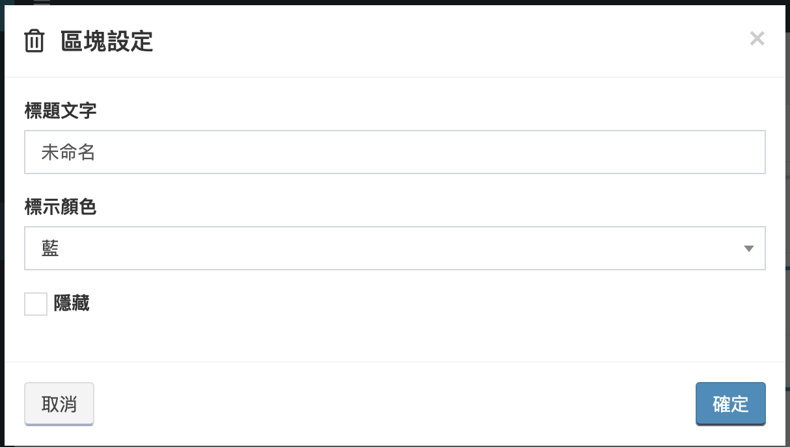
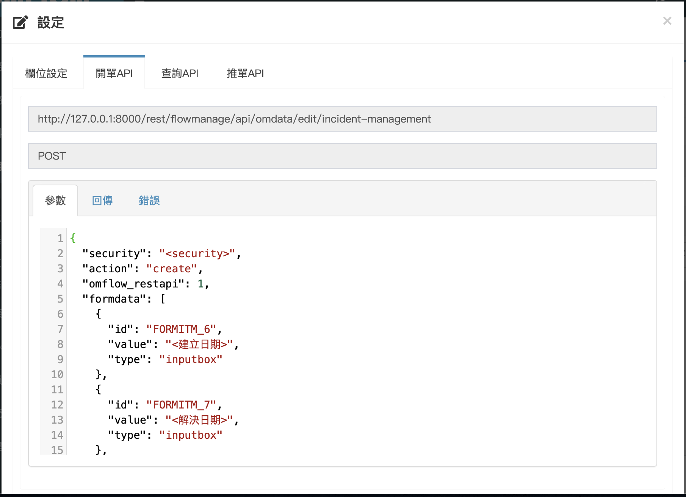

# アプリ管理

## アプリ設計

ここでAPPSとフローを作成し、ユーザーが使用できるようにリリースができます。


この記事では、主に各ページの機能を紹介しますが、アプリをゼロから構築する方法については、[クイックスタート](https://doc.omflow.com.tw/v/japan/4/3#jian-li-ying-yong)を参照してください。


### アプリのリスト

各アプリは複数のフローを持つコンテナと見なすことができ、アプリのリストページの機能は以下のように導入されています。

1. **新規**：新しいAPPS
2. **削除**：チェックしたアプリを削除する
3. **リリース**：設計されたアプリをリリースする
4. **フィルタ**：キーワードを検索し、属性をフィルタリングして、一度にデータ数を表示します
5. **かんげん**：フィルターをデフォルトに戻す
6. **インポート**：アプリをインポートする
7. **エクスポート**：チェックしたアプリをエクスポートする
8. **ダウンロード**：公式クラウドのアプリをダウンロードする
9. **設定：**修改應用名稱與分權設定。


分權設定：

讓指定角色在不給予**應用管理權限**的情況下，能夠編輯、上架該應用。


### 流れリスト

アプリのリスト任意アプリをクリックして、流れリストページに入ります。


このリストに表示されるフローは、サブ流れと区別するために、まとめて主流れと呼ばれます。


流れリスト機能の概要：

1. **新規**：新しいフロー
2. **コピー**：チェックしたフローを別のアプリにコピー
3. **削除**：フローを削除
4. **篩選**：キーワードを検索し、一度にデータ数を表示します
5. **還原**：フィルターをデフォルトに戻す
6. **套件：**表列該應用所有流程需要的套件
7. **語言**：匯入、匯出翻譯後的語言包

### 新規/変更フロー - 引数設定

新規またはフローリストをクリックして、フローの新規作成/編集ページに入ります。

1. **流れ名**：流れの名
2. **API路徑：**外部系統呼叫時使用的路徑\(上架後無法更動\)。
3. **說明**：流れの説明
4. **LOG**：各フローポイントの入力と出力を記録するかどうか
5. **API**：APIを介して他の関数やシステムがフローを呼び出せるようにするかどうか。
6. **任務を作成するか**：このフローによって生成されたデータが私の任務ページに表示されますか（[私の任務](https://doc.omflow.com.tw/v/japan/5/2)を参照する）
7. **現在の流れと進行状況を表示する**：フォームに機能ボタンを表示するかどうか。
8. **フォーム資料の操作履歴を表示する**：フォームに機能ボタンを表示するかどうか。
9. **アタッチメント**：フォームに機能ボタンを表示するかどうか。
10. **資料の関連付けを表示**：フォームに機能ボタンを表示するかどうか。
11. **日誌を記録と表示**：フォームに機能ボタンを表示するかどうか。
12. **表單內快速操作確認視窗：**當使用者在表單內使用快速操作時，是否彈出確認視窗。

上記7〜12の[APPS](https://doc.omflow.com.tw/v/japan/5/7)を参照してください

### 新規/変更フロー - 権限設定

リストには、フローの権限を持つロールが表示されます。

* **新規**：既存のロールを追加し、このロールにこのフローの権限を付与します。
* **削除**：チェックされたロールからこのフローの権限を削除します。

ロールと権限の設定については、[ユーザー管理](https://doc.omflow.com.tw/v/japan/5/8#jiao-se-guan-li)を参照してください。以下の点に注意してください。

* **検分権限**：このフローは、_**目次 &gt; APPS**_ に表示され、フローの全リストを表示できます。
* **新規権限**：フローのフォームを作成できます。
* **変更権限**：フォームが手動フローポイントに入ると、フォームを次のステップに推進できます。
* **削除権限**：フローのフォームを削除できます。


**権限は一緒に使用する必要があります。新しい権限のみがあり、表示権限がない場合、ユーザーはプロセスを表示できないため、データを追加できません。**


**進階設定：**

在某些特定情況下，希望使用者只能看到某些特定的單，此時就能使用進階設定的表單檢視規則。

**一、檢視所有**

即使在限制的情況下，也會需要類似管理員的角色出現，這些人要能檢視該流程的全部資料，此時就是在該項目下選擇指定的組織、角色、使用者。

**二、符合個人資訊**

此類型較常使用於資產單，如下圖所選，當受派人等於使用者的名稱時，該使用者才能看到該筆單。

**三、符合條件**

最後則是當指定欄位符合條件時，後方選擇的組織、角色、使用者可以看到該筆單。

使用的範例情境如：  
當狀態是**處理中**，只有**工程師**能看到。  
當狀態是**審核中**，只有**主管**能看到。


上述三種檢視規則，其每條規則都是各自成立，也就是說，當使用者符合任一條規則時，他就能看到該筆單。


### 新規/変更フロー - フォーム設計

ユーザーがフィールドを入力して計算および適用のフローに取り込むためのフィールドを設計します。


**フォームを設計する必要はありません。フローでユーザーが情報を入力する必要がない場合は、空白のままにすることができます。**


區塊功能介紹：

1. **新增欄位**：在區塊中新增欄位。
2. **設定**：設定區塊。
3. **刪除**：刪除區塊。

區塊設定：

* **タイトル**：ブロックのタイトル
* **表示色**：ブロック上線の色
* **隠す**：ブロック全体を非表示にするかどうか

デザイナーがフォームに配置したい特定の情報を持っているが、ユーザーにそれを表示または変更させたくない場合は、書き込みフィールドをブロックに配置し、ブロック全体を非表示にします。

新しいフィールドを追加するには、ブロックまたはハーフブロックの`＋`をクリックします。

欄位設定：

1. **設定**：設定欄位。
2. **刪除**：刪除欄位。

フィールドの設定はプロジェクトごとに異なりますが、現在、次のタイプのフィールドがあります。

#### 一、入力ボックス

* **フィールド名**：フィールドの名前
* **注釈**：フィールドの説明がプレースホルダーとして表示されます。
* **デフォルト**：フィールドに導入されたデフォルト値
* **タイプ**：文字、数字、パスワード、唯一の値、URL、メールアドレスに分割
* **フォーマットチェック\(REGEX\)**：正規表現の文法を入力した後、ユーザーがフィールドに入力すると、システムは文法に従ってコンテンツが一貫しているかどうかをチェックし、準拠していない場合、ユーザーの操作は拒否されます。
* **必要**：データが作成または推進拡張されると、必須フィールドがチェックされます。値が空の場合、操作は拒否されます。
* **読み取り専門**：チェック後、ユーザーはこのフィールドのみを表示でき、変更することはできません。
* **隠す**：フィールドを非表示にします。 （ブロックの非表示に似ていますが、ここでは1つのフィールドのみが非表示になっています）

#### 二、**複数行入力**

* **行数**：この調整は通常、フォームレイアウトの美しさを考慮したものであり、ユーザーが入力するコンテンツの長さを制限するものではありません。 ユーザーが入力した内容が設定を超えると、フィールドの横にドロップダウンスクロールが表示されます。

#### 三、**ドロップダウンメニュー**

ドロップダウンメニューに追加のオプションタブがあり、オプションを追加および削除できます。 オプションをドラッグするには、`↕︎`を押し続けます。


**値**はシステム計算に使用され、**表示**はユーザーに表示されます。

ドロップダウンメニューのデフォルト**値**には、**表示テキスト**の代わりに値が入力されます。


#### 四、**チェックフィールド**

単一選択と複数選択は同じ項目であり、設定に複数選択があるオプションをチェックできます。デフォルトは単一選択です。


**チェックされているデフォルト値をカンマ \( , \) で区切ります。**

**例：1,2,3,4**


#### 五、**タイトル**

入力ボックスに似ていますが、**タイトル**が[私の任務](https://doc.omflow.com.tw/v/japan/5/2)リストで使用されます。

#### 六、状態

ドロップダウンメニューに似ていますが、**状態**が[私の任務](https://doc.omflow.com.tw/v/japan/5/2)リストで使用されます。

#### 七、レベル

**ドロップダウンメニュー**に似ていますが、[私の任務](https://doc.omflow.com.tw/v/japan/5/2)リストでは赤、黄、青の3つ固定オプションのみが使用されます。

設計サービスレベルがある場合、レベルはSLAによって制御されます。詳細については、SLAを参照してください。

#### 八、**グループと指定された方**

特別な組み合わせフィールド。このフィールドは[ユーザー](https://doc.omflow.com.tw/v/japan/5/8#yz)と[グループ](https://doc.omflow.com.tw/v/japan/5/8#gurpu)にリンクされており、フィールドで選択する前に作成する必要があります。

* 担当者フィールドを含める：このチェックがオフの場合、グループのみがこのフィールドに入力できます。

このフィールドは、私の任務の作成に影響します。割り当てがグループレベルのみにある場合、グループの全メンバーは私の任務リストにデータを表示します。割り当て先レベルに割り当てられている場合は、ユーザーのみ 私の任務リストで確認できます。


ユーザー/グループが割り当てられている場合、[フローの権限](https://doc.omflow.com.tw/v/japan/5/6#xin-jian-bian-ji-liu-cheng-ye-mian-quan-xian-she-ding)がなくてもデータを推進できます。


#### 九、日期

點擊輸入匡之後，會跳出日曆可以進行選擇。

#### 十、日期/時間

類似於**日期**，但是會有時間可以選。

#### 十一、子查詢

設定查詢其他表單，並將使用者所選擇表單的特定欄位回填。

首先在表單頁籤選擇要查詢的應用、流程

條件、動態條件頁籤進行初步篩選，避免使用者看到一些垃圾資料

條件頁籤輸入的是固定值，動態條件則是會取得當下表單的欄位或是當下的使用者資料。

回填頁籤則是，當使用者選定資料後，將該筆資料的欄位值回填至本單的指定欄位中

#### 十二、運算輸入

將其他欄位的內容經過運算，最終填入運算欄位。


範例情境：

訂購表單中有兩個欄位 -- 價格、數量。

使用者希望當他填入價格與數量後，自動將總價計算出來。


步驟一、點開運算欄位設定。

步驟二、插入變數欄位下拉選單，選擇**欄位:價格**。

步驟三、點擊**插入**按鈕，該變數會跑到上方的運算內容方格中。

步驟四、在運算內容中，剛才插入得變數後方輸入一個 **\*** \(乘法運算符\)，接著再將**欄位:數量**插入至運算內容中，完成運算欄位。

完成後，當使用者開單時，在兩個欄位都輸入內容後，運算欄位會依照設定好的公式進行運算，並回填欄位內容。

#### 十三、組織

下拉選單選擇已經建立的組織，可以設定複選。


**複選的預設值請以半形逗號分隔。**

**例：org1,org2,org3,org4**


#### 十四、使用者

下拉選單選擇已經建立的使用者，可以設定複選。


**複選的預設值請以半形逗號分隔。**

**例：user1,user2,user3,user4**


#### 十五、提示

提醒、警語用欄位，該欄位內容無法被使用者編輯，同樣也無法被流程所使用。  

### 新建/編輯流程頁面-欄位計算規則

將其指定欄位的內容經過運算，最終填入其他指定欄位。


運算規則只會在前端介面進行觸發，流程中修改欄位值或進行欄位回填時，不會觸發這些計算條件。


點擊新增可以新增運算規則。

1. **設定：**設定規則。
2. **刪除：**刪除規則。

**設定：**

進到設定畫面後，可以針對這條規則修改名稱以及新增註解。

**觸發欄位：**

點擊新增來新增觸發欄位。

當使用者填寫表單時，當觸發欄位的值被更動時，就會去檢查觸發條件。

**觸發條件：**

當觸發條件達成時，才會開始進行運算。若觸發條件為空，則會直接進行運算。

**運算：**

運算類型分為四種：數字、日期、日期時間、日期指定時間。

數字的運算邏輯可以參考[欄位設計的運算輸入](6.md#shi-er-yun-suan-shu-ru)。

日期類型只能選擇[日期欄位](6.md#liu-cheng-lie-biao)來進行日期的加減運算。

日期/時間類型只能選擇[日期/時間欄位](6.md#liu-cheng-lie-biao)進行日期與時間的加減運算。

日期指定時間類型比較特殊，這裡只做日期的加減運算，時間則會固定成指定的時間。


範例如下：

開始時間為 2021-01-01 08:00:00  
運算字元為 +   
下方的運算時間為 0-1-1 01:30:00

日期時間類型的結果為：  
2021-02-02 09:30:00

日期/指定時間類型的結果為：  
2021-02-02 01:30:00


**回填：**

將運算完的結果回填至指定欄位。

### 新規/変更フロー - 流れ設計

フロー設計ページに入ると、直接使用できるプリセットフローが表示されます。

最初にいくつかの名詞を定義し、コンポーネントをクリックすると、コンポーネントにさらにいくつかの機能キーが表示されます。 下の図の番号は、次の機能を表しています。

1. 設定：このコンポーネントを設定します
2. コピー：このコンポーネントをコピーします（設定されたパラメーターを含む）
3. 削除：このコンポーネントを削除します（コンポーネントを接続する線を含む）
4. 接続ポイント：他のコンポーネントを接続する

次に、すべてのコンポーネントを1つずつ紹介します。

#### 開始

名前が示すように、フローのソースです。後続のコンポーネントで使用するために、ここでフロー変数を作成することをおすすめします。



表示名：フローを表示するときにユーザーが現在の位置を認識できるように、コンポーネントに名前を付けます。



フィールド値または固定文字列を変数に書き込みます。ここで作成される変数はフロー変数であり、後続の全コンポーネントはこれらの変数を使用できます。

ここでは、デフォルトの入力result = successがあり、その目的は\[検証\]タブで説明されています。



入力されたデータを検証するサブ流れを選択します。 検証が失敗すると　　　　　　　　　　（サブ流れは result！=success を返します）、請求は失敗し、記録は残りません。

この機能には2つの主な目的があります。

一、入力した情報が正しいか確認してください。

二、データをフィルタリングします。



選択した検証フローの開始点の入力フィールドが自動的にここに表示されます（検証タブが選択されていない場合、このフィールドは空になります）。



#### 終了

フローの最後に、フローがこの要素に到達した場合にのみ、フローが他のフローによって呼び出されたとき、フローがエンドポイントに到達したときのみ、データがクローズされます（任務を閉じ、SLA監視を終了するなど）。 実行結果を返します。


通常の状況では、フローはエンドポイントまでスムーズに実行されます。


プロセスが以下の状況に該当する場合は、必ずエンドポイントに接続してください。そうしないと、フローがスムーズに完了しません。

1. フローがサブ流れの場合
2. フローが他のフロープロセスによって呼び出されるとき
3. フローが[データ収集](https://doc.omflow.com.tw/v/japan/5/5)フローの場合



表示名：フローを表示するときにユーザーが現在の位置を認識できるように、コンポーネントに名前を付けます。



フィルタは、大きく3つの側面に分かれています。

一、既存の変数の置き換え、長さの取得など。

二、システムのいくつかのデフォルトフィールドを取得する

三、[引数管理](https://doc.omflow.com.tw/v/japan/5/6#can-shu-guan-li)からシステム引数を取得する


フィルターによって作成された引数は、現在のコンポーネントでのみ使用でき、フロー引数では使用できません。 ！ ！




フローが上記の3つの条件を満たす場合、引数は主流れまたはデータセンターに出力されます。



####  **入力**

滞在ポイントとも呼ばれます。 ここでフローが実行されると、ユーザーが確認してデータを入力し、続行するために停止します（フロントエンドインターフェースまたはAPIを介して進めることができます）。


手動入力を入力する場合、手動推進またはAPI推進のみがフローを続行できます。




表示名：フローを表示したときにユーザーが現在の位置を認識できるように、コンポーネントに名前を付けます。

ログ記録：上記の**実行フロー**[**ログ記録**](https://doc.omflow.com.tw/v/japan/5/6#xin-jian-bian-ji-liu-cheng-ye-mian-can-shu-she-ding)と同じ機能で、**実行フローログ記録**をチェックしない場合、すべてのコンポーネントのログが無効になり、現在のコンポーネントのみに影響します。



フィルタは、大きく3つの側面に分かれています。

一、既存の変数の置き換え、長さの取得など。

二、システムのいくつかのデフォルトフィールドを取得する

三、[引数管理](https://doc.omflow.com.tw/v/japan/5/6#can-shu-guan-li)からシステム引数を取得する


フィルターによって作成された引数は、現在のコンポーネントでのみ使用でき、フロー引数では使用できません。 ！ ！




フローが停止したら、データベースのフィールド値を変更します。ユーザーがフォームを開くと、変更されたコンテンツが表示されます。



フォームデザインでデザインしたフォームを読み込むかどうかを選択できます。

ロードすることを選択した後、現在の停止ポイントに表示されるフォームを変更できます。ユーザーに表示する必要がある現在のコンテンツに合わせて、いくつかのフィールドを削除または追加します。

ロードを選択しない場合、フォームによって設計されたフォームが直接適用されます。



入力されたデータを検証するサブ流れを選択します。 検証が失敗すると　　　　　　　　　　（サブ流れは result！=success を返します）、請求は失敗し、記録は残りません。

この機能には2つの主な目的があります。

一、入力した情報が正しいか確認してください。

二、データをフィルタリングします。



選択した検証フローの開始点の入力フィールドが自動的にここに表示されます（検証タブが選択されていない場合、このフィールドは空になります）。



フローが上記の3つの条件を満たす場合、引数は主流れまたはデータセンターに出力されます。



クイック操作とも呼ばれます。デザインが完了すると、[私の任務](https://doc.omflow.com.tw/v/japan/5/2#ren-wu-lie-biao)リストで使用できるようになります。ユーザーはフォーム画面に入力せずにコンテンツを変更できます。これを使用すると、フィールドの値がデザインに応じて変更され、プロセスが進みます。 この機能を使用して、多くの修正済みの返信と進歩を完了することができます。


それを使用するには、啟用になっているオプションにチェックを入れてください。




同じアクション1



#### フィールド設定

データベースに引数または固定文字列を入力します。 このコンポーネントは、データベースを手動で処理せずに修復する必要がある場合に選択できます。



表示名：フローを表示したときにユーザーが現在の位置を認識できるように、コンポーネントに名前を付けます。

ログ記録：上記の**実行フロー**[**ログ記録**](https://doc.omflow.com.tw/v/japan/5/6#xin-jian-bian-ji-liu-cheng-ye-mian-can-shu-she-ding)と同じ機能で、**実行フローログ記録**をチェックしない場合、すべてのコンポーネントのログが無効になり、現在のコンポーネントのみに影響します。



フィルタは、大きく3つの側面に分かれています。

一、既存の変数の置き換え、長さの取得など。

二、システムのいくつかのデフォルトフィールドを取得する

三、[引数管理](https://doc.omflow.com.tw/v/japan/5/6#can-shu-guan-li)からシステム引数を取得する


フィルターによって作成された引数は、現在のコンポーネントでのみ使用でき、フロー引数では使用できません。 ！ ！




引数または文字列にデータを埋め戻します。



開始点の入力と同様に、ユーザーが更新したフィールドの内容は、後続のコンポーネントが使用するプロセス変数として出力されます。



####  欄位/變數篩選

將變數或是欄位進行簡單的置換或是取得系統參數與預設欄位，再輸出給其他流程點使用。



顯示名稱：給予該元件一個名稱，方便使用者檢視流程時辨識當前位置。

紀錄Log：與[前面](6.md#xin-jian-bian-ji-liu-cheng-ye-mian-can-shu-she-ding)介紹過的_**執行過程記錄**_作用相同，當_**執行過程記錄**_沒勾選時，全部元件上的紀錄Log都會失效，而紀錄Log只會影響到當前元件。



篩選大致分為三個方面：

一、對現有變數做置換、取長度等，例如：轉成大寫、取開頭字元...

二、取得系統的一些預設欄位，例如：開單人、取得單號...

三、從[參數管理](6.md#can-shu-guan-li)取得系統參數


**篩選所建立的變數，只有當前元件能使用，並非流程變數！！！**




將篩選後的變數輸出給其他元件使用。



#### **流れ呼び**

呼叫一個同應用底下的其他流程，當該流程進入結束點時，本流程才會進續前進。



表示名：フローを表示したときにユーザーが現在の位置を認識できるように、コンポーネントに名前を付けます。

判定異常時の行為：フローの実行時にコンポーネントでエラーが発生した場合、エラーを無視してフローを続行するかどうか。

ログ記録：上記の**実行フロー**[**ログ記録**](https://doc.omflow.com.tw/v/japan/5/6#xin-jian-bian-ji-liu-cheng-ye-mian-can-shu-she-ding)と同じ機能で、**実行フローログ記録**をチェックしない場合、すべてのコンポーネントのログが無効になり、現在のコンポーネントのみ



主流れを選択します。



主流れを選択すると、フォームフィールドとフローの開始点入力がこのタブに表示されます。


**値を入力しない場合、システムはデフォルトで空の文字列を入力します。**




フローを選択すると、フローのエンドポイント出力がこのタブに表示されます。 

必要な出力を選択し、後続のコンポーネントで使用できるように現在のフローのフロー引数に入れます。



#### サブ流れ

呼叫當前主流程的子流程，當該流程進入結束點時，本流程才會進續前進。



表示名：フローを表示したときにユーザーが現在の位置を認識できるように、コンポーネントに名前を付けます。

判定異常時の行為：フローの実行時にコンポーネントでエラーが発生した場合、エラーを無視してフローを続行するかどうか。

ログ記録：上記の**実行フロー**[**ログ記録**](https://doc.omflow.com.tw/v/japan/5/6#xin-jian-bian-ji-liu-cheng-ye-mian-can-shu-she-ding)と同じ機能で、**実行フローログ記録**をチェックしない場合、すべてのコンポーネントのログが無効になり、現在のコンポーネントのみ



サブ流れを選択します。



サブ流れを選択すると、フォームフィールドとフローの開始点入力がこのタブに表示されます。


**値を入力しない場合、システムはデフォルトで空の文字列を入力します。**




サブ流れを選択すると、フローのエンドポイント出力がこのタブに表示されます。

 必要な出力を選択し、現在のフローのフロー引数に入れて、後続のコンポーネントで使用できるようにします。



####  **コード**

撰寫一段python程式碼讓資料中心/收集器執行。



表示名：フローを表示したときにユーザーが現在の位置を認識できるように、コンポーネントに名前を付けます。

欠いているパッケージを自動的にインストールする：システムがパッケージが外部からインストールされていることを検出した場合、pipを介して自動的にインストールするかどうか。

判定異常時の行為：フローの実行時にコンポーネントでエラーが発生した場合、エラーを無視してフローを続行するかどうか。

分散計算\(**オープンソース版にはこの機能はありません**\)：このオプションをオンにすると、サーバーはコードをグループにスローし、[分散計算](https://doc.omflow.com.tw/v/japan/5/5#shou-ji-qi-shou-ji)のコレクターとして実行します。

ログ記録：上記の**実行フロー**[**ログ記録**](https://doc.omflow.com.tw/v/japan/5/6#xin-jian-bian-ji-liu-cheng-ye-mian-can-shu-she-ding)と同じ機能で、**実行フローログ記録**をチェックしない場合、すべてのコンポーネントのログが無効になり、現在のコンポーネントのみ



フィルタは、大きく3つの側面に分かれています。

一、既存の変数の置き換え、長さの取得など。

二、システムのいくつかのデフォルトフィールドを取得する

三、[引数管理](https://doc.omflow.com.tw/v/japan/5/6#can-shu-guan-li)からシステム引数を取得する


フィルターによって作成された引数は、現在のコンポーネントでのみ使用でき、フロー引数では使用できません。 ！ ！




引数/文字列/フィールドの値をPythonに入力します。以下の例は、その使用方法を示しています。

pythonタブに入力されたコードが

c = a + b

このとき、入力は以下に示すようにa、b、cを取り込みます。

最後に、c = 12の結果を取得します

注1：cを取り込むと、pythonからcをプロセスに戻すことができるようになります。

注2：インポートされた引数はすべて文字列であるため、コードで必要なデータ型に変換する必要があります。



必要なPythonコードを記述します。

コードの最終結果の戻りは戻りに依存しませんが、以下に示すように、結果をキャッチするために入力タブの変数を最も外側のレイヤーに書き込む必要があります。




Pythonの実行結果を取得し、フロー引数を書き戻します。


ここに入力できるのは、入力タブを通過した引数のみです出！




#### **外部流れ**

リリースしたアプリのフローを呼び出し、フローが終点に到達するとフローを継続します。



表示名：フローを表示したときにユーザーが現在の位置を認識できるように、コンポーネントに名前を付けます。

判定異常時の行為：フローの実行時にコンポーネントでエラーが発生した場合、エラーを無視してフローを続行するかどうか。

ログ記録：上記の**実行フロー**[**ログ記録**](https://doc.omflow.com.tw/v/japan/5/6#xin-jian-bian-ji-liu-cheng-ye-mian-can-shu-she-ding)と同じ機能で、**実行フローログ記録**をチェックしない場合、すべてのコンポーネントのログが無効になり、現在のコンポーネントのみ



リリースされているフローを選択します。



主流れを選択すると、フォームフィールドとフローの開始点入力がこのタブに表示されます。


**値を入力しない場合、システムはデフォルトで空の文字列を入力します。**




フローを選択すると、フローのエンドポイント出力がこのタブに表示されます。 

必要な出力を選択し、後続のコンポーネントで使用できるように現在のフローのフロー引数に入れます。



####  **条件判断**

ルートを判断します。



表示名：フローを表示したときにユーザーが現在の位置を認識できるように、コンポーネントに名前を付けます。

ログ記録：上記の**実行フロー**[**ログ記録**](https://doc.omflow.com.tw/v/japan/5/6#xin-jian-bian-ji-liu-cheng-ye-mian-can-shu-she-ding)と同じ機能で、**実行フローログ記録**をチェックしない場合、すべてのコンポーネントのログが無効になり、現在のコンポーネントのみ



フィルタは、大きく3つの側面に分かれています。

一、既存の変数の置き換え、長さの取得など。

二、システムのいくつかのデフォルトフィールドを取得する

三、[引数管理](https://doc.omflow.com.tw/v/japan/5/6#can-shu-guan-li)からシステム引数を取得する


フィルターによって作成された引数は、現在のコンポーネントでのみ使用でき、フロー引数では使用できません。 ！ ！




以下の特性があります。

1. 線が引かれた後、ルールが表示されます。
2. ルールで表示される「FITEM-？」は、各コンポーネント画面の左上に表示されます。
3. ルールの判断はすべてifsです。つまり、2つのルールが確立された場合、後者のルールに従います。
4. 再構築する行を削除する場合は、ルールを再定義する必要があります。



#### **非同期処理**

フローが互いに影響を与えずに同時に複数の操作を実行できるようにします。


非同期処理後に生成されたフロー引数は、他のブランチと共有できません。




表示名：フローを表示したときにユーザーが現在の位置を認識できるように、コンポーネントに名前を付けます。

ログ記録：上記の**実行フロー**[**ログ記録**](https://doc.omflow.com.tw/v/japan/5/6#xin-jian-bian-ji-liu-cheng-ye-mian-can-shu-she-ding)と同じ機能で、**実行フローログ記録**をチェックしない場合、すべてのコンポーネントのログが無効になり、現在のコンポーネントのみ



設定なしで現在他のコンポーネントにプルされているラインのみが表示されます。



#### **非同期処理して纏める**

並行して出て行くブランチを元に戻し、ブランチの1つをメインラインとして選択できるので、ブランチのフロー引数が保存されます。同じ名前の引数がある場合、メインラインがメインラインになります。


コレクションポイントが設計されている場合、次のフローに進む前に、コレクション要素に接続されているすべてのブランチを完了する必要があります。




表示名：フローを表示したときにユーザーが現在の位置を認識できるように、コンポーネントに名前を付けます。

ログ記録：上記の**実行フロー**[**ログ記録**](https://doc.omflow.com.tw/v/japan/5/6#xin-jian-bian-ji-liu-cheng-ye-mian-can-shu-she-ding)と同じ機能で、**実行フローログ記録**をチェックしない場合、すべてのコンポーネントのログが無効になり、現在のコンポーネントのみ



収束点に接続されているすべての支線が表示されます。そのうちの1つを幹線として選択してください。チェックされていない場合、最後に完了した支線が幹線として使用されます。



#### 動的並列処理

プロセスが互いに影響を与えることなく、同じルートで同時に複数の操作を実行できるようにします。


動的並列処理後に生成されたプロセス変数は、他のブランチで共有できません。




表示名：ユーザーがプロセスを表示するときに現在の位置を認識しやすいように、コンポーネントに名前を付けます。

ログ：上記の実行プロセスログと同じ機能です。実行プロセスログがチェックされていない場合、すべてのコンポーネントのログログは無効になり、ログログは現在のコンポーネントにのみ影響します。



緯線の数を決定するために、フィールドまたは変数または固定値を指定します。

配列を選択するときの入力値の例は次のとおりです：

A、B、C、D ===&gt;並列4回

値を選択する場合の入力値の例は次のとおりです。 

4 =====&gt;並列4回



変数またはフィールドを選択し、切断後に配列をブランチに分割します。

例は次のとおりです。  
変数Aの値は：ap-server,db-server,web-server  
変数Bの値は次のとおりです。10.1.1.1,10.1.1.2,10.1.1.3  
変数Cの値は：Jack,Ian

3つのポイントに分割した後、単語は次の値を取得します。  
ブランチ1： A\(ap-server\), B\(10.1.1.1\), \(Jack\)  
ブランチ2：A\(db-server\), B\(10.1.1.2\), C\(Ian\)  
ブランチ3：A\(web-server\), B\(10.1.1.3\), C\(""\)




すべてのブランチが完了すると、次のプロセスが続行されます。


#### 動的集計

並行して出て行くブランチは元に戻すことができ、最後に完成したブランチがメインラインになります。マージする必要のある変数がある場合は、出力タブで設定する必要があります。そうでない場合は、メインラインがメインラインになります。



表示名：ユーザーがプロセスを表示するときに現在の位置を認識しやすいように、コンポーネントに名前を付けます。

ログ：上記の実行プロセスログと同じ機能です。実行プロセスログがチェックされていない場合、すべてのコンポーネントのログログは無効になり、ログログは現在のコンポーネントにのみ影響します。

出力json形式：出力タブのデータを文字列型json形式に変更します。

「、」文字を置き換える：出力タブの変数値またはフィールド値の「、」（半分の形のコンマ）を他の文字に置き換えます。



マージして別の変数に出力するすべてのブランチの共通フィールドまたは変数を選択します。

出力例は次のとおりです。  
1行目： "A"  
2行目："B,D"  
3行目："X，Y"

結合された変数の出力は："A,B,D,X，Y"  
\[設定\]タブで\[jsonに変換\]をオンにすると、出力は次のようになります。："\['A', 'B,D', 'X，Y'\]"  
\[設定\]タブで\[置換\]と\[ooo\]を選択すると、出力は次のようになります。："A,BoooD,X，Y"



####  **一時的に停止**

フローはnミリ秒間一時停止します。



数値引数を取り込みます。



入力が空の場合は、デフォルト値を使用します。



#### **ダイレクト職務**

このコンポーネントは、[組織図管理](https://doc.omflow.com.tw/v/japan/5/8#ldap-jian-shi-mian-fei-ji-qi-ye-ban-1)と[ユーザー管理](https://doc.omflow.com.tw/v/japan/5/8#jiao-se-guan-li)にリンクされています。「ユーザー番号」と「職務名」を入力すると、ユーザーのグループの上位レベルに最も近いジョブ名を検索し、ジョブの「ユーザー番号、グループ番号」を返すことができます 」



表示名：フローを表示したときにユーザーが現在の位置を認識できるように、コンポーネントに名前を付けます。



職務名とユーザー番号を入力します。



コンポーネントは、組織図で見つかったユーザー番号、グループ番号を返します。



#### 部門職務

このコンポーネントは、[組織図管理](https://doc.omflow.com.tw/v/japan/5/8#ldap-jian-shi-mian-fei-ji-qi-ye-ban-1)と[ユーザー管理](https://doc.omflow.com.tw/v/japan/5/8#jiao-se-guan-li)にリンクされています。「グループ番号」と「職務名」を入力すると、グループの下位レベルに最も近いジョブ名を検索し、ジョブの「ユーザー番号、グループ番号」を返すことができます。



表示名：フローを表示したときにユーザーが現在の位置を認識できるように、コンポーネントに名前を付けます。



職務名とグループ番号を入力します。



コンポーネントは、組織図で見つかったユーザー番号、グループ番号を返します。



### 新規/変更フロー - サブ流れ

サブ流れのタブに入ると、サブ流れのリストが表示されます。サブ流れの主な機能は次のとおりです。

* 主流れの読みやすさを簡素化および改善する
* 主流れでのみ呼び出すことができます
* サブ流れのコンポーネントカテゴリは主流れと同じです。上記の概要を参照してください

## アプリがリリースされた

リリースされているアプリ管理の画像。

### アプリのリスト

アプリがリリースにある場合、各アプリがここに表示され、以下の機能が導入されます。

1. **撤去**：すでにリリースされているアプリをリストから撤去
2. **フィルタ**：キーワードを検索し、一度にデータ数を表示します
3. **かんげん**：フィルターをデフォルトに戻す
4. **エクスポート**：チェックしたアプリをエクスポートし、アプリ設計にインポートします。
5. **修改：**修改該版本應用的備註
6. **紀錄：**點擊之後，會顯示所有曾經上架過的應用\(包含所有版本\)。

### 流れリスト

アプリリストをクリックすると、アプリのフローリストに接続します。

フローリスト機能の概要：

1. **啟用**：フローがチェックされると、バッチが有効になります。
2. **停止**：フローがチェックされると、バッチは無効になります。 フローが非アクティブ化されると、進行中の任務が中断され、フローに再度開始したり、推進したりすることはできません。

上記の画像を注意深く見ると、状態、LOG、API、リストの最終設定がすべてクリック可能なボタンであることがわかります。

1. **状態**：クリックすると、啟用と停止が切り替わり、効果は上記のリストの啟動と停止と同じです。
2. **LOG**：**実行フロー記録**の啟用/停止は、前の[フロー設計の引数設定](https://doc.omflow.com.tw/v/japan/5/6#xin-jian-bian-ji-liu-cheng-ye-mian-can-shu-she-ding)で導入された機能と同じで、動的な変更にのみ便利で、再リストする必要はありません。
3. **API**：APIの啟用/停止は、フロー設計の引数設定にも導入されています。
4. **設定**：フィールド設定とAPIフィールドに分けて、概要は次のとおりです。

フィールド設定の目的は、[Apps](https://doc.omflow.com.tw/v/japan/5/7)のリストに表示されるフィールドを変更することです。

データをクリエートか、APIを介して注推進する場合は、ここで必要なデータ形式を見つけることができます。

### フローフォームのリスト

フローをクリックすると、フォームリストを入力できます。データがクリエートされるたびに、このリストにデータが生成されます。

フォームを実行すると、灰色の状態で表示され、実行が完了していない場合やエラーが発生した場合は、データの最後に編集オプションが表示され、クリックできます。

\[編集\]をクリックすると、シートの現在のエラーポイントの入力と出力が表示されます。この時点で、引数を手動で変更できます。変更が完了したら、\[確認する\]をクリックしてフローを進めます。

## スケジュール設定

リリースされたフローについては、定期的に請求するようにスケジュールを設定できます。

### 新規

スケジュールリストページに入ったら、\[新規\]ボタンをクリックして新しいスケジュールを作成します。

すでにシェルフにあるフローを選択します。フローにデザインフォームがある場合は、フロー名の後にフォームのコンテンツ用の追加のボタンがあります。

フォームの内容をクリックして、このフロー用に設計されたフォームを表示します。入力後、\[確認する\]をクリックしてスケジュールを作成します。 その後、入力内容に応じてスケジュールが請求されます。

### 編集

作成されたスケジュールがスケジュールリストに表示され、状態フィールドの下に啟用/停止があり、すばやく操作できます。

リストの最後にある編集ボタンをクリックして、スケジュールを編集します。

## 引数管理

フローで引数が使用されます。このフローは、一部のコンポーネントのフィルタータブで引数を取得することで使用できます。引数は、バッチでインポートおよびエクスポートすることもできます。


サーバーIPなど、多くのフローが同じ引数値を使用する必要がある場合は、この関数を使用することをお勧めします。


新增參數：

1. **名稱**：參數名稱。
2. **說明**：參數的說明。
3. **參數值**：參數的值。
4. **遮罩**：選擇為是時，參數值在列表中會顯示成 ⋯⋯

## SLA管理

SLA管理は、指定されたフローを監視するために使用されます。データがクリエートされるか推進されると、フィールドの内容が変化してSLAが触発されます。このとき、データのレベルと発行イベントが触発条件に従って変更され、指定された通知を送信するためのレターが送信されます 人事。

### 数値測定

特別な機能を紹介します：

* **通知主旨**：メールの件名。
* **通知內容**：メールの内容。
* **ロールに通知**：複数の役割を選択でき、ロールのユーザーに通知されます。
* **ユーザーに通知**：複数のユーザーを選択すると、全部に通知されます。
* **クリエーターに通知**：クリエーターに請求書を通知します。

リストされたフローを選択した後、フィールドを選択します。フィールドが提醒ルールを満たしている場合、提醒通知が送信され、データのレベルが黄色のレベルに変わります。ルールを満たしている場合、違反通知が発行され、データが行われますのレベルが赤色に変わります。

高度な触発条件を作成することもしないこともできます。上記のルールは「and」の概念です。

次のように：

* データの説明フィールドが1より大きい場合、件名フィールドは123に等しい - 提醒を触発
* データの説明フィールドが2より大きい場合、件名フィールドは345に等しい - 触発しない
* データの説明フィールドが2より大きい場合、件名フィールドは123に等しい - 提醒を触発

### 時間測定

時間測定は数値測定とは異なり、触発条件と終了条件の数が多く、触発条件に到達するとタイミングが開始され、終了条件が満たされるとタイミングが終了します。

タイミングが提醒ルールを超えた場合は、レベル番号を変更し、事件リストを作成し、通知を送信し、違反を超えたときに同じことを行います。


触発条件が設計されていない場合は、データがクリエートされて触発されることを意味します。

終了条件が設計されていない場合は、データがクローズされていることを意味します。


## 

