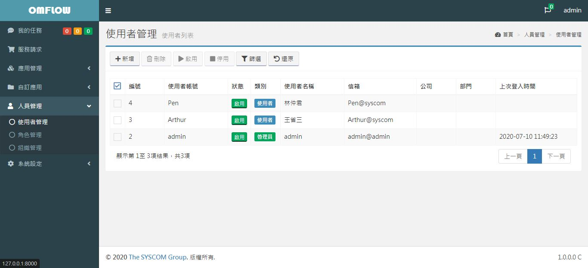
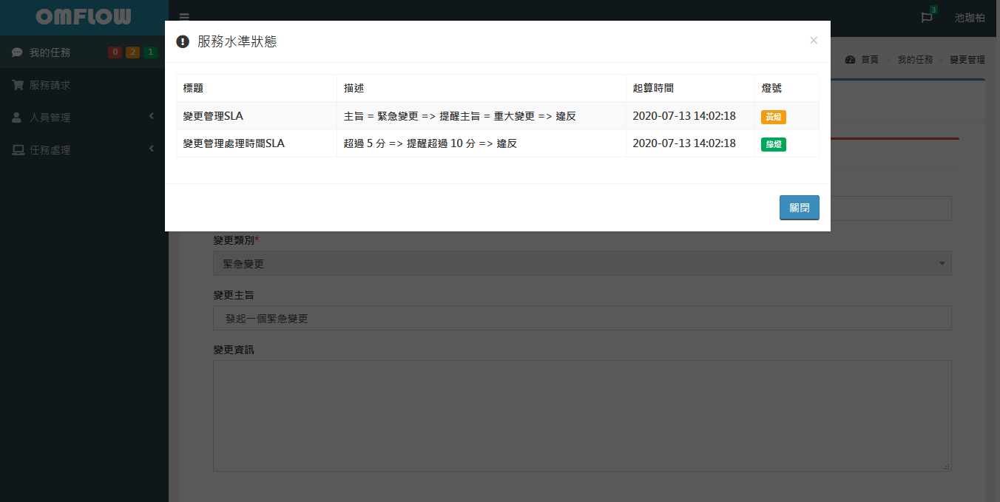

# 人員管理

## 使用者管理

進入 _**人員管理>使用者管理**_ 後可以看到以下畫面，你可以在這裡管理系統內的所有使用者，使用者類別有管理員、使用者和LDAP三種，系統預設只會有一個使用者為管理員類別，管理員擁有系統內所有的權限不受任何限制，其他類別受到所有的權限限制，將使用者加入**角色**才能使其擁有權限。

#### 新增使用者

於_**使用者管理**_頁面按下新增按鈕，進入使用者資料設定的頁籤後填入必填欄位，按下儲存按鈕後跳出完成視窗後即建立完成，關閉後即跳轉回_**使用者管理**_頁面。_帳號_、_密碼_、_名稱_、_電子郵件地址_為必填欄位，在此新增使用者時_密碼_欄位將不受規則限制。

.png>)

#### 編輯使用者

於_**使用者管理**_頁面直接點擊要編輯的使用者欄位，進入使用者資料設定的頁籤，即可修改使用者所有資料，**使用者帳號無法被修改**。

.png>)

使用者無法在此修改自己的密碼，修改自己密碼請參閱[更改密碼](1.md#ge-ren-zi-xun)，擁有_修改使用者_權限的使用者可在此修改其他使用者的密碼。

職代人可選擇一個使用者作為固定職代人，職代人可代替本人使用所有表單相關操作，使用請假系統也可另外選擇職代人，詳細可參考代理機制。

使用者若屬於多個組織可選擇一個為預設組織，在流程內會以預設組織為優先組織，若未設定則系統會選取第一個組織為預設組織。

通知更新頻率為使用者所有通知及資料列表自動更新間隔範圍在5\~60秒。

#### 啟用/停用使用者

於_**使用者管理**_頁面可勾選多位使用者並點擊上方啟用、停用按鈕，批次啟用/停用多位使用者，也可點擊列表內狀態欄位下啟用/停用按鈕，快速改變使用者狀態。

.png>)

.png>)

.png>)

#### 刪除使用者

於_**使用者管理**_頁面可勾選多位使用者並點擊上方刪除按鈕，批次刪除多位使用者。

## 請假紀錄

檢視所有自己的請假紀錄，可勾選決定顯示那些請假紀錄。

.png>)

## 代理紀錄

檢視所有自己代理其他使用者的紀錄，可勾選決定顯示那些代理紀錄。

.png>)

## 角色管理

進入 _**人員管理>角色管理**_ 後可以看到以下畫面，在系統內所有權限都與角色有關係，建立角色後並給予適當的權限，在角色內的所有人皆擁有此角色所設定的權限。包含使用者、組織及角色和各個應用的檢視、新增、刪除、修改的權限。


**擁有新增、刪除或修改的權限，需同時給予檢視權限才能操作。**


.png>)

#### 新增角色

按下**建立**按鈕，輸入角色名稱及說明按下**確定**鍵及建立完成。

#### 編輯角色

點擊列表內欲編輯之角色欄位即可進入頁面編輯角色，所有頁籤的儲存按鍵皆為獨立作用，修改後請務必儲存。

.png>)

.png>)

#### 刪除角色

於_**角色管理**_頁面勾選角色並點擊上方刪除按鈕，刪除角色。

## 組織管理

進入 _**人員管理>組織管理**_ 後可以看到以下畫面，組織主要用於應用設計內的表單填寫受派組織、受派人時使用

.png>)

#### 新增組織

按下**創建**按鈕，選擇所屬組織後輸入組織名稱及說明按下**確定**鍵及建立完成，未選擇所屬組織則為根組織。

#### 編輯組織

點擊列表內欲編輯之組織的名稱即可進入頁面編輯組織，所有頁籤的儲存按鍵皆為獨立作用，修改後請務必儲存。

.png>)

.png>)

#### 刪除組織

於_**組織管理**_頁面勾選組織並點擊上方刪除按鈕，刪除組織。

## AD檢視(免費及企業版)

進入 _**人員管理>AD檢視**_後可以看到以下畫面，這裡主要提供您檢視LDAP匯入的組織及其使用者，詳細設定和創建方式請參照[LDAP設定](9.md#ldap-she-ding)

\
職務管理(免費及企業版) 
---------------------------------------------------------------------------------------------------------

進入 _**人員管理>職務管理**_後可以看到以下畫面，在這裡新增、刪除、修改職務，用於_**組織圖管理**_內設定職務。

.png>)

職務下可建立多個預設權責，在組織圖管理使用時會自動帶入權責。

.png>)

## 組織圖管理(免費及企業版) 

進入 _**人員管理>組織圖管理>企業組織**_後可以看到以下畫面，依照需求新增組織、職務、人員的項目並連線成組織圖，組織底下可以連接有多個部門及職務，職務底下只可以連接人員，點擊項目後上方的齒輪為此項目設定鍵。

.png>)

**設定**按鈕可設定託管組織由哪個組織或哪個使用者審核。

.png>)

編輯組織需先選擇組織，再決定是否託管，託管後的組織無法在_**企業組織**_再連結任何組織、職務與人員，託管的使用者可在左側主選單選擇_**人員管理>組織圖管理>\[受託管的組織]**_編輯該組織底下的組織圖，編輯完成的組織儲存後可做呈核，呈核通過後的組織會合併回企業組織該託管組織底下。

#### 組織設定

選擇組織管理內的組織，組織託管後僅可在企業組織上移動位置，無法對該組織及其底下的組織、職務、人員做設定，直到取消託管，受託管的組織圖示顏色較深。

.png>)

.png>)

#### 職務設定

選擇職務管理上的職務，會帶入職務管理的預設權責，權責可再新增、刪減。

.png>)

#### 人員設定

.png>)

#### 組織圖繪圖

組織圖繪圖會將目前的組織圖輸出成圖片，可選擇繪圖類型。

簡易繪圖: 不顯示已託管組織底下的所有組織、職務與人員。\
完整繪圖: 顯示所有組織及其底下的職務與人員。\
顯示一般組織成員: 顯示該組織在組織管理下的所有成員。

.png>)

#### 匯出/匯入

組織圖可做匯出備份，以供需要時重新匯入使用，受託管組織在匯入時，會檢查最上層組織是否相同才可匯入。
