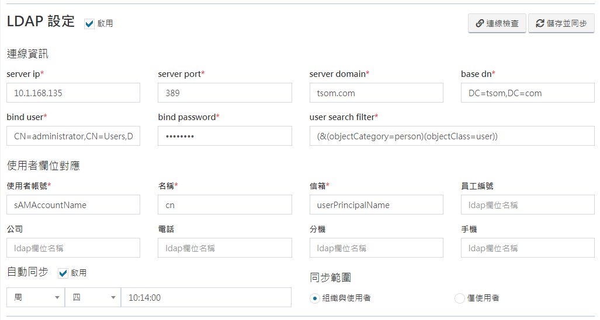

# システム設定

## システム設定

_**システム設定&gt;システム設定**_ ここですべてのシステム関連設定を変更します。管理者のみが設定できます。

### 一般設定

スレッドの最大数とLOGレベルを設定すると、システムはデフォルトでERRORになり、過度のLOG生成を回避します。

### LDAP 設定

LDAP接続関連の設定を入力します。保存後、接続および同期して、すべてのLDAPグループとユーザーを作成できます。同期が完了したら、職務管理に移動して、グループと人員を表示できます。設定を入力したら、最初に設定値と接続が正しいかを確認するための権限をクリックできます。

#### 接続情報

<table>
  <thead>
    <tr>
      <th style="text-align:left">&#x63A5;&#x7D9A;&#x60C5;&#x5831;&#x30D5;&#x30A3;&#x30FC;&#x30EB;&#x30C9;</th>
      <th
      style="text-align:left">&#x30D5;&#x30A3;&#x30FC;&#x30EB;&#x30C9;&#x306E;&#x8AAC;&#x660E;</th>
    </tr>
  </thead>
  <tbody>
    <tr>
      <td style="text-align:left">server ip</td>
      <td style="text-align:left">ActiveDirectory&#x30B5;&#x30FC;&#x30D0;&#x30FC;&#x306E;IP&#x30A2;&#x30C9;&#x30EC;&#x30B9;</td>
    </tr>
    <tr>
      <td style="text-align:left">server port</td>
      <td style="text-align:left">ActiveDirectory&#x30B5;&#x30FC;&#x30D0;&#x30FC;&#x306E;&#x30DD;&#x30FC;&#x30C8;&#x756A;&#x53F7;</td>
    </tr>
    <tr>
      <td style="text-align:left">server domain</td>
      <td style="text-align:left">ActiveDirectory&#x30C9;&#x30E1;&#x30A4;&#x30F3;</td>
    </tr>
    <tr>
      <td style="text-align:left">base dn</td>
      <td style="text-align:left">
        
&#x8A8D;&#x8A3C;&#x7BC4;&#x56F2;&#x3001;&#x4F8B;&#x306F;&#x6B21;&#x306E;&#x3068;&#x304A;&#x308A;&#x3067;&#x3059;&#x3002;

        
1.DC = tsom&#x3001;DC = com

        
2.OU = XXX&#x3001;DC = tsom&#x3001;DC = com

      </td>
    </tr>
    <tr>
      <td style="text-align:left">bind user</td>
      <td style="text-align:left">
        
AD&#x30E6;&#x30FC;&#x30B6;&#x30FC;&#x30A2;&#x30AB;&#x30A6;&#x30F3;&#x30C8;&#x3092;&#x63A5;&#x7D9A;&#x3057;&#x307E;&#x3059;&#x3002;&#x4F8B;&#x306F;&#x6B21;&#x306E;&#x3068;&#x304A;&#x308A;&#x3067;&#x3059;&#x3002;

        
1.AD_connect_user

        
2.CN=AD_connect_user,CN=Users,DC=tsom,DC=com

      </td>
    </tr>
    <tr>
      <td style="text-align:left">bind password</td>
      <td style="text-align:left">AD&#x306B;&#x63A5;&#x7D9A;&#x3059;&#x308B;&#x305F;&#x3081;&#x306E;&#x30E6;&#x30FC;&#x30B6;&#x30FC;&#x30D1;&#x30B9;&#x30EF;&#x30FC;&#x30C9;</td>
    </tr>
    <tr>
      <td style="text-align:left">user search filter</td>
      <td style="text-align:left">
        
&#x30E6;&#x30FC;&#x30B6;&#x30FC;&#x691C;&#x7D22;&#x57FA;&#x6E96;&#x3001;&#x4F8B;&#x306F;&#x6B21;&#x306E;&#x3068;&#x304A;&#x308A;&#x3067;&#x3059;&#x3002;

        
(&amp;(objectCategory=person)(objectClass=user))

      </td>
    </tr>
  </tbody>
</table>

#### ユーザーフィールドマッピング

<table>
  <thead>
    <tr>
      <th style="text-align:center">&#x30E6;&#x30FC;&#x30B6;&#x30FC;&#x30D5;&#x30A3;&#x30FC;&#x30EB;&#x30C9;</th>
      <th
      style="text-align:center">AD&#x30D5;&#x30A3;&#x30FC;&#x30EB;&#x30C9;</th>
    </tr>
  </thead>
  <tbody>
    <tr>
      <td style="text-align:center">username(&#x30E6;&#x30FC;&#x30B6;&#x30FC;&#x30A2;&#x30AB;&#x30A6;&#x30F3;&#x30C8;)</td>
      <td
      style="text-align:center">
        
&#x5FC5;&#x9808;&#x30D5;&#x30A3;&#x30FC;&#x30EB;&#x30C9;

        
&#x4F8B;&#xFF1A;sAMAccountName

        </td>
    </tr>
    <tr>
      <td style="text-align:center">nick_name(&#x540D;&#x524D;)</td>
      <td style="text-align:center">
        
&#x5FC5;&#x9808;&#x30D5;&#x30A3;&#x30FC;&#x30EB;&#x30C9;

        
&#x4F8B;&#xFF1A;cn

      </td>
    </tr>
    <tr>
      <td style="text-align:center">email(&#x30E1;&#x30FC;&#x30EB;&#x30DC;&#x30C3;&#x30AF;&#x30B9;)</td>
      <td
      style="text-align:center">
        
&#x5FC5;&#x9808;&#x30D5;&#x30A3;&#x30FC;&#x30EB;&#x30C9;

        
&#x4F8B;&#xFF1A;mail

        </td>
    </tr>
    <tr>
      <td style="text-align:center">&#x5F93;&#x696D;&#x54E1;ID</td>
      <td style="text-align:center">&#x500B;&#x4EBA;&#x7684;&#x306A;&#x8A2D;&#x5B9A;&#x306B;&#x3088;&#x308B;&#x3068;&#x3001;&#x5FC5;&#x9808;&#x3067;&#x306F;&#x3042;&#x308A;&#x307E;&#x305B;&#x3093;</td>
    </tr>
    <tr>
      <td style="text-align:center">&#x4F1A;&#x793E;</td>
      <td style="text-align:center">&#x500B;&#x4EBA;&#x7684;&#x306A;&#x8A2D;&#x5B9A;&#x306B;&#x3088;&#x308B;&#x3068;&#x3001;&#x5FC5;&#x9808;&#x3067;&#x306F;&#x3042;&#x308A;&#x307E;&#x305B;&#x3093;</td>
    </tr>
    <tr>
      <td style="text-align:center">&#x96FB;&#x8A71;</td>
      <td style="text-align:center">&#x500B;&#x4EBA;&#x7684;&#x306A;&#x8A2D;&#x5B9A;&#x306B;&#x3088;&#x308B;&#x3068;&#x3001;&#x5FC5;&#x9808;&#x3067;&#x306F;&#x3042;&#x308A;&#x307E;&#x305B;&#x3093;</td>
    </tr>
    <tr>
      <td style="text-align:center">&#x62E1;&#x5F35;</td>
      <td style="text-align:center">&#x500B;&#x4EBA;&#x7684;&#x306A;&#x8A2D;&#x5B9A;&#x306B;&#x3088;&#x308B;&#x3068;&#x3001;&#x5FC5;&#x9808;&#x3067;&#x306F;&#x3042;&#x308A;&#x307E;&#x305B;&#x3093;</td>
    </tr>
    <tr>
      <td style="text-align:center">&#x643A;&#x5E2F;&#x96FB;&#x8A71;</td>
      <td style="text-align:center">&#x500B;&#x4EBA;&#x7684;&#x306A;&#x8A2D;&#x5B9A;&#x306B;&#x3088;&#x308B;&#x3068;&#x3001;&#x5FC5;&#x9808;&#x3067;&#x306F;&#x3042;&#x308A;&#x307E;&#x305B;&#x3093;</td>
    </tr>
  </tbody>
</table>

#### 同期範囲

* [ ] 組織とユーザー つまり、AD組織（Organization Unit）が同期され、同期範囲内のユーザーが同期されます。 詳細については、ADビューを確認してください。
* [ ] ユーザーのみ ****同期範囲の使用


組織とユーザーが以前に同期されている場合は、\[ユーザーのみ\]をクリックします。以前に同期されたAD組織は削除されます。


#### 自動同期

スケジュールサイクルは毎週と毎月です。毎週月曜日から金曜日に分割でき、毎月のスケジュールは1日から31日です。スケジュール時間は自由に選択できます。例：土曜日02:00:00。

### **個人データ使用許諾/ソフトウェア使用許諾**

個人データ使用許諾契約およびソフトウェア使用許諾契約を利用して、独自の条件をカスタマイズできます。これらの条件は、新規ユーザーがアカウントを登録するときに同意する必要があります。

### **ライセンス資料**

所有しているライセンスコンテンツがフィールドに表示されます。ライセンスを購入したら、ここにアップロードしてすぐに有効にしてください。

### コレクター設定

現在のホストの場所がフィールドに表示されます。ホストの場所が変更された場合、更新契約を押すと、システムはホストの新しい場所を、報告されたすべてのコレクターに自動的に同期して、コレクターが失われるのを防ぎます。

## _**アタッチメントメンテナンス**_

_**システム設定&gt;アタッチメントメンテナンス**_ここでは、システムにアップロードされたすべてのファイルを表示できます。フィルターを使用して、特定の時間前にファイルを検索、削除して、ホストのスペースを解放できます。

## メインメニュー管理

_**システム設定&gt;メインメニュー管理**_ここで、左側のメニューの順序と位置を調整します。

デフォルトアイテムとすべてのアプリケーションの順序を調整できます。フォルダはフォルダにのみ配置でき、システムデフォルトアイテムにはアプリケーションを配置できません。フォルダにアプリケーションがある場合、それらを削除することはできません。フォルダ名とアイコンはいつでも変更できます。保存後、すべての変更はすべてのユーザーに対して直ちに有効になります。

