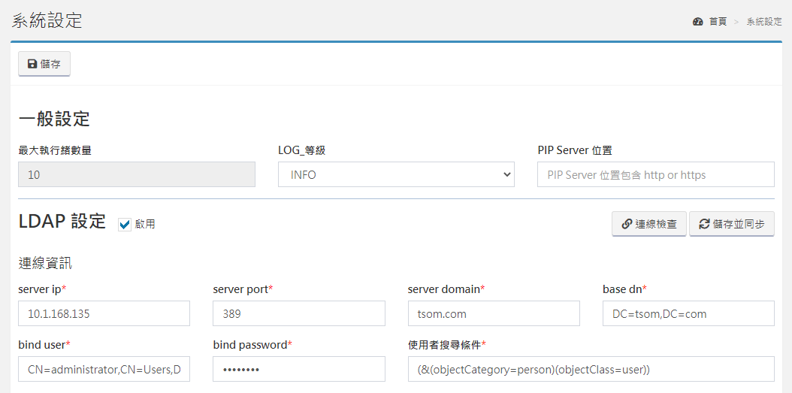

# System Setting

## System setting

_**System Settings&gt;System Settings**_ Change all system related settings here, only the [administrator](8.md#shi-yong-zhe-guan-li) can set.

#### General settings

Set the maximum number of threads and LOG level, the system defaults to ERROR to avoid excessive LOG generation.

#### LDAP settings

Fill in the LDAP connection related settings. After saving, you can connect and create all LDAP organizations and users synchronously. After the synchronization is completed, you can go to [Staff Management](8.md) to view the organizations and personnel. After filling in the settings, you can first click the right to connect and check the test settings Whether the value and connection are correct.

#### Connection information

<table>
  <thead>
    <tr>
      <th style="text-align:left">Connection information</th>
      <th style="text-align:left"><b>Description</b>
      </th>
    </tr>
  </thead>
  <tbody>
    <tr>
      <td style="text-align:left">server ip</td>
      <td style="text-align:left">Active Directory Server IP</td>
    </tr>
    <tr>
      <td style="text-align:left">server port</td>
      <td style="text-align:left">Active Directory Server access port</td>
    </tr>
    <tr>
      <td style="text-align:left">server domain</td>
      <td style="text-align:left">Active Directory Domain</td>
    </tr>
    <tr>
      <td style="text-align:left">base dn</td>
      <td style="text-align:left">
        
Certification scope, ex:

        
1.DC=tsom,DC=com

        
2.OU=XXX,DC=tsom,DC=com

      </td>
    </tr>
    <tr>
      <td style="text-align:left">bind user</td>
      <td style="text-align:left">
        
Connect to AD user account, ex:

        
1.AD_connect_user

        
2.CN=AD_connect_user,CN=Users,DC=tsom,DC=com

      </td>
    </tr>
    <tr>
      <td style="text-align:left">bind password</td>
      <td style="text-align:left">User password to connect to AD</td>
    </tr>
    <tr>
      <td style="text-align:left">user search filter</td>
      <td style="text-align:left">
        
User search criteria, ex:

        
(&amp;(objectCategory=person)(objectClass=user))

      </td>
    </tr>
  </tbody>
</table>

#### User field mapping

<table>
  <thead>
    <tr>
      <th style="text-align:left">User field</th>
      <th style="text-align:left"><b>AD field</b>
      </th>
    </tr>
  </thead>
  <tbody>
    <tr>
      <td style="text-align:left">username(Account)</td>
      <td style="text-align:left">
        
Require

        
ex: sAMAccountName

      </td>
    </tr>
    <tr>
      <td style="text-align:left">nick_name</td>
      <td style="text-align:left">
        
Require

        
ex: cn

      </td>
    </tr>
    <tr>
      <td style="text-align:left">email</td>
      <td style="text-align:left">
        
Require

        
ex: mail

      </td>
    </tr>
    <tr>
      <td style="text-align:left">employee ID</td>
      <td style="text-align:left">Not Require</td>
    </tr>
    <tr>
      <td style="text-align:left">Company</td>
      <td style="text-align:left">Not Require</td>
    </tr>
    <tr>
      <td style="text-align:left">Phone</td>
      <td style="text-align:left">Not Require</td>
    </tr>
    <tr>
      <td style="text-align:left">Extension</td>
      <td style="text-align:left">Not Require</td>
    </tr>
    <tr>
      <td style="text-align:left">Cell phone</td>
      <td style="text-align:left">Not Require</td>
    </tr>
  </tbody>
</table>

#### Synchronization range

* [ ] **Organization and User** Sync Organization Unit and Users.
* [ ] **Only User** Only Sync Users.


If the organization and users have been synchronized before, and then click Only users, The previously synchronized AD organization will be deleted.


#### Auto sync

The scheduling cycle is weekly and monthly. Each week can be divided into Monday to Friday, and the monthly schedule is from 1 to 31 days. The schedule time can be freely selected. Example: Saturday 02:00:00.

### Personal information consent/software use consent

Personal information consent and software use consent can allow you to customize your own terms. These terms must be agreed when a new user registers to register an account.

### Authorized information

The LICENSE content you own is displayed in the field. After purchasing the LICENSE, upload it here and take effect immediately.

### Collector Setting

The current host location is displayed in the field. If the host location is modified, you can press the update agreement, and the system will automatically synchronize the new location of the host to all the collectors that have been reported to prevent the collector from losing contact.

## Attachment maintenance

_**System Settings&gt;Attachment Maintenance**_ Here you can view all the files that have been uploaded to the system. You can use filters to find out the files before a specific time and delete them to free up the use space of the host.

## Main menu management

_**System Settings&gt;Main Menu Management**_ Arrange the order and position of the left menu here.

The order of default items and all applications can be adjusted. Folders can only be placed in folders and applications cannot be placed in system default items. If there are still applications in the folder, they cannot be deleted. The folder name and icon can be modified at any time. All modifications will take effect immediately for all users after saving.

