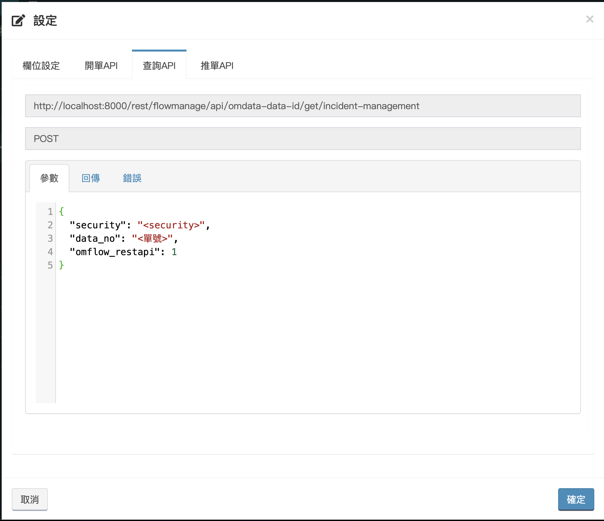

# 快速開單、推單

## 取得API

進入 _**主選單&gt;應用管理&gt;已上架應用**_ ，選擇欲查詢的應用並進入到流程列表。


找到欲查詢的流程，點選最右方的設定。


點擊後會出現介面如下，以下將一一介紹頁籤：


* 欄位設定：自訂該流程的表單列表顯示欄位。
* [開單API](kuai-su-kai-chan-tui-chan.md#kai-chan)：開單時所使用的API格式。
* [查詢API](kuai-su-kai-chan-tui-chan.md#cha-xun)：查詢時所使用的API格式。
* [推單API](kuai-su-kai-chan-tui-chan.md#tui-chan)：推單時所使用的API格式。

## 開單

點開後，選擇「開單API」頁籤，即可看到該流程API範例，如下圖。



**安全碼需帶入&lt;security&gt;，並修改formdata中包含"&lt;&gt;"的內容。**

其中formdata至少須填上必填欄位內容，是否必填由[**應用管理 &gt; 應用設計 &gt; 表單欄位設計**](../5/6.md#xin-jian-bian-ji-liu-cheng-ye-mian-biao-chan-she-ji)決定。


開單成功時，會有兩種回傳。

一、流程的開始點沒有使用[驗證](../5/6.md#kai-shi)功能，此時會回傳data\_no，也稱作單號。

```text
{
  "status": "200",
  "message": "開單成功。",
  "result": "<data_no>"
}
```

二、開始點使用了驗證功能時，不會回傳data\_no。

```text
{
  "status": "200",
  "message": "開單成功。",
  "result": ""
}
```

開單失敗回傳如下所示：

```text
{
  "status": "404",
  "message": "開單失敗。"
}
```

## 附加檔案

開單時，若表單已開啟附加檔案功能，也可同時上傳檔案，如下圖：


Python範例如下：

```text
import requests,json

url = '<開單API網址>'
formdata = [{"id": "FORMITM_2","value": "<輸入>"}]
values={
  "security": "<sevurity>",
  "omflow_restapi": 1,
  "action": "create",
  "formdata": json.dumps(inputjson)
}
files={'files': open('<檔案路徑>','rb')}
requests.post( url, data=values, files=files )
```

## 查詢

選擇「查詢API」頁籤，透過這支API可以查詢資料最新的id，所有開過的單皆需要取得&lt;data\_id&gt;才能進行推單，且_**&lt;data\_id&gt;在表單過程中可能不斷變換或是不只一筆**_，因此在推單先都需要先進行查詢。



查詢成功時回傳如下：

```text
{
  "status": "200",
  "message": "查詢成功。",
  "result": [
    {
      "data_id": "<資料的唯一編號，推單時使用>",
      "stop_chart_text": "<停留的關卡名稱(人工處理點名稱)>"
    },...
  ]
}
```


回傳結果可能不只一個，當流程設計中含有[並行](../5/6.md#liu-cheng-lie-biao)時，可能會一張單會有多個id同時進行，因此需要靠停留點名稱來進行判斷並推單。

註：無論查詢結果是一個還是多個，都是以陣列形式回傳。


查詢失敗時回傳如下：

```text
{
  "status": "404",
  "message": "查詢失敗。"
}
```

## 推單

選擇「推單API」頁籤，可以看到推單的範例。


推單成功時回傳如下：

```text
{
  "status": "200",
  "message": "推單成功。",
  "result": ""
}
```

推單失敗時回傳如下：

```text
{
  "status": "404",
  "message": "推單失敗。"
}
```

