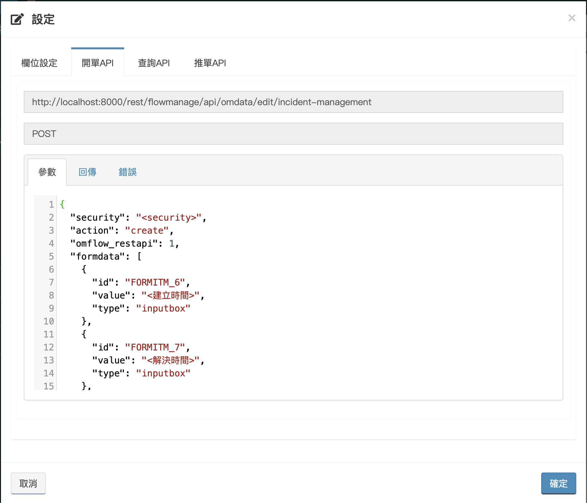
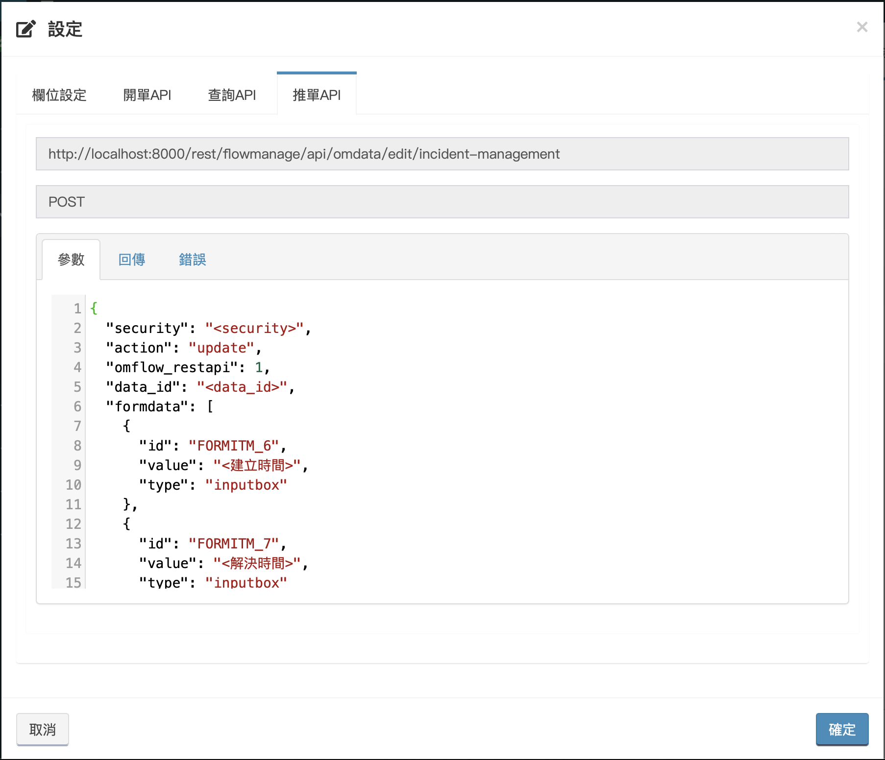

# クイック操作

## APIを取得

_**メインメニュー&gt;アプリケーション管理&gt;アプリがリリースされました**_、クエリを実行するアプリケーションを選択して、プロセスリストを入力します。


クエリを実行するプロセスを見つけて、右端の設定をクリックします。


クリックすると、インターフェースは次のように表示されます。以下では、タブを1つずつ紹介します。


* 列の設定：プロセスのフォームリストの表示列をカスタマイズします。
* [クリエートAPI](kuai-su-kai-chan-tui-chan.md#kai-chan)：請求時に使用されるAPI形式。
* [クエリAPI](kuai-su-kai-chan-tui-chan.md#cha-xun)：クエリ時に使用されるAPI形式。
* [推進API](kuai-su-kai-chan-tui-chan.md#tui-chan)：推進するときに使用されるAPI形式。

## クリエート

クリックした後、\[クリエートAPI\]タブを選択すると、次の図に示すように、プロセスAPIの例が表示されます。




**セキュリティコードをに取り込む必要があり、formdataの"&lt;&gt;"内容を変更する必要があります。**

フォームデータは少なくとも必須フィールドの内容を入力する必要があり、それが必要かどうかは、アプリケーション管理&gt;アプリケーション設計&gt;フォームフィールド設計で決定されます。


クリエートされた場合、2種類の返しあります。

一、検証機能はプロセスの開始時に使用されませんが、このとき、フォームの番号と呼ばれるdata\_noが返されます。

```text
{
  "status": "200",
  "message": "請求成功",
  "result": "<data_no>"
}
```

二、検証機能を開始点として使用した場合、data\_noは返されません。

```text
{
  "status": "200",
  "message": "請求成功",
  "result": ""
}
```

注文を開くことに失敗すると、次のように返されます。

```text
{
  "status": "404",
  "message": "請求失敗"
}
```

## クエリ

\[\[クエリAPI\]タブを選択します。このAPIを使用して、データの最新のIDをクエリできます。開いたすべての注文は、注文を進めるために&lt;data\_id&gt;を取得する必要があり、&lt;data\_id&gt;はフォームプロセス中に常に変更されているか、複数のアイテムである可能性があります 、そのため、注文を進める前に、最初にクエリを実行する必要があります。


クエリが成功すると、次のように戻ります。

```text
{
  "status": "200",
  "message": "検索に成功",
  "result": [
    {
      "data_id": "<注文をプッシュするときに使用されるデータの一意の番号>",
      "stop_chart_text": "<止まっているレベルの名前（手動処理ポイントの名前）>"
    },...
  ]
}
```


複数の結果が返される場合があります。プロセス設計に並列処理がある場合、1つの注文に対して同時に複数のIDが存在する可能性があるため、ストップポイントの名前に基づいて注文を判断し、プッシュする必要があります。

注：クエリの結果が1つ以上かどうかに関係なく、配列の形式で返されます。


クエリが失敗した場合の応答は次のとおりです。

```text
{
  "status": "404",
  "message": "クエリに失敗しました"
}
```

## 推進

「推進API」タブを選択すると、プッシュ注文の例が表示されます。



推進されると、返品は次のようになります。

```text
{
  "status": "200",
  "message": "推單成功",
  "result": ""
}
```

推進失敗した場合、戻りは次のようになります。

```text
{
  "status": "404",
  "message": "推單失敗"
}
```

