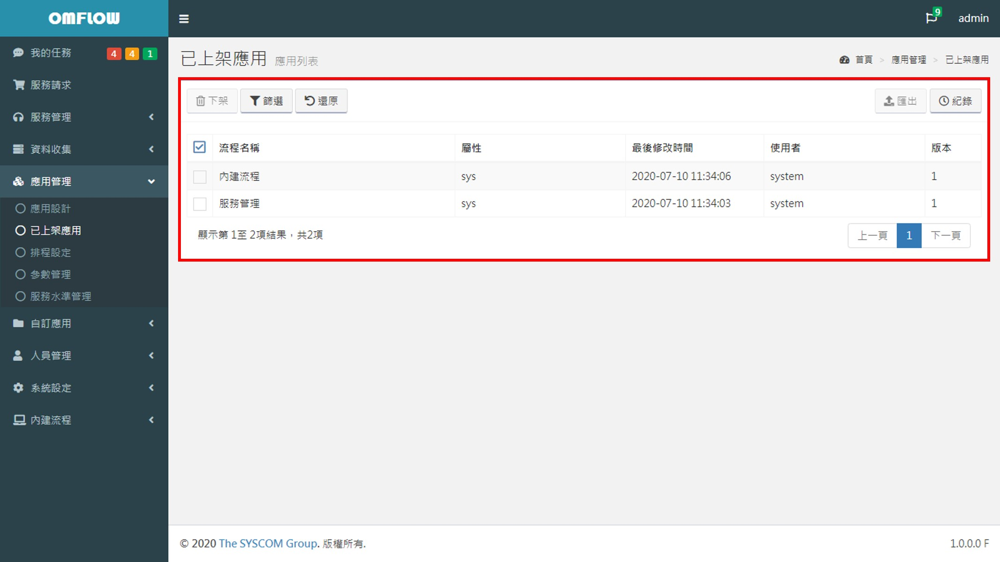
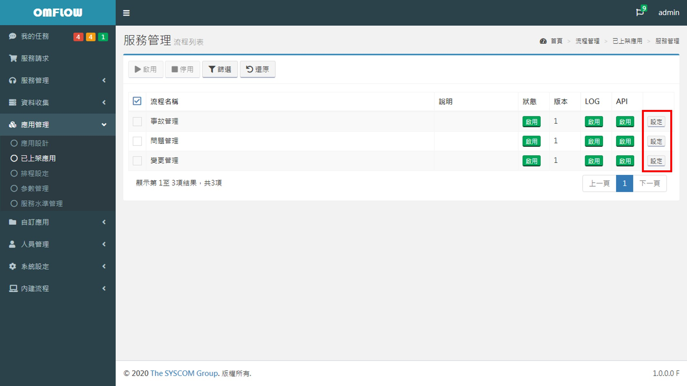
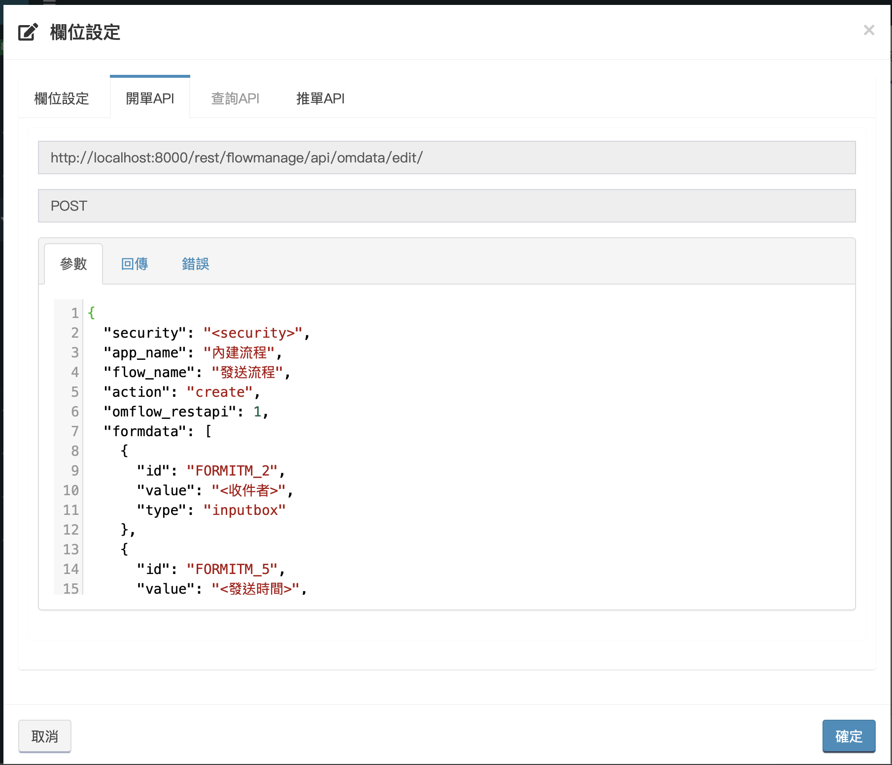
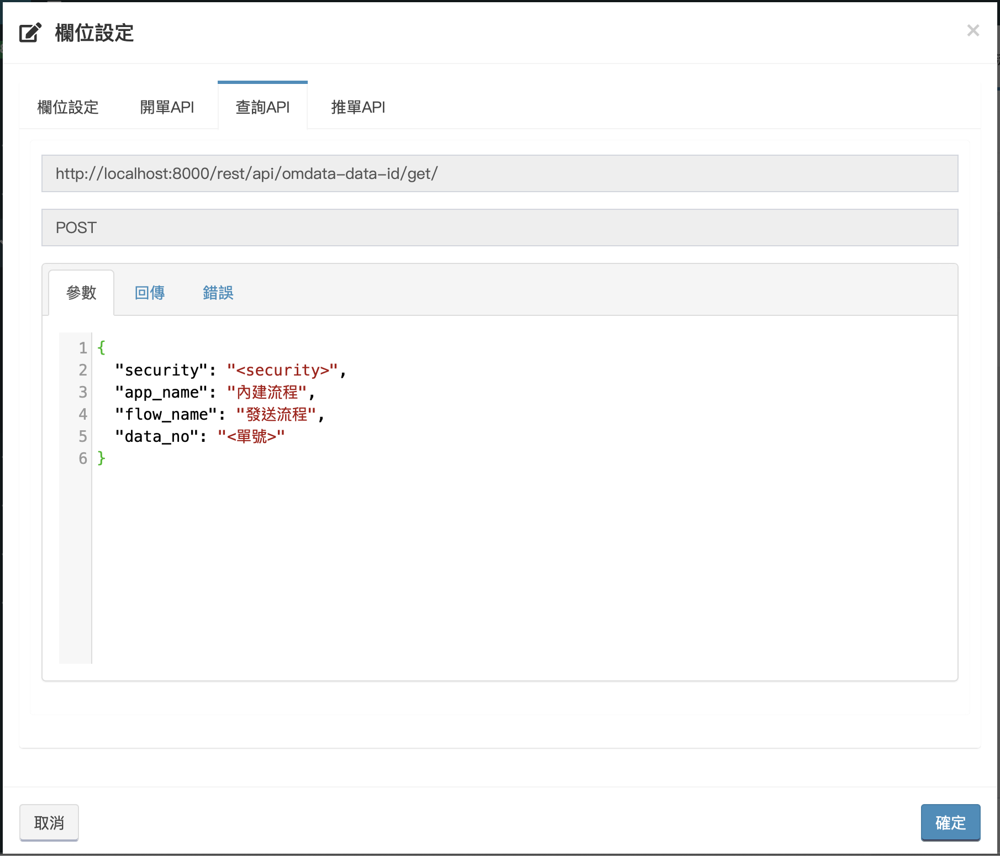
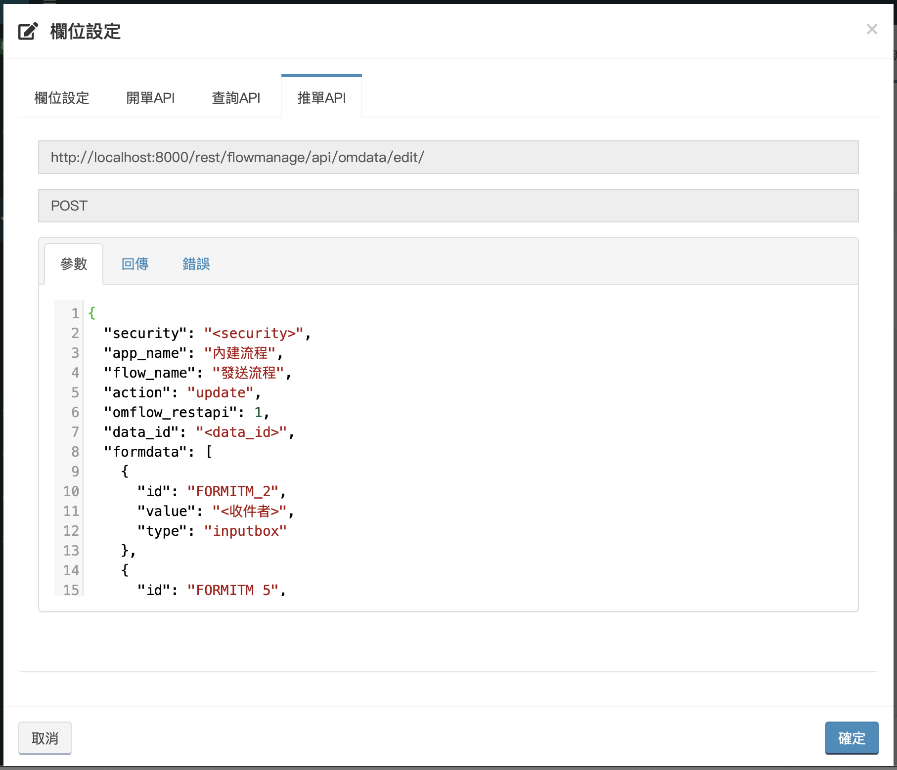

# Create and Update Data

## Get API

Go to _**Main Menu&gt; Application Management&gt; App Stored**_, select the application you want to query and enter the process list.



Find the flow you want to query, and click the rightmost setting.



After clicking, the interface will appear as follows, the following will introduce the tabs one by one:


* Column setting: customize the display column of the form list of the flow.
* [Create data API](kuai-su-kai-chan-tui-chan.md#kai-chan)：The API format used when create a data.
* [Query API](kuai-su-kai-chan-tui-chan.md#cha-xun)：The API format used when querying.
* [Push data API](kuai-su-kai-chan-tui-chan.md#tui-chan)：The API format used when pushing the data.

## Create Data

After clicking open, select the "Create Data API" tab, you can see the flow API example, as shown below.




**The security code needs to be brought into , and the content of "&lt;&gt;" in the formdata should be modified.**

Among them, formdata must be filled in at least the required fields. Whether it is required or not is determined by [**Application Management&gt;Application Design&gt; Form fields design**](../5/6.md#xin-jian-bian-ji-liu-cheng-ye-mian-biao-chan-she-ji) **.**


When the data is successfully created, there will be two types of return.

1.At the beginning of the flow, the [verification](../5/6.md#kai-shi) function is not used. At this time, data\_no, also known as the single number, will be returned.

```text
{
  "status": "200",
  "message": "開單成功",
  "result": "<data_no>"
}
```

2.When the verification function is used at the starting point, data\_no will not be returned.

```text
{
  "status": "200",
  "message": "開單成功",
  "result": ""
}
```

The failure to create a data is returned as follows:

```text
{
  "status": "404",
  "message": "開單失敗"
}
```

## Query

Select the "Query API" tab. Through this API, you can query the latest id of the data. All the data that have been opened need to obtain the in order to push the data, and _**the &lt;data\_id&gt; may be constantly changing or more than one item during the form process**_ , So you need to query first before pushing an data.



When the query is successful, the return is as follows:

```text
{
  "status": "200",
  "message": "查詢成功",
  "result": [
    {
      "data_id": "<資料的唯一編號，推單時使用>",
      "stop_chart_text": "<停留的關卡名稱(人工處理點名稱)>"
    },...
  ]
}
```


There may be more than one return result. When there is parallelism in the flow design, there may be multiple IDs for one order at the same time. Therefore, it is necessary to rely on the name of the stop point to judge and push the data.

Note: No matter whether the query result is one or more, it will be returned in the form of array.


When the query fails, the response is as follows:

```text
{
  "status": "404",
  "message": "查詢失敗"
}
```

## Push Data

Select the "Push Data API" tab, you can see an example of the push data.



When the data is pushed successfully, the return is as follows:

```text
{
  "status": "200",
  "message": "推單成功",
  "result": ""
}
```

When the push data fails, the return is as follows:

```text
{
  "status": "404",
  "message": "推單失敗"
}
```

